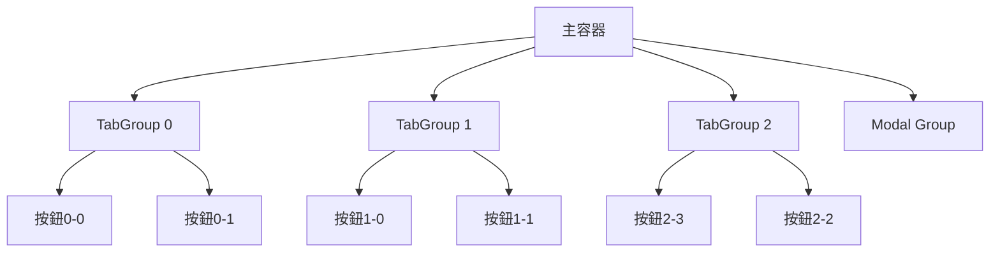

+++
title = "#19239"
date = "2025-05-26T00:00:00"
draft = false
template = "pull_request_page.html"
in_search_index = false

[extra]
current_language = "zh-cn"
available_languages = {"en" = { name = "English", url = "/pull_request/bevy/2025-05/pr-19239-en-20250526" }, "zh-cn" = { name = "中文", url = "/pull_request/bevy/2025-05/pr-19239-zh-cn-20250526" }}
+++

# tab_navigation 示例改进分析报告

## 基本資訊
- **標題**: `tab_navigation` example improvements
- **PR 連結**: https://github.com/bevyengine/bevy/pull/19239
- **作者**: ickshonpe
- **狀態**: 已合併
- **標籤**: C-Examples, A-UI, S-Ready-For-Final-Review, D-Modest
- **建立時間**: 2025-05-16T15:47:12Z
- **合併時間**: 2025-05-26T21:00:02Z
- **合併者**: alice-i-cecile

## 描述翻譯
改進 `tab_navigation` 範例。

### 解決方案
* 為每組按鈕設定不同的 `TabIndex`
* 在按鈕上標示對應的 `TabIndex`
* 使用迴圈減少程式碼重複

嘗試使用新的生成 API 和 `children!` 巨集進一步簡化程式碼，但不確定目前附加觀察者的最佳方式。

## PR 技術分析

### 問題背景與解決動機
原 `tab_navigation` 範例存在三個主要問題：
1. 所有按鈕使用相同 TabIndex，無法展示不同導航順序
2. 按鈕標籤缺乏索引資訊，不利於教學展示
3. 重複的 UI 構建程式碼導致維護困難

範例程式碼中每個按鈕組需要手動重複生成 4 次按鈕，違反 DRY 原則。當需要調整按鈕行為或樣式時，需在多處進行相同修改，增加出錯風險。

### 解決方案實現
核心改進策略採用結構化數據驅動的 UI 生成方式。主要修改集中在 `setup` 函數：

```rust
for (label, tab_group, indices) in [
    ("TabGroup 0", TabGroup::new(0), [0, 0, 0, 0]),
    ("TabGroup 2", TabGroup::new(2), [3, 2, 1, 0]),
    ("TabGroup 1", TabGroup::new(1), [0, 1, 2, 3]),
    ("Modal TabGroup", TabGroup::modal(), [0, 3, 1, 2]),
] {
    // 組結構生成邏輯
}
```

此改動帶來三個關鍵優勢：
1. **明確的測試案例**：每組定義不同的 TabIndex 配置，展示：
   - 相同索引時的子節點順序導航
   - 反向索引的右到左導航
   - 標準左到右導航
   - 非連續索引的任意順序導航

2. **動態標籤生成**：
```rust
Text::new(format!("TabIndex {}", i))
```
直接將 TabIndex 數值嵌入按鈕文字，提升範例的教學價值。

3. **統一樣式管理**：
按鈕生成邏輯集中到單一迴圈中，樣式屬性如尺寸、邊框等只需在一處定義：
```rust
Node {
    width: Val::Px(200.0),
    height: Val::Px(65.0),
    border: UiRect::all(Val::Px(5.0)),
    // ...
}
```

### 技術決策分析
1. **事件處理優化**：
移除 `button_system` 中的文字更新邏輯，因按鈕狀態可透過視覺樣式（背景色、邊框色）區分，簡化系統職責：
```rust
// 修改後不再處理文字更新
for (interaction, mut color, mut border_color) in &mut interaction_query {
    match *interaction {
        Interaction::Pressed => {
            *color = PRESSED_BUTTON.into();
            *border_color = BorderColor::all(RED.into());
        }
        // ...
    }
}
```

2. **觀察者模式應用**：
為每個按鈕附加統一的點擊事件處理：
```rust
.observe(|mut trigger: Trigger<Pointer<Click>>, mut focus: ResMut<InputFocus>| {
    focus.0 = Some(trigger.target());
    trigger.propagate(false);
})
```
此設計確保點擊任何按鈕都會更新輸入焦點，同時阻止事件冒泡。

3. **佈局調整**：
- 新增 `row_gap: Val::Px(6.0)` 改善垂直間距
- 按鈕寬度從 150px 調整為 200px 以容納更長文字
- 移除客製化字體載入，使用預設字體

### 影響與改進
1. **程式碼精簡**：
   - 行數減少 68 行（+62/-130）
   - 消除 `create_button` 輔助函數，減少間接層級

2. **可維護性提升**：
新增測試案例只需在陣列中添加新條目，例如：
```rust
("New Group", TabGroup::new(3), [2, 1, 0, 3])
```

3. **教學價值強化**：
不同 TabIndex 配置直觀展示 Bevy UI 系統的導航邏輯，有助開發者理解：
- TabIndex 相同時的 DOM 順序導航
- 不同 TabIndex 的數值排序導航
- 模態對話框的特殊處理

## 視覺化表示


## 關鍵文件修改
`examples/ui/tab_navigation.rs` (+62/-130)

1. **UI 生成邏輯重構**：
```rust
// 修改前：手動建立每個按鈕組
parent.spawn(Text::new("Tab Group 0"));
parent.spawn((Node { ... }, TabGroup::new(0)))
    .with_children(|parent| {
        create_button(parent, &asset_server);
        // 重複4次
    });

// 修改後：數據驅動生成
for (label, tab_group, indices) in [...] {
    parent.spawn(Text::new(label));
    parent.spawn((Node { ... }, tab_group))
        .with_children(|parent| {
            for i in indices {
                parent.spawn((
                    // 集中定義按鈕屬性
                    TabIndex(i),
                    Text::new(format!("TabIndex {}", i)),
                    // ...
                ));
            }
        });
}
```

2. **按鈕系統簡化**：
```rust
// 修改前：需要更新文字內容
for (interaction, mut color, mut border_color, children) in &mut interaction_query {
    let mut text = text_query.get_mut(children[0]).unwrap();
    match *interaction {
        Interaction::Pressed => {
            **text = "Press".to_string();
            // ...
        }
        // ...
    }
}

// 修改後：僅處理視覺狀態
for (interaction, mut color, mut border_color) in &mut interaction_query {
    match *interaction {
        Interaction::Pressed => {
            *color = PRESSED_BUTTON.into();
            // ...
        }
        // ...
    }
}
```

## 延伸閱讀
1. Bevy UI 系統官方文件：https://bevyengine.org/learn/book/features/ui/
2. Tab Navigation 設計模式：https://www.w3.org/WAI/ARIA/apg/patterns/tabpanel/
3. Bevy 觀察者模式實作：https://github.com/bevyengine/bevy/blob/main/crates/bevy_ui/src/focus.rs