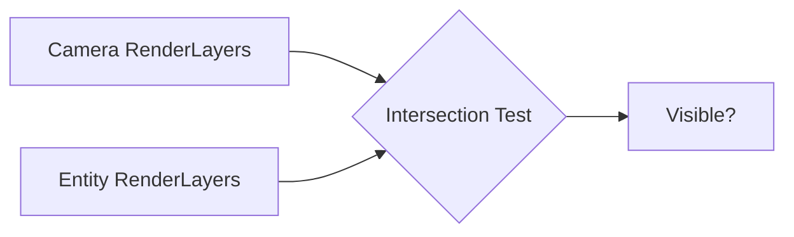

+++
title = "#19241 Clarify RenderLayers docs"
date = "2025-05-26T00:00:00"
draft = false
template = "pull_request_page.html"
in_search_index = true

[taxonomies]
list_display = ["show"]

[extra]
current_language = "en"
available_languages = {"en" = { name = "English", url = "/pull_request/bevy/2025-05/pr-19241-en-20250526" }, "zh-cn" = { name = "中文", url = "/pull_request/bevy/2025-05/pr-19241-zh-cn-20250526" }}
labels = ["C-Docs", "A-Rendering", "D-Straightforward"]
+++

# Title: Clarify RenderLayers docs

## Basic Information
- **Title**: Clarify RenderLayers docs  
- **PR Link**: https://github.com/bevyengine/bevy/pull/19241  
- **Author**: theotherphil  
- **Status**: MERGED  
- **Labels**: C-Docs, A-Rendering, S-Ready-For-Final-Review, D-Straightforward  
- **Created**: 2025-05-16T17:19:04Z  
- **Merged**: 2025-05-26T20:20:17Z  
- **Merged By**: alice-i-cecile  

## Description Translation
# Objective

Clarify `RenderLayers` docs, to fix https://github.com/bevyengine/bevy/issues/18874

## Solution

-

## Testing

-

## The Story of This Pull Request

The PR addresses documentation confusion in Bevy's rendering system by clarifying how `RenderLayers` component works. This stemmed from user reports (issue #18874) where developers misunderstood layer visibility rules, particularly around default values and empty layer configurations.

The core problem resided in ambiguous documentation that could lead to incorrect assumptions:
1. Original docs suggested entities might belong to "no layer at all" despite implicit default layer
2. Relationship between cameras and entity layers wasn't clearly stated
3. Behavior of empty `RenderLayers` vs missing component needed differentiation

The solution focused on precise technical writing while maintaining Bevy's documentation conventions. Key improvements include:
- Explicit statement about default layer (0) for entities without the component
- Clearer description of camera-entity layer intersection logic
- Direct explanation of visibility implications for empty layer sets

Implementation involved revising doc comments for the `RenderLayers` struct. The author streamlined the documentation by:
- Removing redundant explanations
- Using more active voice ("A camera renders..." vs passive constructions)
- Clarifying edge case behavior through concrete examples

Before changes:
```rust
/// Describes which rendering layers an entity belongs to.
///
/// Cameras with this component will only render entities with intersecting
/// layers.
///
/// Entities may belong to one or more layers, or no layer at all.
///
/// The [`Default`] instance of `RenderLayers` contains layer `0`, the first layer.
///
/// An entity with this component without any layers is invisible.
///
/// Entities without this component belong to layer `0`.
```

After changes:
```rust
/// Defines which rendering layers an entity belongs to.
///
/// A camera renders an entity only when their render layers intersect.
///
/// The [`Default`] instance of `RenderLayers` contains layer `0`, the first layer. Entities
/// without this component also belong to layer `0`.
///
/// An empty `RenderLayers` makes the entity invisible.
```

The revised documentation eliminates potential misunderstandings by:
1. Replacing "may belong" with definitive statements about component presence
2. Explicitly connecting component existence with layer membership
3. Separating concerns between empty components and missing components

These changes improve developer experience by:
- Reducing ambiguity in rendering layer configuration
- Preventing accidental invisible entities from empty layer sets
- Clarifying default behavior for entities without explicit configuration

## Visual Representation



## Key Files Changed

**crates/bevy_render/src/view/visibility/render_layers.rs** (+5/-9)  
Primary documentation improvements for the `RenderLayers` component:

```rust
// Before:
/// Describes which rendering layers an entity belongs to.
///
/// Cameras with this component will only render entities with intersecting
/// layers.
///
/// Entities may belong to one or more layers, or no layer at all.
///
/// The [`Default`] instance of `RenderLayers` contains layer `0`, the first layer.
///
/// An entity with this component without any layers is invisible.
///
/// Entities without this component belong to layer `0`.

// After:
/// Defines which rendering layers an entity belongs to.
///
/// A camera renders an entity only when their render layers intersect.
///
/// The [`Default`] instance of `RenderLayers` contains layer `0`, the first layer. Entities
/// without this component also belong to layer `0`.
///
/// An empty `RenderLayers` makes the entity invisible.
```

Changes achieve:
- More authoritative "defines" instead of "describes"
- Simplified camera interaction explanation
- Merged default behavior statements
- Clearer empty component consequence

## Further Reading

1. [Bevy Render Layers Documentation](https://docs.rs/bevy/latest/bevy/render/view/struct.RenderLayers.html)
2. [Entity Component System Pattern](https://en.wikipedia.org/wiki/Entity_component_system)
3. [Rendering Isolation Techniques in Game Engines](https://www.gamedeveloper.com/programming/visibility-and-rendering-techniques)

# Full Code Diff
```diff
diff --git a/crates/bevy_render/src/view/visibility/render_layers.rs b/crates/bevy_render/src/view/visibility/render_layers.rs
index a5a58453e830b..b39ecb215c6df 100644
--- a/crates/bevy_render/src/view/visibility/render_layers.rs
+++ b/crates/bevy_render/src/view/visibility/render_layers.rs
@@ -7,18 +7,14 @@ pub const DEFAULT_LAYERS: &RenderLayers = &RenderLayers::layer(0);
 /// An identifier for a rendering layer.
 pub type Layer = usize;
 
-/// Describes which rendering layers an entity belongs to.
+/// Defines which rendering layers an entity belongs to.
 ///
-/// Cameras with this component will only render entities with intersecting
-/// layers.
+/// A camera renders an entity only when their render layers intersect.
 ///
-/// Entities may belong to one or more layers, or no layer at all.
+/// The [`Default`] instance of `RenderLayers` contains layer `0`, the first layer. Entities
+/// without this component also belong to layer `0`.
 ///
-/// The [`Default`] instance of `RenderLayers` contains layer `0`, the first layer.
-///
-/// An entity with this component without any layers is invisible.
-///
-/// Entities without this component belong to layer `0`.
+/// An empty `RenderLayers` makes the entity invisible.
 #[derive(Component, Clone, Reflect, PartialEq, Eq, PartialOrd, Ord)]
 #[reflect(Component, Default, PartialEq, Debug, Clone)]
 pub struct RenderLayers(SmallVec<[u64; INLINE_BLOCKS]>);
```