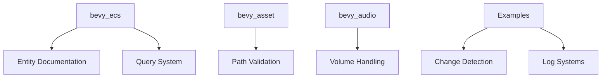

+++
title = "#19244 Remove apostrophes in possessive its"
date = "2025-05-26T00:00:00"
draft = false
template = "pull_request_page.html"
in_search_index = true

[taxonomies]
list_display = ["show"]

[extra]
current_language = "en"
available_languages = {"en" = { name = "English", url = "/pull_request/bevy/2025-05/pr-19244-en-20250526" }, "zh-cn" = { name = "中文", url = "/pull_request/bevy/2025-05/pr-19244-zh-cn-20250526" }}
labels = ["C-Docs", "D-Trivial", "C-Code-Quality"]
+++

# Remove apostrophes in possessive its

## Basic Information
- **Title**: Remove apostrophes in possessive its
- **PR Link**: https://github.com/bevyengine/bevy/pull/19244
- **Author**: theotherphil
- **Status**: MERGED
- **Labels**: C-Docs, D-Trivial, C-Code-Quality, S-Ready-For-Final-Review
- **Created**: 2025-05-16T18:11:42Z
- **Merged**: 2025-05-26T20:23:16Z
- **Merged By**: alice-i-cecile

## Description Translation
# Objective

Fix some grammatical errors: it's -> its

Not the most useful commit in the world, but I saw a couple of these and decided to fix the lot.

## Solution
-

## Testing
-

## The Story of This Pull Request

This PR addresses a common grammatical error found in code comments and documentation strings across multiple Bevy crates. The core issue was incorrect usage of "it's" (the contraction for "it is") where the possessive form "its" was required. While not affecting runtime behavior, these errors could cause confusion for developers reading the documentation.

The author conducted a systematic search through the codebase using likely regex patterns to identify all instances of this error. The changes span 10 files across 6 different crates (bevy_ecs, bevy_asset, bevy_audio, bevy_state, bevy_text, bevy_utils) and 2 example files. Each correction follows the same pattern: replacing apostrophe-containing "it's" with the grammatically correct possessive "its" in documentation comments and string literals.

Key technical considerations included:
1. Maintaining comment integrity while fixing grammar
2. Ensuring no accidental changes to actual code logic
3. Verifying that documentation examples remained functionally unchanged
4. Addressing both public API documentation and internal comments

The changes demonstrate Bevy's commitment to code quality and documentation accuracy. While mechanically simple, these corrections improve the professionalism and clarity of the codebase's documentation. The PR required careful attention to detail to avoid introducing new errors while scanning through numerous code comments.

## Visual Representation



## Key Files Changed

### `crates/bevy_ecs/examples/change_detection.rs`
**Change**: Fixed possessive form in entity birthday message
```rust
// Before:
println!("    {entity} has it's first birthday!");

// After:
println!("    {entity} has its first birthday!");
```

### `crates/bevy_asset/src/path.rs`
**Change**: Corrected grammar in asset path documentation
```rust
// Before:
/// outside of it's [`AssetSource`](crate::io::AssetSource) folder.

// After:
/// outside of its [`AssetSource`](crate::io::AssetSource) folder.
```

### `crates/bevy_audio/src/volume.rs`
**Change**: Fixed technical documentation for volume handling
```rust
// Before:
/// i.e. it's underlying linear scale

// After:
/// i.e. its underlying linear scale
```

### `crates/bevy_ecs/src/query/iter.rs`
**Change**: Corrected two instances in query iterator safety docs
```rust
// Before:
/// - `archetype` must have the same length with it's table.

// After:
/// - `archetype` must have the same length as its table.
```

### `examples/app/log_layers_ecs.rs`
**Change**: Fixed documentation about ECS integration
```rust
// Before:
/// via it's [`mpsc::Sender`].

// After:
/// via its [`mpsc::Sender`].
```

## Further Reading
- Rust API Documentation Guidelines: https://rust-lang.github.io/api-guidelines/documentation.html
- Microsoft Writing Style Guide: https://learn.microsoft.com/en-us/style-guide/grammar/possessives
- Bevy Contribution Guide: https://github.com/bevyengine/bevy/blob/main/CONTRIBUTING.md

## Full Code Diff
(See original PR for complete diff)