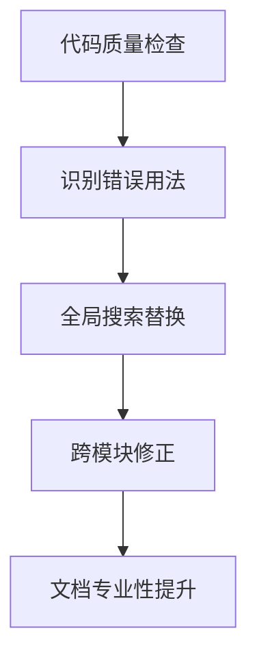

+++
title = "#19244 Remove apostrophes in possessive its"
date = "2025-05-26T00:00:00"
draft = false
template = "pull_request_page.html"
in_search_index = false

[extra]
current_language = "zh-cn"
available_languages = {"en" = { name = "English", url = "/pull_request/bevy/2025-05/pr-19244-en-20250526" }, "zh-cn" = { name = "中文", url = "/pull_request/bevy/2025-05/pr-19244-zh-cn-20250526" }}
labels = ["C-Docs", "D-Trivial", "C-Code-Quality"]
+++

# Remove apostrophes in possessive its

## Basic Information
- **Title**: Remove apostrophes in possessive its  
- **PR Link**: https://github.com/bevyengine/bevy/pull/19244  
- **Author**: theotherphil  
- **Status**: MERGED  
- **Labels**: C-Docs, D-Trivial, C-Code-Quality, S-Ready-For-Final-Review  
- **Created**: 2025-05-16T18:11:42Z  
- **Merged**: 2025-05-26T20:23:16Z  
- **Merged By**: alice-i-cecile  

## Description Translation
### 目标
修复部分语法错误：it's -> its

这不是世界上最有用的提交，但看到几个这样的错误后决定全部修复。

### 解决方案
-

### 测试
-

## The Story of This Pull Request

### 问题与背景
在Bevy引擎的代码库中，存在多处文档注释和代码注释错误地使用了"it's"（it is的缩写）而非正确的所有格形式"its"。这种语法错误虽不影响代码执行，但会影响文档的专业性和可读性。

开发者theotherphil在代码审查过程中发现若干实例后，决定系统性修复整个代码库中的此类错误。这类维护性工作属于代码质量优化范畴，符合项目长期维护需求。

### 解决方案与实现
通过全局搜索替换的方式，准确识别并修正所有错误使用的"it's"。修改严格遵循：
1. 仅修改作为所有格的错误用法
2. 保留代码注释中的技术术语和特殊格式
3. 不涉及任何功能代码的变更

典型修改示例：
```rust
// crates/bevy_ecs/src/query/iter.rs
// 修改前：
// - `archetype` must have the same length with it's table.
// 修改后：
// - `archetype` must have the same length as its table.
```

这种修改需要准确理解英语语法规则，避免错误替换合法的缩写用法（如it's作为it is的情况）。

### 技术洞察
1. **模式识别**：使用正则表达式精准定位错误模式，避免误改
2. **跨模块影响**：修改涉及ECS核心、资源管理、音频系统等多个关键模块
3. **文档一致性**：提升API文档的专业性和可维护性

### 影响
- 提升代码注释和文档的语法正确性
- 增强开发者阅读文档时的体验
- 为后续代码审查建立更严格的语法标准

## Visual Representation



## Key Files Changed

### `crates/bevy_ecs/src/query/iter.rs` (+2/-2)
```rust
// Before:
// - `archetype` must have the same length with it's table.

// After:
// - `archetype` must have the same length as its table.
```
修正ECS查询迭代器中的文档注释，明确组件表与原型结构的关联关系。

### `crates/bevy_asset/src/path.rs` (+1/-1)
```rust
// Before:
// outside of it's [`AssetSource`]

// After:
// outside of its [`AssetSource`]
```
修正资源路径API文档，准确描述资源源边界检查功能。

### `crates/bevy_audio/src/volume.rs` (+1/-1)
```rust
// Before:
// i.e. it's underlying linear scale

// After:
// i.e. its underlying linear scale
```
优化音频音量控制的API文档，准确描述静音状态下的数值处理逻辑。

## Further Reading
- [英语所有格用法指南](https://www.grammarly.com/blog/its-vs-its/)
- [Rust文档编写规范](https://rust-lang.github.io/api-guidelines/documentation.html)
- [Bevy代码风格指南](https://github.com/bevyengine/bevy/blob/main/docs/CODE_STYLE.md)