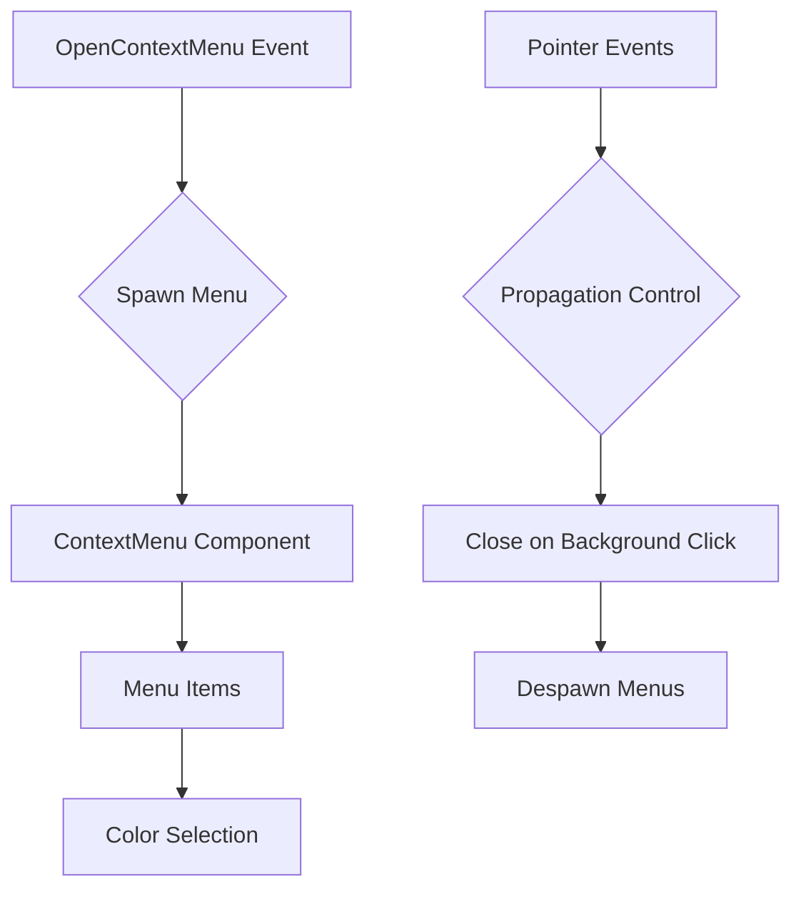

+++
title = "#19245 Adding context menu example"
date = "2025-05-26T00:00:00"
draft = false
template = "pull_request_page.html"
in_search_index = true

[taxonomies]
list_display = ["show"]

[extra]
current_language = "en"
available_languages = {"en" = { name = "English", url = "/pull_request/bevy/2025-05/pr-19245-en-20250526" }, "zh-cn" = { name = "中文", url = "/pull_request/bevy/2025-05/pr-19245-zh-cn-20250526" }}
labels = ["C-Docs", "C-Examples", "A-UI", "D-Straightforward"]
+++

# Title: Adding context menu example

## Basic Information
- **Title**: Adding context menu example
- **PR Link**: https://github.com/bevyengine/bevy/pull/19245
- **Author**: extrawurst
- **Status**: MERGED
- **Labels**: C-Docs, C-Examples, A-UI, S-Ready-For-Final-Review, D-Straightforward
- **Created**: 2025-05-16T20:55:30Z
- **Merged**: 2025-05-26T22:44:11Z
- **Merged By**: alice-i-cecile

## Description Translation

# Objective

Provides usage example of a context menu

## Testing

* [x] Tested on MacOS
* [x] Tested on wasm using bevy_cli

---

## Showcase


https://github.com/user-attachments/assets/2e39cd32-131e-4535-beb7-b46680bca74a


## The Story of This Pull Request

This PR addresses the need for a concrete example demonstrating context menu implementation in Bevy's UI system. While Bevy provides various UI components, there was no official example showing how to create interactive context menus - a common requirement for game UIs and tools.

The implementation centers around three key elements:
1. Event-driven menu management using `OpenContextMenu` and `CloseContextMenus` events
2. Dynamic UI spawning with absolute positioning
3. Color change functionality to demonstrate menu interaction

The example creates a right-click menu that modifies the background color, showcasing several Bevy UI concepts:

```rust
// Event definition for menu operations
#[derive(Event)]
struct OpenContextMenu {
    pos: Vec2,
}

#[derive(Event)]
struct CloseContextMenus;

// Menu root marker component
#[derive(Component)]
struct ContextMenu;
```

The core interaction flow handles event propagation carefully to prevent unintended closures. When opening a menu, the implementation stops event propagation to avoid immediate closure by parent click handlers:

```rust
.observe(|mut trigger: Trigger<Pointer<Pressed>>, mut commands: Commands| {
    trigger.propagate(false);
    commands.trigger(OpenContextMenu {
        pos: trigger.pointer_location.position,
    });
})
```

The menu construction demonstrates Bevy's UI composition pattern, using nested nodes with absolute positioning:

```rust
commands.spawn((
    ContextMenu,
    Node {
        position_type: PositionType::Absolute,
        left: Val::Px(pos.x),
        top: Val::Px(pos.y),
        flex_direction: FlexDirection::Column,
        ..default()
    },
    // ... styling properties
));
```

Hover effects are implemented through observer patterns, demonstrating reusable interaction logic:

```rust
fn text_color_on_hover<T: Debug + Clone + Reflect>(
    color: Color,
) -> impl FnMut(Trigger<Pointer<T>>, Query<&mut TextColor>, Query<&Children>) {
    // Logic to update text color on hover
}
```

The solution makes several intentional design choices:
- Uses absolute positioning for menu placement
- Implements event propagation control for layered UI
- Demonstrates ECS-friendly UI component relationships
- Shows WASM-compatible input handling

Testing covered both native (MacOS) and web targets, ensuring cross-platform functionality. The example serves as a foundation for more complex menu systems while adhering to Bevy's entity-component paradigm.

## Visual Representation



## Key Files Changed

1. `examples/usages/context_menu.rs` (+201/-0)
```rust
// Core menu spawning logic
commands.spawn((
    ContextMenu,
    Node {
        position_type: PositionType::Absolute,
        left: Val::Px(pos.x),
        top: Val::Px(pos.y),
        // ... other properties
    },
    // ... styling and children
)).observe(/* color change logic */);
```

2. `Cargo.toml` (+11/-0)
```toml
[[example]]
name = "context_menu"
path = "examples/usages/context_menu.rs"
doc-scrape-examples = true

[package.metadata.example.context_menu]
name = "Context Menu"
description = "Example of a context menu"
category = "Usage"
wasm = true
```

3. `examples/README.md` (+1/-0)
```markdown
|[Context Menu](../examples/usages/context_menu.rs) | Example of a context menu
```

## Further Reading

- Bevy UI Documentation: https://bevyengine.org/learn/book/features/ui/
- Bevy ECS Events Guide: https://bevyengine.org/learn/book/features/ecs/events
- WASM Input Handling: https://bevyengine.org/examples/Web/2D%20Rendering/