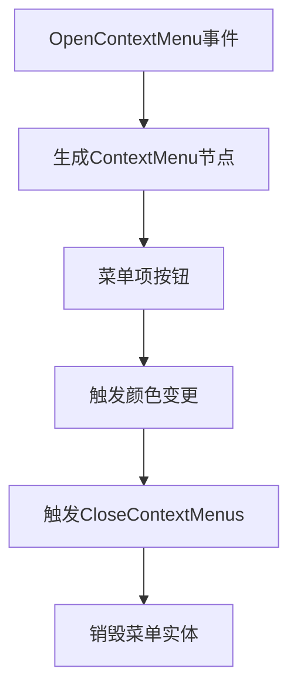

+++
title = "#19245 Adding context menu example"
date = "2025-05-26T00:00:00"
draft = false
template = "pull_request_page.html"
in_search_index = false

[extra]
current_language = "zh-cn"
available_languages = {"en" = { name = "English", url = "/pull_request/bevy/2025-05/pr-19245-en-20250526" }, "zh-cn" = { name = "中文", url = "/pull_request/bevy/2025-05/pr-19245-zh-cn-20250526" }}
labels = ["C-Docs", "C-Examples", "A-UI", "D-Straightforward"]
+++

# 添加上下文菜单示例的技术实现分析

## Basic Information
- **Title**: Adding context menu example
- **PR Link**: https://github.com/bevyengine/bevy/pull/19245
- **Author**: extrawurst
- **Status**: MERGED
- **Labels**: C-Docs, C-Examples, A-UI, S-Ready-For-Final-Review, D-Straightforward
- **Created**: 2025-05-16T20:55:30Z
- **Merged**: 2025-05-26T22:44:11Z
- **Merged By**: alice-i-cecile

## Description Translation
该PR添加了一个上下文菜单的使用示例，展示了如何通过右键点击按钮触发颜色选择菜单，并修改背景颜色。测试覆盖了MacOS和WebAssembly平台。

---

## The Story of This Pull Request

### 问题背景与需求
在UI开发中，上下文菜单是常见交互模式，但Bevy引擎的官方示例中缺少相关实现。开发者需要参考具体示例来理解如何组合Bevy的ECS架构、事件系统和UI组件实现这种交互。该PR的目标是填补这一空白，提供标准实现模式。

### 解决方案架构
实现基于Bevy的观察者模式（Observer Pattern）和事件驱动架构，主要包含以下技术要素：

1. **事件系统**：
   - `OpenContextMenu`：携带菜单位置坐标的事件
   - `CloseContextMenus`：关闭所有菜单的全局事件

2. **UI结构**：
   ```rust
   commands.spawn((
       ContextMenu,
       Node { /* 绝对定位参数 */ },
       BorderColor::all(Color::BLACK),
       // 包含多个颜色选项按钮
   ));
   ```
   使用绝对定位实现菜单浮动效果，每个菜单项通过`ContextMenuItem`组件携带颜色数据。

3. **交互处理**：
   ```rust
   .observe(|trigger: Trigger<Pointer<Pressed>>, menu_items: Query<&ContextMenuItem>| {
       if let Ok(item) = menu_items.get(target) {
           clear_col.0 = item.0.into();
           commands.trigger(CloseContextMenus);
       }
   })
   ```
   利用Bevy的观察者模式处理点击事件，实现颜色选择和菜单关闭的连锁反应。

### 关键技术点
1. **事件传播控制**：
   ```rust
   trigger.propagate(false); // 阻止事件冒泡
   ```
   在按钮点击处理中显式停止事件传播，避免触发父容器的关闭逻辑。

2. **动态菜单生成**：
   ```rust
   fn context_item(text: &str, col: Srgba) -> impl Bundle {
       (/* 构建标准化菜单项 */)
   }
   ```
   通过工厂函数生成标准菜单项，保证UI样式一致性。

3. **跨平台支持**：
   通过`wasm = true`配置确保WebAssembly兼容性，处理浏览器环境下的坐标系统差异。

### 实现影响
该示例为开发者提供了以下参考模式：
- Bevy事件系统的典型用法
- UI组件的动态生成与管理
- 观察者模式在交互逻辑中的应用
- 跨平台UI开发的实践方案

## Visual Representation



## Key Files Changed

### 1. `examples/usages/context_menu.rs` (+201/-0)
```rust
// 核心菜单生成逻辑
commands.spawn((
    ContextMenu,
    Node {
        position_type: PositionType::Absolute,
        left: Val::Px(pos.x),
        top: Val::Px(pos.y),
        // ...
    },
    // 包含多个颜色选项
));

// 事件处理观察者
.observe(|trigger: Trigger<Pointer<Pressed>>| {
    // 处理颜色选择逻辑
});
```

### 2. `Cargo.toml` (+11/-0)
```toml
[[example]]
name = "context_menu"
path = "examples/usages/context_menu.rs"
wasm = true  # 启用WebAssembly支持
```

### 3. `examples/README.md` (+1/-0)
```markdown
|[Context Menu](../examples/usages/context_menu.rs) | Example of a context menu
```

## Further Reading
1. [Bevy官方UI文档](https://bevyengine.org/learn/book/features/ui/)
2. [Bevy事件系统详解](https://bevy-cheatbook.github.io/programming/events.html)
3. [ECSS模式在UI开发中的应用](https://github.com/bevyengine/bevy/discussions/4022)