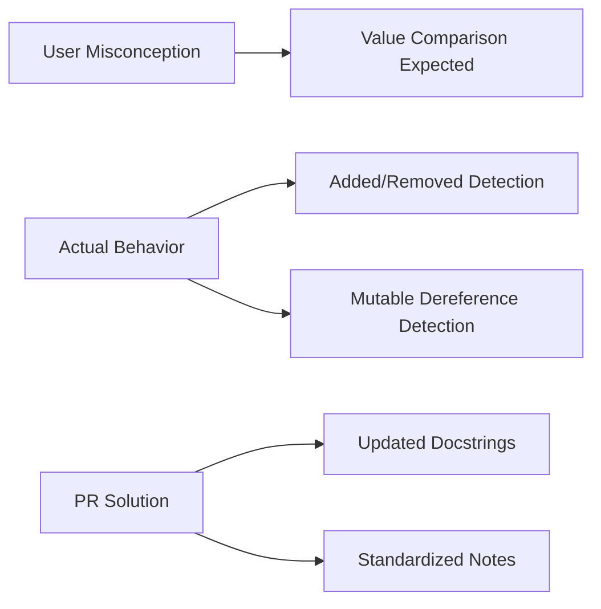

+++
title = "#19252 Clarify Resource change detection behaviour in condition docs"
date = "2025-05-30T00:00:00"
draft = false
template = "pull_request_page.html"
in_search_index = true

[taxonomies]
list_display = ["show"]

[extra]
current_language = "en"
available_languages = {"en" = { name = "English", url = "/pull_request/bevy/2025-05/pr-19252-en-20250530" }, "zh-cn" = { name = "中文", url = "/pull_request/bevy/2025-05/pr-19252-zh-cn-20250530" }}
labels = ["C-Docs", "A-ECS", "D-Straightforward"]
+++

## Technical Analysis: PR #19252 - Clarify Resource Change Detection Behaviour

### Basic Information
- **Title**: Clarify Resource change detection behaviour in condition docs
- **PR Link**: https://github.com/bevyengine/bevy/pull/19252
- **Author**: theotherphil
- **Status**: MERGED
- **Labels**: C-Docs, A-ECS, S-Ready-For-Final-Review, D-Straightforward
- **Created**: 2025-05-17T10:08:20Z
- **Merged**: 2025-05-30T01:04:39Z
- **Merged By**: mockersf

### Description Translation
# Objective

Fixes https://github.com/bevyengine/bevy/issues/17933

## Solution

Correct "value has changed'" in docs to "value has been added or mutably dereferenced", with a note for emphasis copied from the docs for Changed.

## Testing

-

### The Story of This Pull Request

The PR addresses a documentation ambiguity in Bevy's ECS change detection system. Resource change detection conditions were previously described using the phrase "value has changed," which could be misinterpreted as value-based comparison. This was reported in issue #17933, where users might expect Bevy to perform deep equality checks on resource values.

The core misunderstanding stemmed from how Bevy actually implements change detection. Rather than comparing previous and current values, Bevy flags resources as changed when they're either:
1. Newly added
2. Mutably dereferenced (via `DerefMut`)
3. Removed (for specific conditions)

This is a fundamental aspect of Bevy's change tracking system that wasn't clearly communicated in the documentation. The solution modifies docstrings for three condition functions to accurately reflect this behavior. The key improvement is replacing "value has changed" with explicit descriptions of the actual triggers, and adding standardized notes about the dereferencing behavior.

For consistency, the PR copies the existing note from `Changed` documentation ("Bevy does not compare resources to their previous values") to all three modified functions. This provides immediate clarification without requiring users to hunt through documentation.

The changes are purely documentation-focused - no functional modifications were made to the ECS logic. This approach minimizes risk while maximizing clarity for users working with resource change conditions.

### Visual Representation



### Key Files Changed

**File**: `crates/bevy_ecs/src/schedule/condition.rs`

**Changes**: Documentation updates for three resource change detection conditions to clarify actual behavior.

**Key modifications**:

1. **resource_changed** condition:
```rust
// Before:
/// A [`SystemCondition`]-satisfying system that returns `true`
/// if the resource of the given type has had its value changed since the condition
/// was last checked.
///
/// The value is considered changed when it is added. The first time this condition
/// is checked after the resource was added, it will return `true`.
/// Change detection behaves like this everywhere in Bevy.

// After:
/// A [`SystemCondition`]-satisfying system that returns `true`
/// if the resource of the given type has been added or mutably dereferenced
/// since the condition was last checked.
///
/// **Note** that simply *mutably dereferencing* a resource is considered a change ([`DerefMut`](std::ops::DerefMut)).
/// Bevy does not compare resources to their previous values.
```

2. **resource_exists_and_changed** condition:
```rust
// Before:
/// A [`SystemCondition`]-satisfying system that returns `true`
/// if the resource of the given type has had its value changed since the condition
/// was last checked.
///
/// The value is considered changed when it is added. The first time this condition
/// is checked after the resource was added, it will return `true`.
/// Change detection behaves like this everywhere in Bevy.
///
/// This run condition does not detect when the resource is removed.

// After:
/// A [`SystemCondition`]-satisfying system that returns `true`
/// if the resource of the given type has been added or mutably dereferenced since the condition
/// was last checked.
///
/// **Note** that simply *mutably dereferencing* a resource is considered a change ([`DerefMut`](std::ops::DerefMut)).
/// Bevy does not compare resources to their previous values.
```

3. **resource_changed_or_removed** condition:
```rust
// Before:
/// A [`SystemCondition`]-satisfying system that returns `true`
/// if the resource of the given type has had its value changed since the condition
/// was last checked.
///
/// The value is considered changed when it is added. The first time this condition
/// is checked after the resource was added, it will return `true`.
/// Change detection behaves like this everywhere in Bevy.
///
/// This run condition also detects removal. It will return `true` if the resource
/// has been removed since the run condition was last checked.

// After:
/// A [`SystemCondition`]-satisfying system that returns `true`
/// if the resource of the given type has been added, removed or mutably dereferenced since the condition
/// was last checked.
///
/// **Note** that simply *mutably dereferencing* a resource is considered a change ([`DerefMut`](std::ops::DerefMut)).
/// Bevy does not compare resources to their previous values.
```

### Further Reading
1. [Bevy Change Detection Documentation](https://bevyengine.org/learn/book/next/programming/change-detection/)
2. [Rust DerefMut Trait](https://doc.rust-lang.org/std/ops/trait.DerefMut.html)
3. [Bevy ECS Conditions API Reference](https://docs.rs/bevy_ecs/latest/bevy_ecs/schedule/condition/index.html)