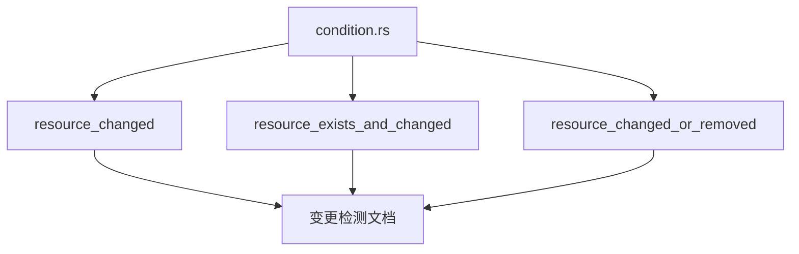

+++
title = "#19252 Clarify Resource change detection behaviour in condition docs"
date = "2025-05-30T00:00:00"
draft = false
template = "pull_request_page.html"
in_search_index = false

[extra]
current_language = "zh-cn"
available_languages = {"en" = { name = "English", url = "/pull_request/bevy/2025-05/pr-19252-en-20250530" }, "zh-cn" = { name = "中文", url = "/pull_request/bevy/2025-05/pr-19252-zh-cn-20250530" }}
+++

## 技术分析报告：Clarify Resource change detection behaviour in condition docs

### 基础信息
- **标题**: Clarify Resource change detection behaviour in condition docs
- **PR链接**: https://github.com/bevyengine/bevy/pull/19252
- **作者**: theotherphil
- **状态**: 已合并
- **标签**: C-Docs, A-ECS, S-Ready-For-Final-Review, D-Straightforward
- **创建时间**: 2025-05-17T10:08:20Z
- **合并时间**: 2025-05-30T01:04:39Z
- **合并者**: mockersf

### 描述翻译
#### 目标
修复 https://github.com/bevyengine/bevy/issues/17933

#### 解决方案
在文档中将 "value has changed" 修正为 "value has been added or mutably dereferenced"，并从 Changed 文档复制强调说明作为补充注释。

#### 测试
-

---

### PR 分析：澄清资源变更检测的文档行为

#### 问题背景
在 Bevy 的 ECS 系统中，资源变更检测(resource change detection)是核心机制之一。开发者通过`resource_changed`等条件(condition)系统来控制系统的执行逻辑。然而，文档中关于"资源变更"的定义不够精确，存在误导性表述。具体问题(#17933)是文档将变更描述为"value has changed"(值已改变)，而实际实现机制完全不同。

Bevy 的资源变更检测并非基于值比较(value comparison)，而是基于访问模式(access patterns)：
- 资源首次添加被视为变更
- 对资源的可变解引用(`DerefMut`)被视为变更
- 系统不会比较资源的前后值

这种设计出于性能考虑，避免深度值比较带来的开销。但原文档未清晰说明这一关键机制，导致开发者可能误解变更检测的实际行为。

#### 解决方案
PR 通过精确重写三个条件系统的文档来解决此问题：
1. 将"value has changed"替换为"has been added or mutably dereferenced"
2. 添加显式说明强调`DerefMut`即被视为变更
3. 统一三个相关函数的文档表述
4. 从`Changed`文档移植关键说明段落

这种修改不涉及任何代码逻辑变更，纯粹是文档改进，但能显著提升API的易用性和准确性。

#### 关键修改分析
所有修改集中在`condition.rs`文件，下面是具体变更对比：

**1. resource_changed 函数文档**
```rust
// 修改前：
/// if the resource of the given type has had its value changed since the condition
/// was last checked.
///
/// The value is considered changed when it is added. The first time this condition
/// is checked after the resource was added, it will return `true`.
/// Change detection behaves like this everywhere in Bevy.

// 修改后：
/// if the resource of the given type has been added or mutably dereferenced
/// since the condition was last checked.
///
/// **Note** that simply *mutably dereferencing* a resource is considered a change ([`DerefMut`](std::ops::DerefMut)).
/// Bevy does not compare resources to their previous values.
```

**2. resource_exists_and_changed 函数文档**
```rust
// 修改前：
/// if the resource of the given type has had its value changed since the condition
/// was last checked.
///
/// The value is considered changed when it is added. The first time this condition
/// is checked after the resource was added, it will return `true`.
/// Change detection behaves like this everywhere in Bevy.

// 修改后：
/// if the resource of the given type has been added or mutably dereferenced since the condition
/// was last checked.
///
/// **Note** that simply *mutably dereferencing* a resource is considered a change ([`DerefMut`](std::ops::DerefMut)).
/// Bevy does not compare resources to their previous values.
```

**3. resource_changed_or_removed 函数文档**
```rust
// 修改前：
/// if the resource of the given type has had its value changed since the condition
/// was last checked.
///
/// The value is considered changed when it is added. The first time this condition
/// is checked after the resource was added, it will return `true`.
/// Change detection behaves like this everywhere in Bevy.

// 修改后：
/// if the resource of the given type has been added, removed or mutably dereferenced since the condition
/// was last checked.
///
/// **Note** that simply *mutably dereferencing* a resource is considered a change ([`DerefMut`](std::ops::DerefMut)).
/// Bevy does not compare resources to their previous values.
```

#### 技术要点说明
1. **变更检测机制**：
   - 基于访问追踪(access tracking)而非值比较
   - `DerefMut`操作触发变更标记
   - 资源添加自动标记为变更

2. **文档改进策略**：
   - 使用行为描述("has been added or mutably dereferenced")替代结果描述("has changed")
   - 显式说明`DerefMut`的影响
   - 添加技术警告(**Note**)突出关键机制

3. **一致性维护**：
   - 统一三个相关函数的文档结构
   - 复用标准说明段落保持表述一致
   - 明确区分变更和移除检测的逻辑差异

#### 影响与价值
1. **消除API误解**：预防开发者错误假设变更检测基于值比较
2. **性能预期管理**：明确系统无值比较开销的设计意图
3. **调试效率提升**：准确描述帮助定位与变更检测相关的问题
4. **模式指导**：强调`DerefMut`的影响，指导资源访问最佳实践

#### 组件关系


### 关键文件变更
- **文件路径**: crates/bevy_ecs/src/schedule/condition.rs
- **变更描述**: 精确化三个资源变更检测条件系统的文档
- **修改量**: +10 行 / -18 行

### 延伸阅读
1. [Bevy 变更检测官方文档](https://bevyengine.org/learn/book/next/programming/change-detection/)
2. [ECS 变更检测设计模式](https://github.com/SanderMertens/ecs-faq#change-detection)
3. [Rust Deref 和 DerefMut 特性](https://doc.rust-lang.org/std/ops/trait.DerefMut.html)