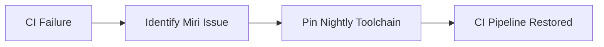

+++
title = "#19253 Pin nightly due to miri issue"
date = "2025-05-17T00:00:00"
draft = false
template = "pull_request_page.html"
in_search_index = true

[taxonomies]
list_display = ["show"]

[extra]
current_language = "en"
available_languages = {"en" = { name = "English", url = "/pull_request/bevy/2025-05/pr-19253-en-20250517" }, "zh-cn" = { name = "中文", url = "/pull_request/bevy/2025-05/pr-19253-zh-cn-20250517" }}
labels = ["C-Bug", "D-Trivial", "A-Build-System", "P-Critical"]
+++

# Title: Pin nightly due to miri issue

## Basic Information
- **Title**: Pin nightly due to miri issue
- **PR Link**: https://github.com/bevyengine/bevy/pull/19253
- **Author**: NiklasEi
- **Status**: MERGED
- **Labels**: C-Bug, D-Trivial, A-Build-System, S-Ready-For-Final-Review, P-Critical
- **Created**: 2025-05-17T11:07:50Z
- **Merged**: 2025-05-17T11:41:08Z
- **Merged By**: mockersf

## Description Translation
# Objective

The required miri check is currently failing due to rust-lang/miri#4323
Let's pin nightly to yesterday to not be blocked today.

## Solution

- Pinned nightly to `nightly-2025-05-16`

## Testing

- Let's see if the pipeline is green on this PR :D

## The Story of This Pull Request

The Bevy engine's continuous integration pipeline encountered a critical failure when running Miri checks, a Rust tool for detecting undefined behavior. The root cause was traced to an upstream issue in Miri (rust-lang/miri#4323) that broke compatibility with the latest nightly Rust toolchain. 

As a temporary mitigation, the team needed to ensure CI stability while waiting for an upstream fix. The solution involved modifying the CI configuration to pin the nightly Rust version to a known-working version from the previous day (2025-05-16). This approach follows standard practice in Rust projects when dealing with breaking changes in nightly toolchains.

The implementation required a single-line change in the GitHub Actions workflow file, updating the `NIGHTLY_TOOLCHAIN` environment variable from the floating `nightly` label to a specific dated version. The comment was updated to document the reason for pinning and reference the upstream issue.

```yaml
# Before:
NIGHTLY_TOOLCHAIN: nightly

# After:
NIGHTLY_TOOLCHAIN: nightly-2025-05-16 # pinned until a fix for https://github.com/rust-lang/miri/issues/4323 is released
```

This change demonstrates several key engineering practices:
1. **CI/CD Resilience**: Maintaining working CI pipelines is critical for project health
2. **Temporary Solutions**: Pinning dependencies is an acceptable short-term fix while awaiting upstream resolutions
3. **Documentation**: Adding issue references in comments helps future maintainers understand context

The rapid merge (33 minutes from creation to merge) and critical priority label (P-Critical) indicate this was blocking other development work. The trivial complexity label (D-Trivial) reflects the minimal code changes required despite the high impact.

## Visual Representation



## Key Files Changed

- `.github/workflows/ci.yml` (+1/-1)

**Change Description**:  
Updated the nightly Rust toolchain version used in CI to work around a Miri compatibility issue.

**Code Diff**:
```yaml
# File: .github/workflows/ci.yml
-  NIGHTLY_TOOLCHAIN: nightly
+  NIGHTLY_TOOLCHAIN: nightly-2025-05-16 # pinned until a fix for https://github.com/rust-lang/miri/issues/4323 is released
```

**Impact**:  
Restored CI functionality by using a known-good Rust nightly version, unblocking development while awaiting an upstream Miri fix.

## Further Reading

1. [Rustup Toolchain Management](https://rust-lang.github.io/rustup/concepts/toolchains.html)
2. [Miri Documentation](https://github.com/rust-lang/miri)
3. [GitHub Actions Environment Variables](https://docs.github.com/en/actions/learn-github-actions/variables)

# Full Code Diff
```
diff --git a/.github/workflows/ci.yml b/.github/workflows/ci.yml
index 37db848558d6f..2a0610cf032a8 100644
--- a/.github/workflows/ci.yml
+++ b/.github/workflows/ci.yml
@@ -13,7 +13,7 @@ env:
   CARGO_PROFILE_TEST_DEBUG: 0
   CARGO_PROFILE_DEV_DEBUG: 0
   # If nightly is breaking CI, modify this variable to target a specific nightly version.
-  NIGHTLY_TOOLCHAIN: nightly
+  NIGHTLY_TOOLCHAIN: nightly-2025-05-16 # pinned until a fix for https://github.com/rust-lang/miri/issues/4323 is released
   RUSTFLAGS: "-D warnings"
   BINSTALL_VERSION: "v1.12.3"
 
```