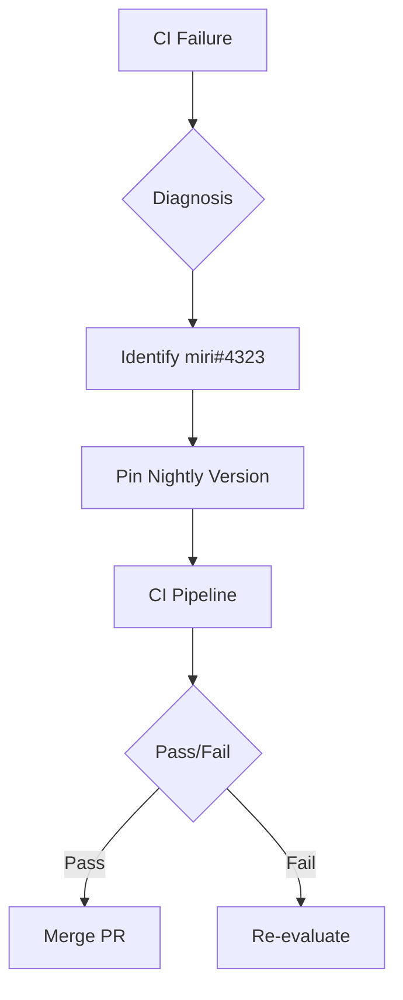

+++
title = "#19253 Pin nightly due to miri issue"
date = "2025-05-17T00:00:00"
draft = false
template = "pull_request_page.html"
in_search_index = false

[extra]
current_language = "zh-cn"
available_languages = {"en" = { name = "English", url = "/pull_request/bevy/2025-05/pr-19253-en-20250517" }, "zh-cn" = { name = "中文", url = "/pull_request/bevy/2025-05/pr-19253-zh-cn-20250517" }}
labels = ["C-Bug", "D-Trivial", "A-Build-System", "P-Critical"]
+++

# Pin nightly due to miri issue

## Basic Information
- **Title**: Pin nightly due to miri issue
- **PR Link**: https://github.com/bevyengine/bevy/pull/19253
- **Author**: NiklasEi
- **Status**: MERGED
- **Labels**: C-Bug, D-Trivial, A-Build-System, S-Ready-For-Final-Review, P-Critical
- **Created**: 2025-05-17T11:07:50Z
- **Merged**: 2025-05-17T11:41:08Z
- **Merged By**: mockersf

## Description Translation
### 目标
由于 rust-lang/miri#4323 导致必须的 miri 检查失败，暂时将 nightly 版本固定到前一天的版本以解除阻塞。

### 解决方案
- 将 nightly 工具链固定为 `nightly-2025-05-16`

### 测试验证
- 通过观察当前 PR 的 CI 流水线状态进行验证

## The Story of This Pull Request

### 问题背景与紧急处理
Bevy 引擎的持续集成（CI）流水线突然开始失败，根本原因是 Rust 的 miri 工具（用于检测未定义行为的检查工具）在最新 nightly 版本中出现回归问题（具体见 rust-lang/miri#4323）。由于 Bevy 的 CI 配置默认使用最新的 nightly 工具链（`nightly`），这个未预期的故障直接阻断了所有后续的代码提交。

### 临时解决方案的抉择
开发团队面临两个选择：
1. 等待上游修复并发布新的 nightly 版本
2. 暂时固定使用已知可用的旧版本

考虑到 CI 中断会严重影响开发进度，维护者 NiklasEi 选择方案二作为临时措施。通过将 `NIGHTLY_TOOLCHAIN` 环境变量从动态的 `nightly` 修改为具体的 `nightly-2025-05-16` 版本，可以立即恢复 CI 的正常运行。

### 技术实现细节
核心修改集中在 CI 配置文件，关键改动如下：

```yaml
# Before:
NIGHTLY_TOOLCHAIN: nightly

# After: 
NIGHTLY_TOOLCHAIN: nightly-2025-05-16 # pinned until a fix for https://github.com/rust-lang/miri/issues/4323 is released
```

这个环境变量控制着 CI 流水线中以下关键操作：
1. 使用指定版本的 Rust 工具链
2. 运行 cargo miri 进行未定义行为检查
3. 编译测试涉及 unsafe 代码的关键模块

### 工程实践考量
此修改体现了三个重要的工程实践原则：
1. **构建稳定性优先**：通过版本锁定确保可重复的构建结果
2. **问题可追溯性**：在代码注释中直接关联上游 issue，方便后续追踪
3. **最小化变更**：仅修改单个环境变量，将影响范围控制在最低限度

### 后续维护计划
尽管这是个临时修复，但维护者在注释中明确标注了问题跟踪链接。团队需要：
1. 监控 rust-lang/miri#4323 的解决进展
2. 在问题修复后及时解除版本锁定
3. 评估是否增加 nightly 版本的自动测试机制

## Visual Representation



## Key Files Changed

### `.github/workflows/ci.yml` (+1/-1)
**修改背景**：修复因上游工具链问题导致的 CI 中断

代码差异：
```diff
-  NIGHTLY_TOOLCHAIN: nightly
+  NIGHTLY_TOOLCHAIN: nightly-2025-05-16 # pinned until a fix for https://github.com/rust-lang/miri/issues/4323 is released
```

**技术意义**：
- 将动态的 nightly 工具链切换为具体日期版本
- 通过代码注释记录问题上下文
- 保持其他 CI 配置不变，最小化变更风险

## Further Reading
1. [Rustup 工具链管理文档](https://rust-lang.github.io/rustup/concepts/toolchains.html)
2. [Miri 用户指南](https://github.com/rust-lang/miri/blob/master/README.md)
3. [GitHub Actions 环境变量最佳实践](https://docs.github.com/en/actions/learn-github-actions/variables)

# Full Code Diff
```diff
diff --git a/.github/workflows/ci.yml b/.github/workflows/ci.yml
index 37db848558d6f..2a0610cf032a8 100644
--- a/.github/workflows/ci.yml
+++ b/.github/workflows/ci.yml
@@ -13,7 +13,7 @@ env:
   CARGO_PROFILE_TEST_DEBUG: 0
   CARGO_PROFILE_DEV_DEBUG: 0
   # If nightly is breaking CI, modify this variable to target a specific nightly version.
-  NIGHTLY_TOOLCHAIN: nightly
+  NIGHTLY_TOOLCHAIN: nightly-2025-05-16 # pinned until a fix for https://github.com/rust-lang/miri/issues/4323 is released
   RUSTFLAGS: "-D warnings"
   BINSTALL_VERSION: "v1.12.3"
 
```