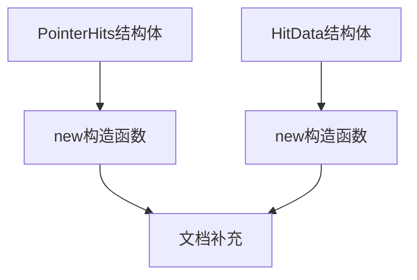

+++
title = "#19259 Add boilerplate docs for PointerHits::new and HitData::new"
date = "2025-05-19T00:00:00"
draft = false
template = "pull_request_page.html"
in_search_index = false

[extra]
current_language = "zh-cn"
available_languages = {"en" = { name = "English", url = "/pull_request/bevy/2025-05/pr-19259-en-20250519" }, "zh-cn" = { name = "中文", url = "/pull_request/bevy/2025-05/pr-19259-zh-cn-20250519" }}
+++

# Add boilerplate docs for PointerHits::new and HitData::new

## 基本信息
- **标题**: Add boilerplate docs for PointerHits::new and HitData::new
- **PR链接**: https://github.com/bevyengine/bevy/pull/19259
- **作者**: theotherphil
- **状态**: 已合并
- **标签**: C-Docs, D-Trivial, S-Ready-For-Final-Review, A-Picking
- **创建时间**: 2025-05-17T14:16:15Z
- **合并时间**: 2025-05-19T19:42:22Z
- **合并者**: alice-i-cecile

## 描述翻译
### 目标
为`bevy_picking`模块中最后两个缺失文档的函数添加文档说明。

### 解决方案
为`PointerHits::new()`和`HitData::new()`添加标准的"Constructs an X"模板文档。这种无额外信息的`new()`函数文档形式已在代码库多个位置使用，且经@alice-i-cecile确认这是合理方案——参数文档已包含在结构体字段的定义中。

## PR技术分析

### 问题背景与上下文
在Bevy引擎的picking模块中，`PointerHits`和`HitData`两个结构体的构造函数长期缺少文档注释。这种情况违反了项目的代码规范，也给开发者使用这些API带来困惑。虽然相关参数在结构体字段中已有文档，但构造函数本身的用途仍需明确说明。

### 解决方案与实现
PR采用最小化文档补充策略，为两个构造函数添加标准化的说明注释。这种模式在Bevy代码库中已有先例，符合项目维护者制定的文档规范。具体实现直接替换原有的`#[expect(missing_docs)]`属性为正式文档注释：

```rust
// 修改前
#[expect(missing_docs, reason = "Not all docs are written yet, see #3492.")]
pub fn new(...) -> Self {...}

// 修改后
/// Construct [`PointerHits`].
pub fn new(...) -> Self {...}
```

这种改动实现了：
1. 消除编译警告
2. 明确构造函数用途
3. 保持与现有代码风格一致

### 技术决策考量
选择简单模板文档而非详细说明的决策基于：
1. 参数文档已存在于结构体字段
2. 保持代码库文档风格统一
3. 避免冗余文档维护成本
4. 符合项目issue #3492的长期文档计划

### 影响与改进
- 提升API可发现性和易用性
- 完善模块文档覆盖率
- 为后续开发者提供明确的使用指引
- 消除编译时的文档缺失警告

## 关键文件变更
### `crates/bevy_picking/src/backend.rs`
**修改内容**：
```rust
// PointerHits构造函数的文档补充
- #[expect(missing_docs, reason = "Not all docs are written yet, see #3492.")]
+ /// Construct [`PointerHits`].
pub fn new(...)

// HitData构造函数的文档补充  
- #[expect(missing_docs, reason = "Not all docs are written yet, see #3492.")]
+ /// Construct a [`HitData`].
pub fn new(...)
```

**关联性**：
- 直接解决目标中提出的文档缺失问题
- 保持与现有文档风格的一致性
- 使用标准Rust文档注释语法

## 技术示意图


## 延伸阅读
- Rust文档注释规范：https://doc.rust-lang.org/rustdoc/how-to-write-documentation.html
- Bevy代码风格指南：https://github.com/bevyengine/bevy/blob/main/docs/CODE_STYLE.md
- 相关issue #3492：https://github.com/bevyengine/bevy/issues/3492

# 完整代码差异
```diff
diff --git a/crates/bevy_picking/src/backend.rs b/crates/bevy_picking/src/backend.rs
index 3758816ac98ab..9e28cc6d7c43e 100644
--- a/crates/bevy_picking/src/backend.rs
+++ b/crates/bevy_picking/src/backend.rs
@@ -84,7 +84,7 @@ pub struct PointerHits {
 }
 
 impl PointerHits {
-    #[expect(missing_docs, reason = "Not all docs are written yet, see #3492.")]
+    /// Construct [`PointerHits`].
     pub fn new(pointer: prelude::PointerId, picks: Vec<(Entity, HitData)>, order: f32) -> Self {
         Self {
             pointer,
@@ -114,7 +114,7 @@ pub struct HitData {
 }
 
 impl HitData {
-    #[expect(missing_docs, reason = "Not all docs are written yet, see #3492.")]
+    /// Construct a [`HitData`].
     pub fn new(camera: Entity, depth: f32, position: Option<Vec3>, normal: Option<Vec3>) -> Self {
         Self {
             camera,
```