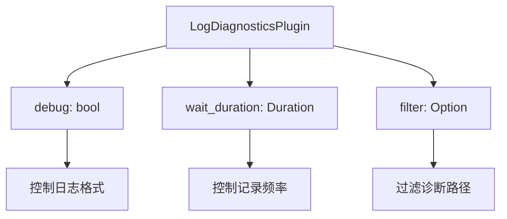

+++
title = "#19261 Add missing doc comments for log_diagnostics_plugin"
date = "2025-05-26T00:00:00"
draft = false
template = "pull_request_page.html"
in_search_index = false

[extra]
current_language = "zh-cn"
available_languages = {"en" = { name = "English", url = "/pull_request/bevy/2025-05/pr-19261-en-20250526" }, "zh-cn" = { name = "中文", url = "/pull_request/bevy/2025-05/pr-19261-zh-cn-20250526" }}
+++

# 为 log_diagnostics_plugin 添加缺失文档的 Pull Request 分析

## 基本信息
- **标题**: Add missing doc comments for log_diagnostics_plugin
- **PR链接**: https://github.com/bevyengine/bevy/pull/19261
- **作者**: theotherphil
- **状态**: 已合并
- **标签**: C-Docs, D-Trivial, S-Ready-For-Final-Review, A-Diagnostics
- **创建时间**: 2025-05-17T14:58:09Z
- **合并时间**: 2025-05-26T23:03:20Z
- **合并者**: alice-i-cecile

## 描述翻译
### 目标
补全 bevy_diagnostics 中缺失的部分文档

## PR 技术背景解析

### 问题定位与解决动机
在 Bevy 引擎的诊断模块中，`LogDiagnosticsPlugin` 作为核心的日志记录插件，其公共 API 的文档注释存在缺失。具体表现在：

1. `LogDiagnosticsPlugin` 结构体的字段缺乏文档说明
2. `filtered` 构造方法的用途未明确说明
3. 配置参数的默认值和行为描述不足

这对开发者使用和配置插件造成以下困难：
- 无法通过文档快速理解各配置参数的作用
- 不确定 `debug` 标志位的具体影响
- 难以正确使用过滤功能进行诊断日志定制

### 解决方案实施
PR 通过以下三个关键修改点来完善文档：

1. **结构体字段注释**：
```rust
pub struct LogDiagnosticsPlugin {
    /// 如果为 `true` 则记录每个 Diagnostic 的 Debug 表示
    /// 如果为 `false` 则记录（平滑后的）当前值和历史平均值
    ///
    /// 默认值：`false`
    pub debug: bool,
    /// 两次记录诊断信息之间的等待时间
    pub wait_duration: Duration,
    /// 如果为 `Some` 则只记录这些诊断路径
    pub filter: Option<HashSet<DiagnosticPath>>,
}
```
- 明确 `debug` 标志位的两种模式差异
- 标注 `debug` 参数的默认值
- 解释 `filter` 字段的过滤逻辑

2. **构造方法文档**：
```rust
impl LogDiagnosticsPlugin {
    /// 将日志记录限制在 `filter` 指定的路径范围内
    pub fn filtered(filter: HashSet<DiagnosticPath>) -> Self {
        // ...原有实现...
    }
}
```
- 明确方法用途为过滤特定诊断路径
- 说明参数类型和用途

3. **默认值说明**：
在 `debug` 字段的文档中特别标注默认值，这是 Rust 文档的最佳实践（C-Docs 标签体现此改进）

### 技术实现细节
- 使用 `///` 文档注释格式，符合 Rust 标准
- 保持现有代码结构不变，仅添加文档（D-Trivial 标签体现此特性）
- 参数说明遵循 Bevy 的文档规范（例如默认值标注方式）
- 字段文档顺序与结构体声明顺序保持一致，便于对照阅读

### 对代码库的影响
1. **可维护性提升**：
   - 新开发者无需深入代码即可理解插件配置
   - 自动生成的文档页面（通过 `cargo doc`）将包含完整参数说明

2. **API 使用优化**：
   ```rust
   // 使用示例：
   // 仅记录特定诊断路径
   LogDiagnosticsPlugin::filtered(hashset!{
       FrameTimeDiagnosticsPlugin::FPS,
       EntityCountDiagnosticsPlugin::ENTITY_COUNT
   });
   ```
   - 明确的文档使过滤功能更易正确使用

3. **配置行为透明化**：
   - `debug` 模式的两种日志格式差异得到明确说明
   - 时间间隔参数的单位（Duration）和过滤参数的类型（HashSet）在文档中显式标注

## 视觉表示



## 关键文件变更

### `crates/bevy_diagnostic/src/log_diagnostics_plugin.rs` (+7/-0)
```rust
// 修改前：
pub struct LogDiagnosticsPlugin {
    pub debug: bool,
    pub wait_duration: Duration,
    pub filter: Option<HashSet<DiagnosticPath>>,
}

impl LogDiagnosticsPlugin {
    pub fn filtered(filter: HashSet<DiagnosticPath>) -> Self {
        LogDiagnosticsPlugin {
            filter: Some(filter),
            wait_duration: DEFAULT_WAIT_DURATION,
            debug: false,
        }
    }
}

// 修改后：
pub struct LogDiagnosticsPlugin {
    /// 如果为 `true` 则记录每个 Diagnostic 的 Debug 表示...
    pub debug: bool,
    /// 两次记录诊断信息之间的等待时间
    pub wait_duration: Duration,
    /// 如果为 `Some` 则只记录这些诊断路径
    pub filter: Option<HashSet<DiagnosticPath>>,
}

impl LogDiagnosticsPlugin {
    /// 将日志记录限制在 `filter` 指定的路径范围内
    pub fn filtered(filter: HashSet<DiagnosticPath>) -> Self {
        LogDiagnosticsPlugin {
            filter: Some(filter),
            wait_duration: DEFAULT_WAIT_DURATION,
            debug: false,
        }
    }
}
```

## 延伸阅读
1. [Rust 文档注释规范](https://doc.rust-lang.org/rustdoc/how-to-write-documentation.html)
2. [Bevy 诊断系统设计文档](https://bevyengine.org/learn/book/development/diagnostics/)
3. [HashSet 在过滤中的应用示例](https://doc.rust-lang.org/std/collections/struct.HashSet.html)
4. [Duration 类型的使用指南](https://doc.rust-lang.org/std/time/struct.Duration.html)

## 完整代码差异
```diff
diff --git a/crates/bevy_diagnostic/src/log_diagnostics_plugin.rs b/crates/bevy_diagnostic/src/log_diagnostics_plugin.rs
index 8b01d10402fb2..d91c4235cc4cd 100644
--- a/crates/bevy_diagnostic/src/log_diagnostics_plugin.rs
+++ b/crates/bevy_diagnostic/src/log_diagnostics_plugin.rs
@@ -15,8 +15,14 @@ use log::{debug, info};
 ///
 /// When no diagnostics are provided, this plugin does nothing.
 pub struct LogDiagnosticsPlugin {
+    /// If `true` then the `Debug` representation of each `Diagnostic` is logged.
+    /// If `false` then a (smoothed) current value and historical average are logged.
+    ///
+    /// Defaults to `false`.
     pub debug: bool,
+    /// Time to wait between logging diagnostics and logging them again.
     pub wait_duration: Duration,
+    /// If `Some` then only these diagnostics are logged.
     pub filter: Option<HashSet<DiagnosticPath>>,
 }
 
@@ -107,6 +113,7 @@ impl Plugin for LogDiagnosticsPlugin {
 }
 
 impl LogDiagnosticsPlugin {
+    /// Filter logging to only the paths in `filter`.
     pub fn filtered(filter: HashSet<DiagnosticPath>) -> Self {
         LogDiagnosticsPlugin {
             filter: Some(filter),
```