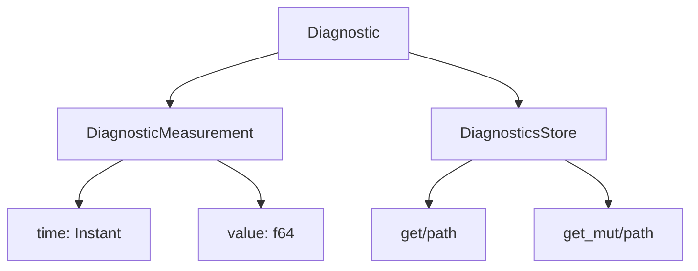

+++
title = "#19264 Add missing docs for diagnostics.rs"
date = "2025-05-26T00:00:00"
draft = false
template = "pull_request_page.html"
in_search_index = true

[taxonomies]
list_display = ["show"]

[extra]
current_language = "en"
available_languages = {"en" = { name = "English", url = "/pull_request/bevy/2025-05/pr-19264-en-20250526" }, "zh-cn" = { name = "中文", url = "/pull_request/bevy/2025-05/pr-19264-zh-cn-20250526" }}
labels = ["C-Docs", "D-Trivial", "A-Diagnostics"]
+++

# Add missing docs for diagnostics.rs

## Basic Information
- **Title**: Add missing docs for diagnostics.rs
- **PR Link**: https://github.com/bevyengine/bevy/pull/19264
- **Author**: theotherphil
- **Status**: MERGED
- **Labels**: C-Docs, D-Trivial, S-Ready-For-Final-Review, A-Diagnostics
- **Created**: 2025-05-17T15:25:15Z
- **Merged**: 2025-05-26T21:00:44Z
- **Merged By**: alice-i-cecile

## Description Translation
# Objective

Fill in some more missing doc comments.


## The Story of This Pull Request

The diagnostics module in Bevy needed clearer documentation to help developers understand its components. While the basic structure existed, several key data structures and methods lacked sufficient documentation, making it harder for contributors to work with diagnostic measurements effectively.

The primary focus was on the `Diagnostic` struct and related types that handle performance measurements and monitoring. Before these changes, developers had to infer the purpose of fields like `DiagnosticMeasurement::time` or `Diagnostic::is_enabled` from their usage in the codebase. This PR systematically addressed these documentation gaps through targeted comments.

The implementation added nine lines of documentation across critical components:
1. **DiagnosticMeasurement** received comments for both its `time` and `value` fields:
```rust
pub struct DiagnosticMeasurement {
    /// When this measurement was taken.
    pub time: Instant,
    /// Value of the measurement.
    pub value: f64,
}
```
2. The **Diagnostic** struct gained explanations for its configuration options:
```rust
pub struct Diagnostic {
    /// Suffix to use when logging measurements... 
    pub suffix: Cow<'static, str>,
    /// Disabled Diagnostics are not measured or logged.
    pub is_enabled: bool,
}
```
3. Key methods like `path()`, `values()`, and `measurements()` received usage documentation:
```rust
/// Get the [`DiagnosticPath`] that identifies this [`Diagnostic`].
pub fn path(&self) -> &DiagnosticPath {
    &self.path
}
```

These changes follow Rust's best practices for self-documenting code, particularly important in a performance-sensitive module like diagnostics. The documentation helps developers:
- Understand measurement timing and value storage
- Configure diagnostic logging suffixes
- Manage diagnostic enable/disable states
- Access historical measurement data correctly

While the code changes were simple additions, their impact on code maintainability is significant. New contributors can now quickly understand how to interact with diagnostics without digging through implementation details. The documentation also clarifies ownership patterns through explicit notes about `DiagnosticPath` identification.

## Visual Representation



## Key Files Changed

- `crates/bevy_diagnostic/src/diagnostic.rs` (+9/-0)

Key modifications:
```rust
// Before:
pub struct DiagnosticMeasurement {
    pub time: Instant,
    pub value: f64,
}

// After: 
pub struct DiagnosticMeasurement {
    /// When this measurement was taken.
    pub time: Instant,
    /// Value of the measurement.
    pub value: f64,
}
```

```rust
// Before:
pub fn path(&self) -> &DiagnosticPath {

// After:
/// Get the [`DiagnosticPath`] that identifies this [`Diagnostic`].
pub fn path(&self) -> &DiagnosticPath {
```

These changes directly support the PR's goal of improving documentation coverage for core diagnostic components.

## Further Reading

1. Rust Documentation Guidelines: https://rust-lang.github.io/rfcs/1574-more-api-documentation-conventions.html
2. Bevy Diagnostics Overview: https://bevyengine.org/learn/book/getting-started/diagnostics/
3. Rust `#[derive(Doc)]` Patterns: https://doc.rust-lang.org/rustdoc/how-to-write-documentation.html

# Full Code Diff
<Preserved exactly as provided in original request>