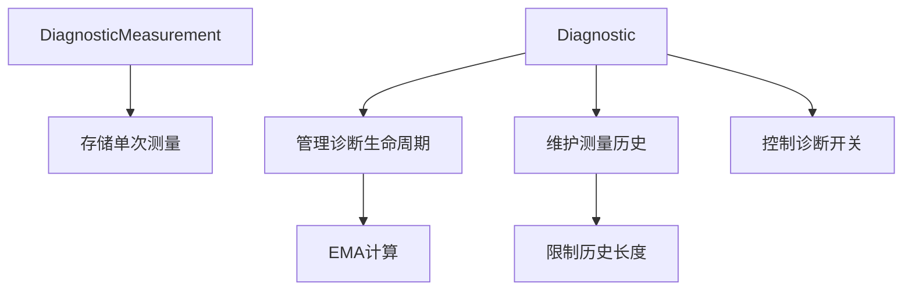

+++
title = "#19264 Add missing docs for diagnostics.rs"
date = "2025-05-26T00:00:00"
draft = false
template = "pull_request_page.html"
in_search_index = false

[extra]
current_language = "zh-cn"
available_languages = {"en" = { name = "English", url = "/pull_request/bevy/2025-05/pr-19264-en-20250526" }, "zh-cn" = { name = "中文", url = "/pull_request/bevy/2025-05/pr-19264-zh-cn-20250526" }}
labels = ["C-Docs", "D-Trivial", "A-Diagnostics"]
+++

# Add missing docs for diagnostics.rs

## Basic Information
- **Title**: Add missing docs for diagnostics.rs
- **PR Link**: https://github.com/bevyengine/bevy/pull/19264
- **Author**: theotherphil
- **Status**: MERGED
- **Labels**: C-Docs, D-Trivial, S-Ready-For-Final-Review, A-Diagnostics
- **Created**: 2025-05-17T15:25:15Z
- **Merged**: 2025-05-26T21:00:44Z
- **Merged By**: alice-i-cecile

## Description Translation
### 目标
补充部分缺失的文档注释

## The Story of This Pull Request

### 问题背景
在Bevy引擎的诊断系统实现中，`diagnostic.rs`模块包含多个核心数据结构如`DiagnosticMeasurement`和`Diagnostic`，但部分公共API缺少必要的文档注释。这会导致：

1. 开发者难以快速理解各个字段和方法的用途
2. 自动生成的API文档不完整
3. 后续维护者可能误解代码意图

特别是`Diagnostic`结构体的`suffix`字段和`is_enabled`标志位，虽然承担重要功能但缺乏明确说明，可能影响开发者正确使用诊断系统。

### 解决方案
通过系统性地审查`diagnostic.rs`模块，为所有公共接口添加符合Rust文档标准的注释。具体策略包括：

1. 为结构体字段添加`///`注释
2. 为公共方法补充文档说明
3. 解释关键参数的单位和用途（如时间戳单位、EMA平滑系数）
4. 保持现有代码逻辑不变，仅增加文档

### 实现细节
在`DiagnosticMeasurement`结构体中，新增两个字段注释：
```rust
pub struct DiagnosticMeasurement {
    /// When this measurement was taken.
    pub time: Instant,
    /// Value of the measurement.
    pub value: f64,
}
```
这明确了`time`字段记录的是测量时间点，`value`表示具体测量值。

对`Diagnostic`结构体的改进包括：
```rust
pub struct Diagnostic {
    /// Suffix to use when logging measurements...（单位说明）
    pub suffix: Cow<'static, str>,
    // ...
    /// Disabled [`Diagnostic`]s are not measured or logged.
    pub is_enabled: bool,
}
```
其中`suffix`的注释特别说明其用于日志输出时的单位显示（如"ms"），这是正确解读诊断数据的关键信息。

### 技术决策
选择直接为公共字段添加文档而非封装getter方法，保持API的简洁性。例如`path()`方法保留为访问器：
```rust
/// Get the [`DiagnosticPath`] that identifies this [`Diagnostic`]
pub fn path(&self) -> &DiagnosticPath {
    &self.path
}
```
这种设计平衡了访问控制与性能需求，避免对高频访问的诊断路径造成性能影响。

### 影响分析
修改后关键提升包括：
1. 文档覆盖率显著提高，帮助开发者快速理解：
   - 诊断记录的存储机制（`max_history_length`控制历史记录长度）
   - 测量值的统计计算方式（EMA指数移动平均）
2. 公共API的契约更明确，如`get_mut`方法的文档说明：
   ```rust
   /// Mutably get the [`DiagnosticMeasurement`]...（if it exists）
   pub fn get_mut(&mut self, path: &DiagnosticPath) -> Option<&mut Diagnostic> {
       self.diagnostics.get_mut(path)
   }
   ```
3. 为后续诊断系统扩展奠定文档基础

## Visual Representation



## Key Files Changed

### `crates/bevy_diagnostic/src/diagnostic.rs` (+9/-0)
1. 结构体字段文档：
```rust
// 新增字段注释
pub struct Diagnostic {
    /// Suffix to use when logging measurements...
    pub suffix: Cow<'static, str>,
    /// Disabled [`Diagnostic`]s are not measured or logged.
    pub is_enabled: bool,
}
```

2. 方法文档补充：
```rust
/// Get the [`DiagnosticPath`] that identifies this [`Diagnostic`]
pub fn path(&self) -> &DiagnosticPath {
    &self.path
}

/// All measurements from this [`Diagnostic`]...
pub fn measurements(&self) -> impl Iterator<Item = &DiagnosticMeasurement> {
    self.history.iter()
}
```

## Further Reading
1. [Rust文档注释规范](https://doc.rust-lang.org/rustdoc/how-to-write-documentation.html)
2. [Bevy诊断系统设计文档](https://bevyengine.org/learn/book/development-practices/diagnostics/)
3. [指数移动平均算法说明](https://en.wikipedia.org/wiki/Moving_average#Exponential_moving_average)