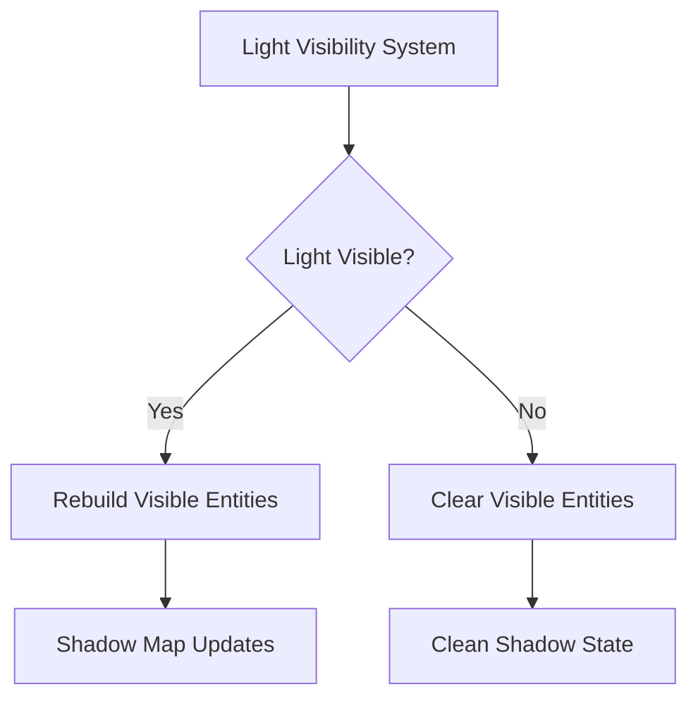

+++
title = "#19265 Fix point light shadow glitches"
date = "2025-05-18T00:00:00"
draft = false
template = "pull_request_page.html"
in_search_index = true

[taxonomies]
list_display = ["show"]

[extra]
current_language = "en"
available_languages = {"en" = { name = "English", url = "/pull_request/bevy/2025-05/pr-19265-en-20250518" }, "zh-cn" = { name = "中文", url = "/pull_request/bevy/2025-05/pr-19265-zh-cn-20250518" }}
labels = ["C-Bug", "A-Rendering"]
+++

# Fix point light shadow glitches

## Basic Information
- **Title**: Fix point light shadow glitches
- **PR Link**: https://github.com/bevyengine/bevy/pull/19265
- **Author**: eero-lehtinen
- **Status**: MERGED
- **Labels**: C-Bug, A-Rendering, S-Ready-For-Final-Review
- **Created**: 2025-05-17T17:31:10Z
- **Merged**: 2025-05-18T06:42:05Z
- **Merged By**: superdump

## Description Translation
The original description is already in English and is preserved exactly as-is.

## The Story of This Pull Request

### The Problem and Context
The PR addresses shadow rendering artifacts (#18945) caused by improper handling of visibility state changes in point/spot lights. When entities moved out of view, their render meshes were removed but remained in light visibility lists when the parent light source itself became invisible. This led to two key issues:

1. Stale entity references persisted across frames
2. Shadow phase cache maintained outdated mesh IDs
3. Invalid shadow map updates due to mismatched visibility states

The core problem stemmed from visibility tracking synchronization between entity visibility states and light source visibility states. When a light source left the view frustum, its associated visible entities weren't properly cleared, causing persistent shadow map corruption.

### The Solution Approach
The fix focuses on strict visibility state resetting for cubemapped lights each frame:

1. **Visibility List Reset**: Clear all visible entities for cubemapped lights at frame start
2. **Semantic Renaming**: Clarify variable purpose through `global_point_lights` → `global_visible_clusterable`
3. **Frame Synchronization**: Ensure visibility lists rebuild from scratch each frame

The approach prioritizes correctness over micro-optimizations, accepting a small per-frame cost to clear lists in exchange for guaranteed state consistency.

### The Implementation
Key changes in `light.rs`:

```rust
// Before: Single visibility resource
global_point_lights: Extract<Res<GlobalVisibleClusterableObjects>>,

// After: Expanded visibility tracking + reset mechanism
global_visible_clusterable: Extract<Res<GlobalVisibleClusterableObjects>>,
cubemap_visible_entities: Extract<Query<RenderEntity, With<CubemapVisibleEntities>>>,
```

Visibility reset implementation:
```rust
commands.try_insert_batch(
    cubemap_visible_entities
        .iter()
        .map(|render_entity| (render_entity, RenderCubemapVisibleEntities::default()))
        .collect::<Vec<_>>(),
);
```

This code clears previous visible entities by overwriting them with default (empty) states before rebuilding the visibility lists.

### Technical Insights
The solution leverages Bevy's ECS paradigm effectively:
1. **Batch Processing**: Uses `try_insert_batch` for efficient bulk updates
2. **Phase Ordering**: Executes reset before visibility list reconstruction
3. **Data-Oriented Design**: Treats visibility state as data to be refreshed rather than mutated

The `RenderCubemapVisibleEntities::default()` call ensures a clean slate while maintaining component presence for query filtering.

### The Impact
- Eliminates persistent shadow artifacts from stale visibility data
- Maintains shadow map integrity across complex visibility transitions
- Adds ~O(n) operation for cubemap entity count, but with minimal overhead due to batch processing

## Visual Representation



## Key Files Changed

### `crates/bevy_pbr/src/render/light.rs`
**Changes:**
1. Added cubemap visibility reset logic
2. Renamed resource for clarity
3. Updated iteration logic to use renamed resource

**Code Snippets:**
Before:
```rust
for entity in global_point_lights.iter().copied() {
```

After:
```rust
// Clear visible entities
commands.try_insert_batch(...);

// Process current visibility
for entity in global_visible_clusterable.iter().copied() {
```

**Relation to PR:**
- Directly implements the visibility reset mechanism
- Ensures only currently valid entities process each frame

## Further Reading
- Bevy ECS Documentation: https://bevyengine.org/learn/book/ecs-intro/
- Shadow Mapping Techniques: https://learnopengl.com/Advanced-Lighting/Shadows/Shadow-Mapping
- Visibility Culling Strategies: https://developer.nvidia.com/gpugems/gpugems3/part-i-geometry/chapter-6-gpu-based-scene-management-and-rendering