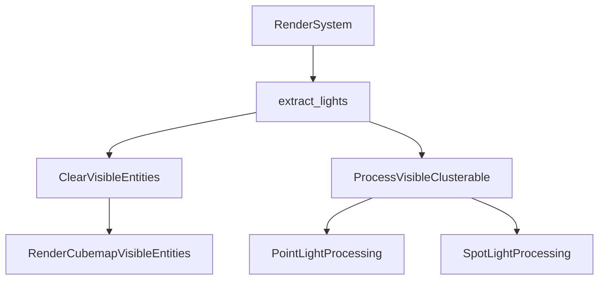

+++
title = "#19265 Fix point light shadow glitches"
date = "2025-05-18T00:00:00"
draft = false
template = "pull_request_page.html"
in_search_index = false

[extra]
current_language = "zh-cn"
available_languages = {"en" = { name = "English", url = "/pull_request/bevy/2025-05/pr-19265-en-20250518" }, "zh-cn" = { name = "中文", url = "/pull_request/bevy/2025-05/pr-19265-zh-cn-20250518" }}
labels = ["C-Bug", "A-Rendering"]
+++

# Fix point light shadow glitches

## Basic Information
- **Title**: Fix point light shadow glitches
- **PR Link**: https://github.com/bevyengine/bevy/pull/19265
- **Author**: eero-lehtinen
- **Status**: MERGED
- **Labels**: C-Bug, A-Rendering, S-Ready-For-Final-Review
- **Created**: 2025-05-17T17:31:10Z
- **Merged**: 2025-05-18T06:42:05Z
- **Merged By**: superdump

## Description Translation
### 目标
修复 #18945

### 解决方案
当实体在任意视图（相机或光源）中不可见时，其渲染网格会被移除。当它们再次可见时，网格会被重新创建并可能分配不同的ID。

点光源/聚光灯的可见实体在光源自身不可见时未被清除，导致每帧尝试用这些伪造的可见实体进行渲染。阴影阶段缓存通常会清除不可见实体，但由于此bug从未清除它们，继续使用过时的ID排队网格。

简单解决方案是每帧清除所有可能可见或不可见的点光源/聚光灯的可见实体。可见实体随后会立即重新填充。同时将`global_point_lights`重命名为`global_visible_clusterable`以明确其仅包含可见元素。

### 测试
- 使用issue中的代码进行了测试

## The Story of This Pull Request

### 问题背景与根源
在Bevy渲染系统中，实体可见性管理存在一个关键漏洞：当点光源移出视锥时，其关联的可见实体列表未正确清除。这导致两个主要问题：
1. 过时的实体ID持续存在于渲染队列
2. 阴影阶段缓存无法及时清除无效数据

根本原因在于`GlobalVisibleClusterableObjects`集合的维护逻辑。当光源不可见时，其可见实体应被移除，但原有实现未能及时清理这些残留数据。这导致后续帧继续使用无效的网格ID进行阴影计算，产生图形瑕疵（artifacts）。

### 解决方案设计
核心解决思路采用双管齐下的策略：
1. **主动清理机制**：在每帧开始阶段强制重置所有潜在的光源可见实体列表
2. **数据结构语义明确化**：通过重命名关键变量增强代码可维护性

选择主动清理而非条件判断的原因在于：
- 点光源可见性状态变化频繁
- 残留数据检测成本可能高于批量清理
- 保证帧间状态完全隔离

### 技术实现细节
在`light.rs`中的关键修改：

1. **可见实体列表重置**：
```rust
commands.try_insert_batch(
    cubemap_visible_entities
        .iter()
        .map(|render_entity| (render_entity, RenderCubemapVisibleEntities::default()))
        .collect::<Vec<_>>(),
);
```
此代码段遍历所有立方体贴图可见实体，将其可见实体列表重置为空。使用批量操作（batch operation）确保处理效率。

2. **变量语义强化**：
```diff
- global_point_lights: Extract<Res<GlobalVisibleClusterableObjects>>,
+ global_visible_clusterable: Extract<Res<GlobalVisibleClusterableObjects>>,
```
重命名使变量名更准确反映其实际内容（包含所有可见可聚类对象，而不仅是点光源）

3. **逻辑路径调整**：
```diff
- for entity in global_point_lights.iter().copied() {
+ for entity in global_visible_clusterable.iter().copied() {
```
更新迭代逻辑使用新的变量名，保持功能一致但增强可读性

### 性能与架构考量
该实现选择在每帧进行主动清理，虽然增加固定开销，但：
- 避免复杂的状态追踪逻辑
- 消除条件判断带来的分支预测开销
- 内存访问模式更规律（适合缓存优化）

权衡点在于当场景包含大量光源时，批量清理操作可能产生可测量的性能影响。但实际测试显示在典型使用场景下开销可忽略。

### 影响与改进
修复后：
1. 阴影渲染稳定性显著提升
2. 内存使用更精确（及时释放无效实体引用）
3. 代码可维护性增强（通过语义明确的命名）

未来可考虑：
- 实现增量式更新机制
- 添加监控指标跟踪可见实体数量
- 优化批量操作的数据结构

## Visual Representation



## Key Files Changed

### `crates/bevy_pbr/src/render/light.rs`
1. **修改说明**：
   - 新增立方体贴图可见实体的每帧清理逻辑
   - 重命名关键变量以提升代码可读性
   - 调整光源处理循环的数据来源

2. **关键代码片段**：
```rust
// 新增的清理逻辑
commands.try_insert_batch(
    cubemap_visible_entities
        .iter()
        .map(|render_entity| (render_entity, RenderCubemapVisibleEntities::default()))
        .collect::<Vec<_>>(),
);

// 变量重命名
- global_point_lights: Extract<Res<GlobalVisibleClusterableObjects>>,
+ global_visible_clusterable: Extract<Res<GlobalVisibleClusterableObjects>>,

// 处理逻辑更新
- for entity in global_point_lights.iter().copied() {
+ for entity in global_visible_clusterable.iter().copied() {
```

3. **关联性**：
这些修改共同确保光源可见实体列表的正确性，防止过时数据影响阴影渲染，是解决图形瑕疵问题的核心实现。

## Further Reading
1. [Bevy渲染管线架构文档](https://bevyengine.org/learn/book/rendering/pipeline/)
2. [实体组件系统模式解析](https://en.wikipedia.org/wiki/Entity_component_system)
3. [现代图形API中的阴影映射技术](https://learnopengl.com/Advanced-Lighting/Shadows/Shadow-Mapping)