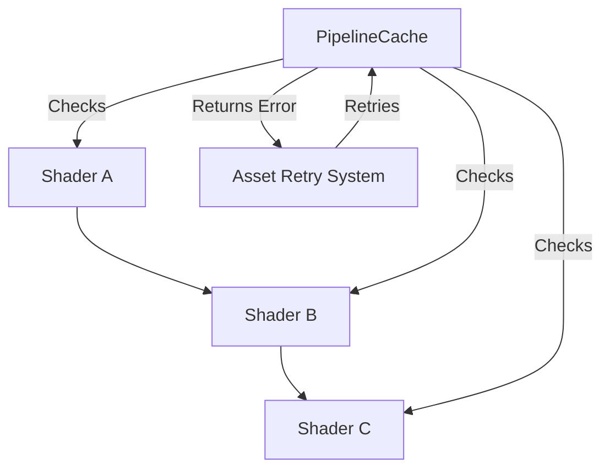

+++
title = "#19266 Fixing Transitive Shader Import Reliability in WebGL Context"
date = "2025-05-17T00:00:00"
draft = false
template = "pull_request_page.html"
in_search_index = true

[taxonomies]
list_display = ["show"]

[extra]
current_language = "en"
available_languages = {"en" = { name = "English", url = "/pull_request/bevy/2025-05/pr-19266-en-20250517" }, "zh-cn" = { name = "中文", url = "/pull_request/bevy/2025-05/pr-19266-zh-cn-20250517" }}
labels = ["C-Bug", "A-Rendering"]
+++

# Title: Fixing Transitive Shader Import Reliability in WebGL Context

## Basic Information
- **Title**: fix(render): transitive shader imports now work consistently on web
- **PR Link**: https://github.com/bevyengine/bevy/pull/19266
- **Author**: atlv24
- **Status**: MERGED
- **Labels**: C-Bug, A-Rendering, S-Needs-Review
- **Created**: 2025-05-17T18:39:04Z
- **Merged**: 2025-05-17T19:24:10Z
- **Merged By**: superdump

## Description Translation
The original description is in English and preserved as-is:

# Objective

- Transitive shader imports sometimes fail to load silently and return Ok
- Fixes #19226

## Solution

- Don't return Ok, return the appropriate error code which will retry the load later when the dependencies load

## Testing

- `bevy run --example=3d_scene web --open`

Note: this was theoretically a problem before the hot reloading PR, but probably extremely unlikely to occur.

## The Story of This Pull Request

### The Problem and Context
The rendering system faced intermittent failures with transitive shader imports in WebGL environments. When Shader A imported Shader B which in turn imported Shader C, the system would sometimes return Ok() prematurely if intermediate dependencies weren't fully loaded. This silent failure pattern (#19226) led to incomplete shader compilation with no error feedback, particularly problematic for web targets where asset loading is asynchronous.

### The Solution Approach
The core insight recognized that existing error handling didn't properly account for dependency chains in shader processing. Rather than allowing partial success states, the fix introduces explicit error propagation when dependencies are missing. This leverages Bevy's existing retry mechanism for asset loading by triggering PipelineCacheError::ShaderImportNotYetAvailable when unresolved dependencies are detected.

### The Implementation
The critical changes occur in pipeline_cache.rs where shader module composition is managed:

```rust
// Before: Silent continuation on missing dependencies
if let Some(shader) = self.processed_shaders.get(shader) {
    composer.add_composable_module(shader.into())?;
}

// After: Explicit error propagation
if let Some(shader) = self.processed_shaders.get(shader) {
    composer.add_composable_module(shader.into())?;
} else {
    Err(PipelineCacheError::ShaderImportNotYetAvailable)?;
}
```

This pattern repeats for both primary and secondary dependency checks. The implementation ensures:
1. Immediate error return when any shader in the dependency chain isn't ready
2. Proper triggering of Bevy's asset retry mechanism
3. Clear error state communication through established PipelineCacheError types

### Technical Insights
The fix demonstrates effective use of error-driven control flow in asynchronous systems. Key technical points:

1. **Asset Loading State Management**: By refusing to return Ok() for incomplete states, the system maintains valid dependency chains
2. **Error Propagation Patterns**: Reusing existing PipelineCacheError variants maintains API consistency
3. **WebGL Considerations**: Addresses browser environment constraints where synchronous asset loading isn't guaranteed

### The Impact
This change directly improves:
1. **Reliability**: Prevents silent failures in complex shader dependency chains
2. **Debugging**: Failing fast surfaces issues earlier in the loading process
3. **Cross-Platform Consistency**: Aligns web shader loading behavior with native targets

The solution maintains backward compatibility while fixing a subtle edge case in dependency resolution. Engineers working with complex shader setups can now rely on the system to properly handle transitive dependencies.

## Visual Representation



## Key Files Changed

### `crates/bevy_render/src/render_resource/pipeline_cache.rs`
**Modification Purpose**: Fix error handling in shader dependency resolution

**Key Changes**:
```rust
// Before: Missing error handling for unprocessed shaders
composer.add_composable_module(shader.into())?;

// After: Explicit error propagation
} else {
    Err(PipelineCacheError::ShaderImportNotYetAvailable)?;
}
}
+            } else {
+                Err(PipelineCacheError::ShaderImportNotYetAvailable)?;
+            }
```

**Relation to PR**: These changes implement the core error propagation logic that ensures incomplete shader dependencies trigger proper retry behavior.

## Further Reading
1. [Bevy Asset System Documentation](https://bevyengine.org/learn/book/assets/)
2. [WGSL Shader Composition Patterns](https://gpuweb.github.io/gpuweb/wgsl/#imports)
3. [WebGL Asset Loading Considerations](https://developer.mozilla.org/en-US/docs/Web/API/WebGL_API/WebGL_best_practices#shader_management)