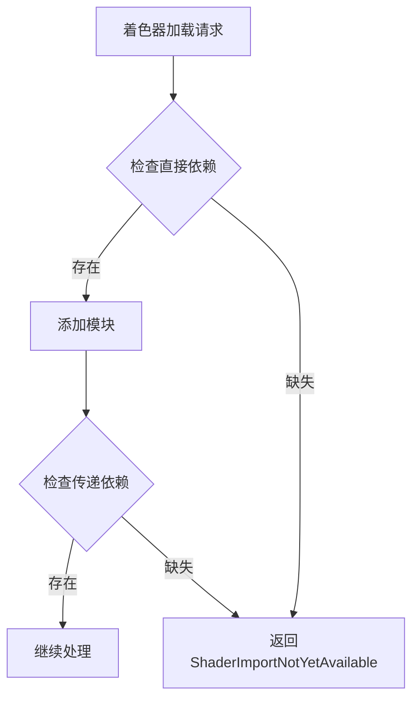

+++
title = "#19266 fix(render): transitive shader imports now work consistently on web"
date = "2025-05-17T00:00:00"
draft = false
template = "pull_request_page.html"
in_search_index = false

[extra]
current_language = "zh-cn"
available_languages = {"en" = { name = "English", url = "/pull_request/bevy/2025-05/pr-19266-en-20250517" }, "zh-cn" = { name = "中文", url = "/pull_request/bevy/2025-05/pr-19266-zh-cn-20250517" }}
+++

# 修复渲染器中的着色器传递导入问题

## 基本信息
- **标题**: fix(render): transitive shader imports now work consistently on web
- **PR链接**: https://github.com/bevyengine/bevy/pull/19266
- **作者**: atlv24
- **状态**: 已合并
- **标签**: C-Bug, A-Rendering, S-Needs-Review
- **创建时间**: 2025-05-17T18:39:04Z
- **合并时间**: 2025-05-17T19:24:10Z
- **合并者**: superdump

## 问题描述翻译

### 目标
- 修复传递性着色器导入（transitive shader imports）有时会静默加载失败并返回 Ok 状态的问题
- 修复 #19226

### 解决方案
- 不再返回 Ok，而是返回适当的错误代码，在依赖项加载完成后重试加载

### 测试方法
- `bevy run --example=3d_scene web --open`

注：在热重载（hot reloading）PR 之前理论上也存在此问题，但实际发生概率极低

## PR技术分析

### 问题背景
在 Web 平台使用 Bevy 渲染时，当着色器存在传递性依赖（例如 Shader A 依赖 Shader B，而 Shader B 又依赖 Shader C），系统可能无法正确识别完整的依赖链。当中间依赖项尚未加载完成时，上层着色器会错误地返回加载成功状态（Ok），导致渲染异常。这个问题在异步加载环境（如 Web）中尤为明显。

### 解决方案设计
核心思路是改进错误处理机制，确保在依赖项未就绪时触发正确的重试逻辑。原代码在检查依赖时存在两个缺陷：
1. 未正确处理直接依赖缺失的情况
2. 未处理传递性依赖链中中间节点的缺失

### 实现细节
在 `pipeline_cache.rs` 文件中，关键修改位于着色器模块组合阶段：

```rust
// 修改前代码逻辑
if let Some(shader) = shaders.get(handle) {
    // 处理存在的情况
} 
// 缺少else处理

// 修改后代码
if let Some(shader) = shaders.get(handle) {
    composer.add_composable_module(shader.into())?;
} else {
    Err(PipelineCacheError::ShaderImportNotYetAvailable)?; // 新增错误返回
}

// 新增第二个错误检查点
} else {
    Err(PipelineCacheCacheError::ShaderImportNotYetAvailable)?;
}
```

主要改动点：
1. 在直接依赖缺失时（第一个else分支），立即返回ShaderImportNotYetAvailable错误
2. 新增对依赖树中间节点缺失的检查（第二个else分支），确保传递性依赖链完整

### 技术影响
1. **错误处理改进**：将静默失败转换为显式错误，触发Bevy的资源重试机制
2. **依赖追踪完善**：确保着色器依赖图的完整性检查，包括传递性依赖
3. **平台兼容性增强**：特别解决Web平台由于异步加载特性导致的竞态条件问题

### 性能考量
该修改仅在资源加载阶段增加错误判断，不影响运行时渲染性能。错误重试机制基于Bevy现有的资源加载系统，具有可控的重试频率。

## 可视化关系图



## 关键文件变更

### `crates/bevy_render/src/render_resource/pipeline_cache.rs` (+4/-0)
1. **修改原因**：修复着色器传递依赖检查逻辑漏洞
2. **代码片段**：
```rust
// 修改后关键代码段
                    composer.add_composable_module(shader.into())?;
+                } else {
+                    Err(PipelineCacheError::ShaderImportNotYetAvailable)?;
                 }
+            } else {
+                Err(PipelineCacheError::ShaderImportNotYetAvailable)?;
             }
```
3. **关联性**：这两个新增的错误返回点确保在依赖链的任何环节缺失时终止当前加载流程，是修复传递性依赖问题的核心实现

## 延伸阅读
1. [Bevy 资源加载系统文档](https://docs.rs/bevy/latest/bevy/asset/trait.AssetServer.html)
2. [WGSL 着色器规范](https://www.w3.org/TR/WGSL/)
3. [Rust 错误处理最佳实践](https://doc.rust-lang.org/book/ch09-00-error-handling.html)