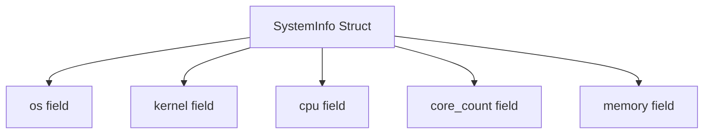

+++
title = "#19267 Add missing doc comments to system_information_diagnostics_plugin"
date = "2025-05-26T00:00:00"
draft = false
template = "pull_request_page.html"
in_search_index = true

[taxonomies]
list_display = ["show"]

[extra]
current_language = "en"
available_languages = {"en" = { name = "English", url = "/pull_request/bevy/2025-05/pr-19267-en-20250526" }, "zh-cn" = { name = "中文", url = "/pull_request/bevy/2025-05/pr-19267-zh-cn-20250526" }}
labels = ["C-Docs", "D-Trivial", "A-Diagnostics"]
+++

# Add missing doc comments to system_information_diagnostics_plugin

## Basic Information
- **Title**: Add missing doc comments to system_information_diagnostics_plugin
- **PR Link**: https://github.com/bevyengine/bevy/pull/19267
- **Author**: theotherphil
- **Status**: MERGED
- **Labels**: C-Docs, D-Trivial, S-Ready-For-Final-Review, A-Diagnostics
- **Created**: 2025-05-17T18:42:01Z
- **Merged**: 2025-05-26T20:23:16Z
- **Merged By**: alice-i-cecile

## Description Translation
# Objective

More trivial doc comments towards being able to deny missing docs across the board.

## The Story of This Pull Request

The PR addresses a straightforward but important documentation gap in Bevy's diagnostics system. The core issue was missing documentation comments for fields in the `SystemInfo` resource within the `system_information_diagnostics_plugin`. While the struct itself had some existing documentation, its individual fields lacked explicit explanations, making it harder for developers to understand their purpose at a glance.

The solution focused on adding precise doc comments to each field in the `SystemInfo` struct. This approach follows Rust's best practices for documenting public API elements, particularly important for a game engine's diagnostic utilities that might be used by developers at various experience levels. The changes are minimal but significant for code clarity and maintainability.

Key technical considerations included:
1. Maintaining consistency with existing documentation style
2. Providing clear, concise explanations of each field's purpose
3. Ensuring compatibility with potential future documentation linter rules

The implementation added five doc comments using Rust's `///` syntax. Each comment directly describes the corresponding field's contents:

```rust
/// OS name and version.
pub os: String,
/// System kernel version.
pub kernel: String,
/// CPU model name.
pub cpu: String,
/// Physical core count.
pub core_count: String,
/// System RAM.
pub memory: String,
```

These changes improve the codebase by:
1. Enabling better IDE tooltip documentation
2. Supporting generated API documentation
3. Moving closer to enforcing complete documentation coverage through compiler warnings

The PR represents a incremental step in Bevy's ongoing effort to improve documentation quality. While simple in execution, it demonstrates the project's commitment to maintainability and developer experience through consistent documentation practices.

## Visual Representation



## Key Files Changed

### crates/bevy_diagnostic/src/system_information_diagnostics_plugin.rs (+5/-0)
**Purpose**: Add documentation comments to all fields of the SystemInfo resource

**Code Changes**:
```rust
// Before:
#[derive(Debug, Resource)]
pub struct SystemInfo {
    pub os: String,
    pub kernel: String,
    pub cpu: String,
    pub core_count: String,
    pub memory: String,
}

// After:
#[derive(Debug, Resource)]
pub struct SystemInfo {
    /// OS name and version.
    pub os: String,
    /// System kernel version.
    pub kernel: String,
    /// CPU model name.
    pub cpu: String,
    /// Physical core count.
    pub core_count: String,
    /// System RAM.
    pub memory: String,
}
```

**Impact**: 
- Documents critical fields used in system diagnostics
- Enables future enforcement of documentation requirements
- Improves API discoverability through generated docs

## Further Reading
1. [Rust Documentation Guidelines](https://rust-lang.github.io/api-guidelines/documentation.html)
2. [Bevy's Contributing Documentation](https://github.com/bevyengine/bevy/blob/main/CONTRIBUTING.md)
3. [Rustdoc Book](https://doc.rust-lang.org/rustdoc/index.html)

# Full Code Diff
```diff
diff --git a/crates/bevy_diagnostic/src/system_information_diagnostics_plugin.rs b/crates/bevy_diagnostic/src/system_information_diagnostics_plugin.rs
index 376a109ae3bbf..768bbb0828844 100644
--- a/crates/bevy_diagnostic/src/system_information_diagnostics_plugin.rs
+++ b/crates/bevy_diagnostic/src/system_information_diagnostics_plugin.rs
@@ -46,10 +46,15 @@ impl SystemInformationDiagnosticsPlugin {
 /// [`SystemInformationDiagnosticsPlugin`] for more information.
 #[derive(Debug, Resource)]
 pub struct SystemInfo {
+    /// OS name and version.
     pub os: String,
+    /// System kernel version.
     pub kernel: String,
+    /// CPU model name.
     pub cpu: String,
+    /// Physical core count.
     pub core_count: String,
+    /// System RAM.
     pub memory: String,
 }
 
 impl Default for SystemInfo {
```