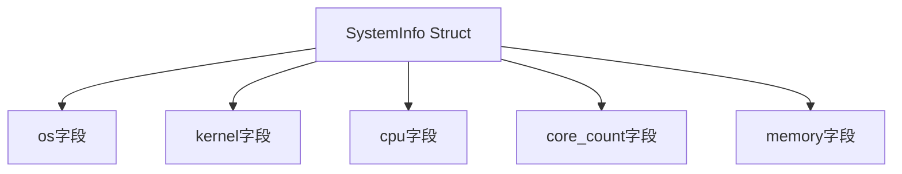

+++
title = "#19267 Add missing doc comments to system_information_diagnostics_plugin"
date = "2025-05-26T00:00:00"
draft = false
template = "pull_request_page.html"
in_search_index = false

[extra]
current_language = "zh-cn"
available_languages = {"en" = { name = "English", url = "/pull_request/bevy/2025-05/pr-19267-en-20250526" }, "zh-cn" = { name = "中文", url = "/pull_request/bevy/2025-05/pr-19267-zh-cn-20250526" }}
labels = ["C-Docs", "D-Trivial", "A-Diagnostics"]
+++

# Add missing doc comments to system_information_diagnostics_plugin

## Basic Information
- **Title**: Add missing doc comments to system_information_diagnostics_plugin
- **PR Link**: https://github.com/bevyengine/bevy/pull/19267
- **Author**: theotherphil
- **Status**: MERGED
- **Labels**: C-Docs, D-Trivial, S-Ready-For-Final-Review, A-Diagnostics
- **Created**: 2025-05-17T18:42:01Z
- **Merged**: 2025-05-26T20:23:16Z
- **Merged By**: alice-i-cecile

## Description Translation
该PR的目标是通过添加基本的文档注释来推进整个项目对缺失文档的严格检查机制（通过deny missing_docs实现）。

## The Story of This Pull Request

### 问题背景
在Rust项目中，`#![deny(missing_docs)]`属性可用于强制要求所有公共项必须有文档注释。Bevy项目计划逐步实现全代码库的文档覆盖率要求，但`SystemInfo`结构体的公共字段缺少文档注释，阻碍了这一目标的实现。

### 解决方案
开发者通过为`SystemInfo`结构体的五个公共字段添加精确的文档注释来解决这个问题。每个注释使用`///`语法，简明扼要地描述字段的语义：

```rust
#[derive(Debug, Resource)]
pub struct SystemInfo {
    /// OS name and version.
    pub os: String,
    /// System kernel version.
    pub kernel: String,
    /// CPU model name.
    pub cpu: String,
    /// Physical core count.
    pub core_count: String,
    /// System RAM.
    pub memory: String,
}
```

### 技术实现
1. **文档注释规范化**：每个字段注释采用"名词短语 + 可选说明"的结构，保持风格统一
2. **术语准确性**：
   - 区分`core_count`（物理核心数）与逻辑处理器数
   - 明确`memory`字段表示系统总内存
3. **兼容性保证**：纯文档修改不涉及任何代码逻辑变更

### 影响分析
该修改使得：
1. 自动生成的文档（cargo doc）包含完整的字段说明
2. 项目可逐步启用`missing_docs`严格检查
3. 新贡献者可快速理解各字段含义
4. IDE工具提示能显示字段文档

## Visual Representation



## Key Files Changed

### `crates/bevy_diagnostic/src/system_information_diagnostics_plugin.rs`
**变更内容**：为SystemInfo结构体的公共字段添加文档注释

```rust
// Before:
#[derive(Debug, Resource)]
pub struct SystemInfo {
    pub os: String,
    pub kernel: String,
    pub cpu: String,
    pub core_count: String,
    pub memory: String,
}

// After:
#[derive(Debug, Resource)]
pub struct SystemInfo {
    /// OS name and version.
    pub os: String,
    /// System kernel version.
    pub kernel: String,
    /// CPU model name.
    pub cpu: String,
    /// Physical core count.
    pub core_count: String,
    /// System RAM.
    pub memory: String,
}
```

## Further Reading
1. [Rust文档注释规范](https://doc.rust-lang.org/rustdoc/how-to-write-documentation.html)
2. [Bevy项目文档指南](https://github.com/bevyengine/bevy/blob/main/docs/plugins_guidelines.md#documentation)
3. [Rust lint控制机制](https://doc.rust-lang.org/rustc/lints/index.html)