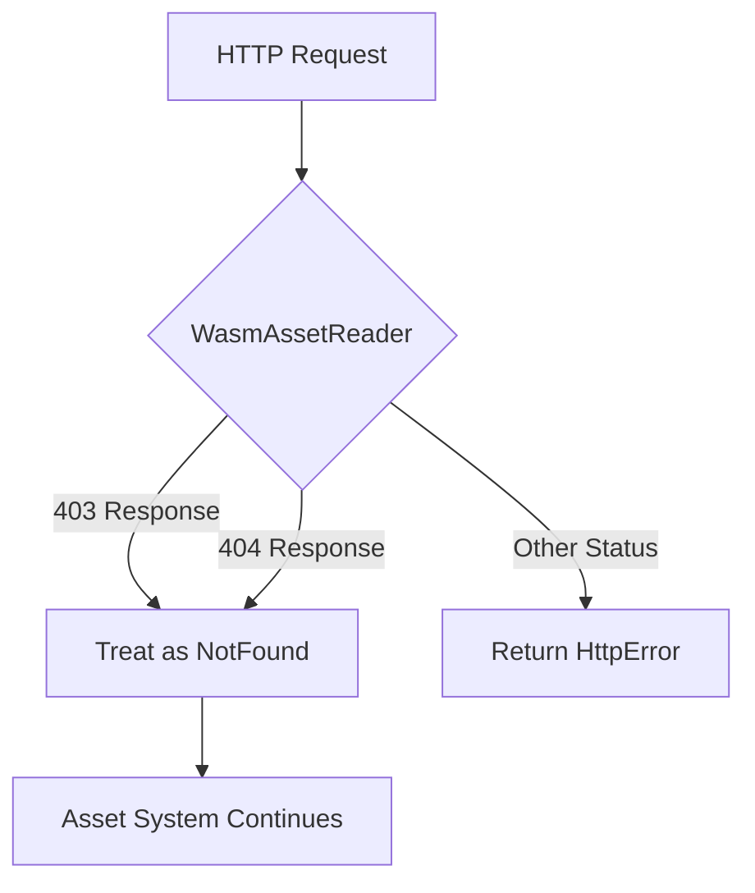

+++
title = "#19268 Fix missing meta files breaking Bevy on itch"
date = "2025-05-30T00:00:00"
draft = false
template = "pull_request_page.html"
in_search_index = true

[taxonomies]
list_display = ["show"]

[extra]
current_language = "en"
available_languages = {"en" = { name = "English", url = "/pull_request/bevy/2025-05/pr-19268-en-20250530" }, "zh-cn" = { name = "中文", url = "/pull_request/bevy/2025-05/pr-19268-zh-cn-20250530" }}
labels = ["C-Bug", "A-Assets", "O-Web"]
+++

## Fix missing meta files breaking Bevy on itch

### Basic Information
- **Title**: Fix missing meta files breaking Bevy on itch
- **PR Link**: https://github.com/bevyengine/bevy/pull/19268
- **Author**: rparrett
- **Status**: MERGED
- **Labels**: C-Bug, A-Assets, O-Web, S-Ready-For-Final-Review
- **Created**: 2025-05-17T19:41:39Z
- **Merged**: 2025-05-30T20:58:15Z
- **Merged By**: mockersf

### Description Translation
# Objective

Fixes #19029 (also maybe sorta #18002, but we may want to handle the SPA issue I outlined there more gracefully?)

## Solution

The most minimal / surgical approach I could think of, hopefully cherry-pickable for a point release.

It seems that it's not *entirely* crazy for web services to return 403 for an item that was not found. Here's an example from [Amazon CloudFront docs](https://docs.aws.amazon.com/AmazonCloudFront/latest/DeveloperGuide/http-403-permission-denied.html#s3-origin-403-error). If it is somewhat common for web services to behave this way, then I think it's best to also treat these responses as if they were "not found."

I was previously of the opinion that any 400 level error "might as well" get this treatment, but I'm now thinking that's probably overkill and there are quite a few 400 level statuses that would indicate some problem that needs to be fixed, and interpreting these as "not found" might add confusion to the debugging process.

## Testing

Tested this with a web server that returns 403 for requests to meta files.

```bash
cargo run -p build-wasm-example -- --api webgl2 sprite && \
open "http://localhost:4000" && \
python3 test_403.py examples/wasm
```
`test_403.py`:
```python
from http.server import HTTPServer, SimpleHTTPRequestHandler
import os
import sys

class CustomHandler(SimpleHTTPRequestHandler):
    def do_GET(self):
        if self.path.endswith(".meta"):
            self.send_response(403)
            self.send_header("Content-type", "text/plain")
            self.end_headers()
            self.wfile.write(b"403 Forbidden: Testing.\n")
        else:
            super().do_GET()

if __name__ == "__main__":
    if len(sys.argv) != 2:
        print(f"Usage: {sys.argv[0]} <directory>")
        sys.exit(1)
        
    os.chdir(sys.argv[1])
    
    server_address = ("", 4000)
    httpd = HTTPServer(server_address, CustomHandler)
    httpd.serve_forever()
```

### The Story of This Pull Request

#### The Problem and Context
Bevy applications deployed to itch.io were failing to load due to a specific behavior in itch's CDN. When assets were missing - particularly `.meta` files - itch's CDN returned HTTP 403 (Forbidden) responses instead of the standard 404 (Not Found). This behavior conflicted with Bevy's web asset loader, which only treated 404 errors as missing assets. The 403 responses were being interpreted as hard errors, causing asset loading to fail completely and breaking application startup.

This issue was especially problematic because `.meta` files are optional in many Bevy workflows. Developers shouldn't need to include them in production builds, but the CDN behavior made their absence fatal. The problem was documented in issue #19029, where users reported their games failing to load on itch.io despite working correctly locally.

#### The Solution Approach
The developer considered several approaches:
1. Treat all 400-level status codes as missing assets
2. Make the status code handling configurable
3. Specifically handle 403 as equivalent to 404 for asset loading

After research, the developer discovered this behavior wasn't unique to itch.io - services like Amazon CloudFront also return 403 for missing resources in some configurations. However, treating all 400-level errors as missing assets was rejected as potentially masking real problems (like authentication issues). A configurable solution was deemed too heavy for an immediate fix. The chosen approach was the minimal surgical change: specifically handle HTTP 403 and 404 identically as missing assets.

#### The Implementation
The change was localized to the HTTP response handler in Bevy's WASM asset reader. Previously, only 404 responses were mapped to the `NotFound` error variant. The modification added 403 to this handling:

```rust
// Before:
404 => Err(AssetReaderError::NotFound(path)),

// After:
403 | 404 => Err(AssetReaderError::NotFound(path)),
```

The implementation includes a TODO comment acknowledging this might be a temporary solution until a more configurable system exists. The change maintains existing error handling for other status codes, preserving the ability to detect genuine server errors.

#### Technical Insights
This solution works because:
1. Bevy's asset system treats `NotFound` errors as non-fatal for optional assets
2. Missing `.meta` files don't break critical functionality
3. The change doesn't affect other error cases (500s, 401s, etc.)

The HTTP 403 case is handled identically to 404 at the asset system level, despite being semantically different at the HTTP layer. This is acceptable because:
- The asset system only cares whether the asset exists
- The root cause (CDN misconfiguration) is outside Bevy's control
- No security implications exist since assets are public

#### The Impact
This change resolved the immediate issue of Bevy applications failing to load on itch.io when `.meta` files were missing. The fix:
- Required minimal code changes
- Maintained backward compatibility
- Didn't introduce new dependencies
- Was easily backportable to maintenance branches

The solution demonstrates how targeted fixes for deployment-specific issues can maintain framework flexibility while supporting real-world constraints.

### Visual Representation



### Key Files Changed

#### `crates/bevy_asset/src/io/wasm.rs`
**Change**: Modified HTTP response handling to treat 403 and 404 status codes identically as missing assets  
**Why**: To fix Bevy applications failing on itch.io due to CDN returning 403 for missing assets  
**Code**:
```rust
// Before:
404 => Err(AssetReaderError::NotFound(path)),

// After:
// Some web servers, including itch.io's CDN, return 403 when a requested file isn't present.
// TODO: remove handling of 403 as not found when it's easier to configure
// see https://github.com/bevyengine/bevy/pull/19268#pullrequestreview-2882410105
403 | 404 => Err(AssetReaderError::NotFound(path)),
```

### Further Reading
1. [Bevy Asset System Documentation](https://bevyengine.org/learn/book/assets/)
2. [HTTP Status Code Definitions](https://developer.mozilla.org/en-US/docs/Web/HTTP/Status)
3. [itch.io Deployment Guide](https://itch.io/docs/creators/html5)