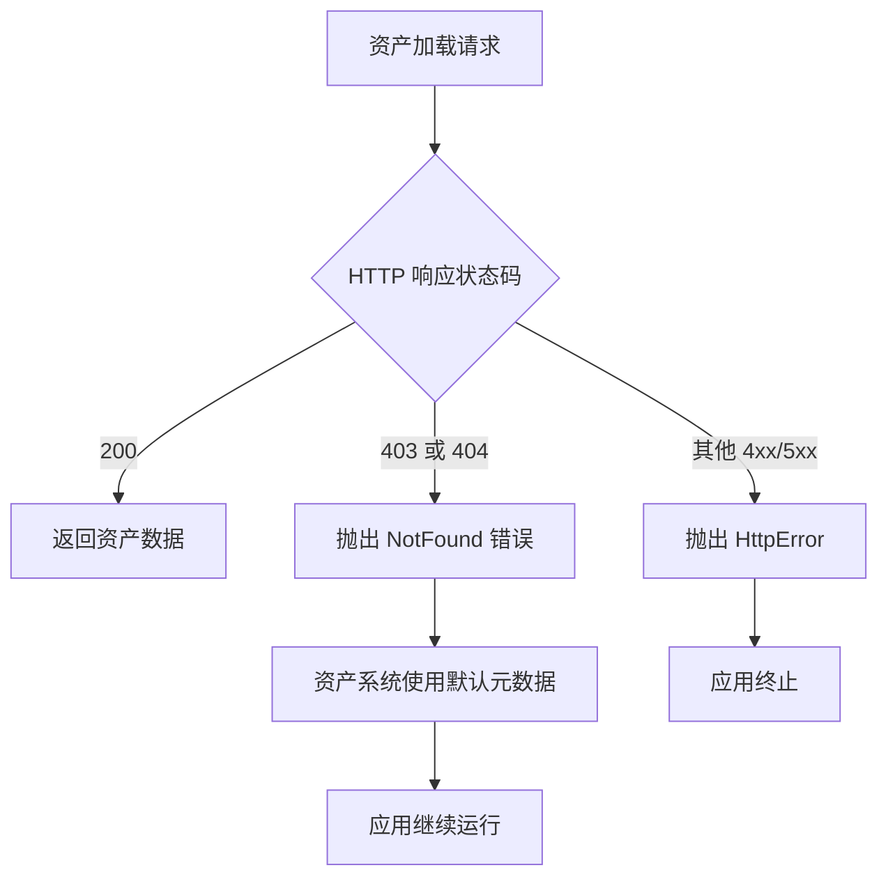

+++
title = "#19268 Fix missing meta files breaking Bevy on itch"
date = "2025-05-30T00:00:00"
draft = false
template = "pull_request_page.html"
in_search_index = false

[extra]
current_language = "zh-cn"
available_languages = {"en" = { name = "English", url = "/pull_request/bevy/2025-05/pr-19268-en-20250530" }, "zh-cn" = { name = "中文", url = "/pull_request/bevy/2025-05/pr-19268-zh-cn-20250530" }}
+++

## 修复缺失 meta 文件导致 Bevy 在 itch.io 崩溃的问题

### 基本信息
- **标题**: Fix missing meta files breaking Bevy on itch
- **PR 链接**: https://github.com/bevyengine/bevy/pull/19268
- **作者**: rparrett
- **状态**: MERGED
- **标签**: C-Bug, A-Assets, O-Web, S-Ready-For-Final-Review
- **创建时间**: 2025-05-17T19:41:39Z
- **合并时间**: 2025-05-30T20:58:15Z
- **合并者**: mockersf

### 描述翻译
#### 目标
修复 #19029 (可能也部分修复 #18002，但我们可能需要更优雅地处理我在那里概述的 SPA 问题？)

#### 解决方案
我想到的最精简/最精准的解决方案，希望能作为点版本发布。

某些 Web 服务对未找到的项目返回 403 并不完全不合理。[Amazon CloudFront 文档](https://docs.aws.amazon.com/AmazonCloudFront/latest/DeveloperGuide/http-403-permission-denied.html#s3-origin-403-error)中就有示例。如果 Web 服务普遍存在这种行为，那么最好将这些响应也视为"未找到"。

我之前认为任何 400 级错误"不妨"都这样处理，但现在认为这可能过度了，因为很多 400 级状态码表示需要修复的问题，将这些解释为"未找到"会增加调试难度。

#### 测试
使用对 meta 文件返回 403 的 Web 服务器进行了测试。

```bash
cargo run -p build-wasm-example -- --api webgl2 sprite && \
open "http://localhost:4000" && \
python3 test_403.py examples/wasm
```

`test_403.py`:
```python
from http.server import HTTPServer, SimpleHTTPRequestHandler
import os
import sys

class CustomHandler(SimpleHTTPRequestHandler):
    def do_GET(self):
        if self.path.endswith(".meta"):
            self.send_response(403)
            self.send_header("Content-type", "text/plain")
            self.end_headers()
            self.wfile.write(b"403 Forbidden: Testing.\n")
        else:
            super().do_GET()

if __name__ == "__main__":
    if len(sys.argv) != 2:
        print(f"Usage: {sys.argv[0]} <directory>")
        sys.exit(1)

    os.chdir(sys.argv[1])

    server_address = ("", 4000)
    httpd = HTTPServer(server_address, CustomHandler)
    httpd.serve_forever()
```

### 这个 Pull Request 的故事

#### 问题与背景
在 Web 环境下运行 Bevy 应用时，特别是通过 itch.io 平台分发时，遇到了一个特定问题：当资产系统尝试加载缺失的 .meta 文件时，某些 CDN（包括 itch.io 使用的）会返回 HTTP 403 Forbidden 而非标准的 404 Not Found。这导致 Bevy 的资产系统错误地将此情况解释为权限问题而非文件缺失，最终引发运行时崩溃（issue #19029）。

技术约束在于 Bevy 的 Web 资产读取器（`HttpWasmAssetReader`）原本只将 404 状态码识别为文件缺失。其他 4xx 错误都被视为需要直接抛出的异常。这种严格处理在遇到返回非标准状态码的 CDN 时就会失败。

#### 解决方案方法
采用最小化修改方案：扩展资产读取器的状态码处理逻辑，将 403 和 404 都识别为文件缺失（NotFound）。这样当 CDN 返回 403 时，系统能正确回退到默认资产处理流程。

考虑过将所有 4xx 错误视为文件缺失的方案，但被否决了，因为：
1. 400 Bad Request 等错误通常表示客户端问题，不应忽略
2. 泛化处理会掩盖真实问题，增加调试难度
3. 仅处理 403 和 404 能精准解决目标平台的特定问题

决策依据来自行业实践（如 Amazon CloudFront 文档），确认某些 CDN 确实用 403 表示资源缺失。添加了 TODO 注释说明未来可能移除对 403 的特殊处理（当配置更灵活时）。

#### 具体实现
修改集中在 `wasm.rs` 文件的 HTTP 响应处理逻辑。关键变更是在状态码匹配分支中添加对 403 的处理：

```rust
// 修改前
404 => Err(AssetReaderError::NotFound(path)),

// 修改后
// 某些 Web 服务器（包括 itch.io 的 CDN）对缺失文件返回 403
403 | 404 => Err(AssetReaderError::NotFound(path)),
```

这个单行修改解决了核心问题：
1. 保持原有 404 处理不变
2. 新增 403 作为文件缺失的等效状态
3. 添加代码注释说明决策依据
4. 保留其他状态码的原有错误处理逻辑

#### 技术洞察
这个修改展示了如何适配现实世界服务的非标准行为：
1. **错误处理策略**：在严格标准与实现兼容性间取得平衡
2. **最小化变更**：1 行代码修改解决特定平台问题
3. **可追溯性**：通过代码注释和 PR 链接保留决策上下文
4. **隔离性**：变更局限在 Wasm 资产读取器，不影响其他 IO 系统

资产系统在遇到 `NotFound` 错误时会：
1. 尝试使用内置的默认元数据
2. 继续运行而非崩溃
3. 输出警告而非终止应用

#### 影响与验证
该修复：
1. 解决了 itch.io 部署的关键崩溃问题
2. 保持了对标准 HTTP 状态码的严格处理
3. 添加了可复现的测试方案（Python 模拟服务器）
4. 不影响非 Web 平台的资产加载逻辑

测试方案验证了：
1. 正常资产加载不受影响
2. 对 .meta 文件的 403 响应被正确处理
3. 应用能继续运行而非崩溃

### 视觉表示



### 关键文件变更

#### `crates/bevy_asset/src/io/wasm.rs`
**变更说明**：修改 HTTP 状态码处理逻辑，将 403 和 404 都视为文件缺失

```diff
@@ -81,7 +81,10 @@ impl HttpWasmAssetReader {
                 let reader = VecReader::new(bytes);
                 Ok(reader)
             }
-            404 => Err(AssetReaderError::NotFound(path)),
+            // Some web servers, including itch.io's CDN, return 403 when a requested file isn't present.
+            // TODO: remove handling of 403 as not found when it's easier to configure
+            // see https://github.com/bevyengine/bevy/pull/19268#pullrequestreview-2882410105
+            403 | 404 => Err(AssetReaderError::NotFound(path)),
             status => Err(AssetReaderError::HttpError(status)),
         }
     }
```

**关键点**：
1. 扩展匹配模式 `403 | 404` 处理文件缺失
2. 添加代码注释说明业务背景和技术债务
3. 保持其他状态码的原有错误处理逻辑

### 扩展阅读
1. [HTTP 状态码规范 (MDN)](https://developer.mozilla.org/en-US/docs/Web/HTTP/Status)
2. [Amazon CloudFront 403 处理文档](https://docs.aws.amazon.com/AmazonCloudFront/latest/DeveloperGuide/http-403-permission-denied.html)
3. [Bevy 资产系统文档](https://bevyengine.org/learn/book/introduction/assets/)
4. [WebAssembly 文件加载限制](https://webassembly.org/docs/security/)

### 完整代码差异
```diff
diff --git a/crates/bevy_asset/src/io/wasm.rs b/crates/bevy_asset/src/io/wasm.rs
index c2551a40f15a3..4080e03ecd39e 100644
--- a/crates/bevy_asset/src/io/wasm.rs
+++ b/crates/bevy_asset/src/io/wasm.rs
@@ -81,7 +81,10 @@ impl HttpWasmAssetReader {
                 let reader = VecReader::new(bytes);
                 Ok(reader)
             }
-            404 => Err(AssetReaderError::NotFound(path)),
+            // Some web servers, including itch.io's CDN, return 403 when a requested file isn't present.
+            // TODO: remove handling of 403 as not found when it's easier to configure
+            // see https://github.com/bevyengine/bevy/pull/19268#pullrequestreview-2882410105
+            403 | 404 => Err(AssetReaderError::NotFound(path)),
             status => Err(AssetReaderError::HttpError(status)),
         }
     }
```