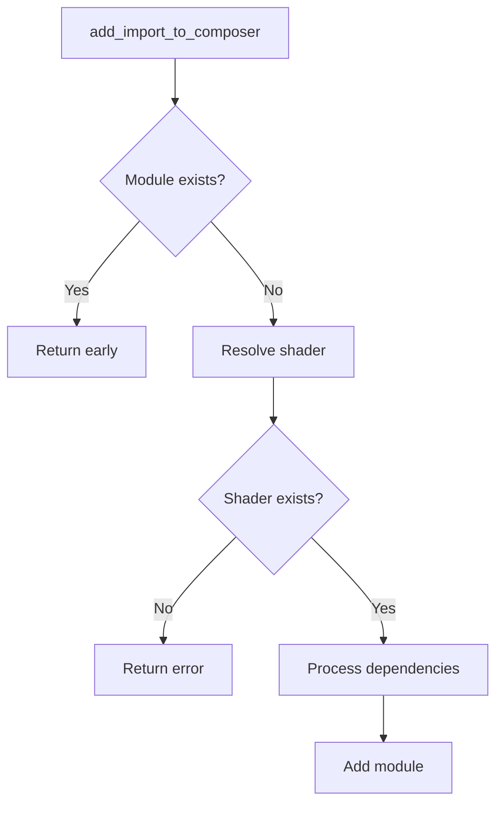

+++
title = "#19269 PR #19269 - Refactoring Shader Import Handling in Bevy Render"
date = "2025-05-18T00:00:00"
draft = false
template = "pull_request_page.html"
in_search_index = true

[taxonomies]
list_display = ["show"]

[extra]
current_language = "en"
available_languages = {"en" = { name = "English", url = "/pull_request/bevy/2025-05/pr-19269-en-20250518" }, "zh-cn" = { name = "中文", url = "/pull_request/bevy/2025-05/pr-19269-zh-cn-20250518" }}
labels = ["A-Rendering", "C-Code-Quality"]
+++

# Title: PR #19269 - Refactoring Shader Import Handling in Bevy Render

## Basic Information  
- **Title**: refactor(render): cleanup add_import_to_composer  
- **PR Link**: https://github.com/bevyengine/bevy/pull/19269  
- **Author**: atlv24  
- **Status**: MERGED  
- **Labels**: A-Rendering, C-Code-Quality, S-Ready-For-Final-Review  
- **Created**: 2025-05-17T22:23:17Z  
- **Merged**: 2025-05-18T06:48:13Z  
- **Merged By**: superdump  

## The Story of This Pull Request

### The Problem and Context  
The `add_import_to_composer` function in Bevy's pipeline cache system had become difficult to maintain due to excessive nesting in its error handling and import resolution logic. The original implementation used multiple nested `if let` statements that:  

1. Made control flow harder to follow  
2. Obscured the primary error conditions  
3. Complicated future maintenance of shader import handling  

This was particularly problematic in a critical path of Bevy's rendering system that manages shader composition and dependency resolution.

### The Solution Approach  
The author chose to refactor the function using three key strategies:  

1. **Early return pattern** to reduce nesting depth  
2. **Combinator chaining** for cleaner error handling  
3. **Linear code flow** to make execution paths more explicit  

The primary goals were to:  
- Improve code readability  
- Make error conditions more apparent  
- Maintain identical runtime behavior  
- Reduce cognitive overhead for future contributors  

### The Implementation  
The core changes occurred in `pipeline_cache.rs` where the team reworked the import handling logic:

**Before:**
```rust
if !composer.contains_module(...) {
    if let Some(shader_handle) = ... {
        if let Some(shader) = ... {
            for import in &shader.imports {
                // Recursive call
            }
            composer.add_composable_module(...)?;
        } else {
            Err(...)?
        }
    } else {
        Err(...)?
    }
}
```

**After:**
```rust
// Early exit for already imported modules
if composer.contains_module(...) {
    return Ok(());
}

let shader = import_path_shaders
    .get(import)
    .and_then(|handle| shaders.get(handle))
    .ok_or(...)?;

// Process dependencies first
for import in &shader.imports {
    Self::add_import_to_composer(...)?;
}

composer.add_composable_module(...)?;
```

Key improvements:  
1. **Early return** eliminates 3 levels of nesting immediately  
2. **Combinator chain** (`and_then` + `ok_or`) replaces nested option checks  
3. **Explicit error propagation** through `?` operator  
4. **Logical grouping** of recursive import processing  

### Technical Insights  
The refactor demonstrates several Rust best practices:  

1. **Error Handling**: Uses `ok_or` to convert Option to Result early  
2. **Recursion Management**: Processes child imports before parent to ensure dependency ordering  
3. **Resource Checking**: Early module existence check prevents redundant work  
4. **Control Flow**: Linear progression from checks -> resource acquisition -> processing  

Notably, the recursive call structure remains identical - only the imperative structure changes to favor readability over compactness.

### The Impact  
This refactor:  
- Reduces line count from 19 to 16 while improving clarity  
- Makes error paths immediately visible through linear control flow  
- Sets clearer patterns for future modifications to shader processing  
- Maintains strict backward compatibility in behavior  

The changes particularly benefit developers working on shader compilation and dependency resolution by making the code more approachable for debugging and extension.

## Visual Representation  



## Key Files Changed  

### `crates/bevy_render/src/render_resource/pipeline_cache.rs` (+16/-19)  
**Key Changes:**  
1. Flattened nested conditionals into linear flow  
2. Consolidated error handling using Rust's Result/Option combinators  
3. Reordered operations to emphasize dependency-first processing  

**Code Comparison:**  
```rust
// Before (simplified):
if !composer.has_module() {
    if let Some(handle) = imports.get() {
        if let Some(shader) = shaders.get(handle) {
            // process imports
            // add module
        } else {
            error
        }
    } else {
        error
    }
}

// After:
if composer.has_module() {
    return Ok(());
}

let shader = imports.get()
    .and_then(|h| shaders.get(h))
    .ok_or(error)?;

// process imports
// add module
```

## Further Reading  
1. [Rust Error Handling Guide](https://doc.rust-lang.org/book/ch09-02-recoverable-errors-with-result.html)  
2. [Combinator Programming Pattern](https://blog.logrocket.com/understanding-rust-combinators/)  
3. [Bevy Shader System Documentation](https://bevyengine.org/learn/book/features/pipelined/shaders/)