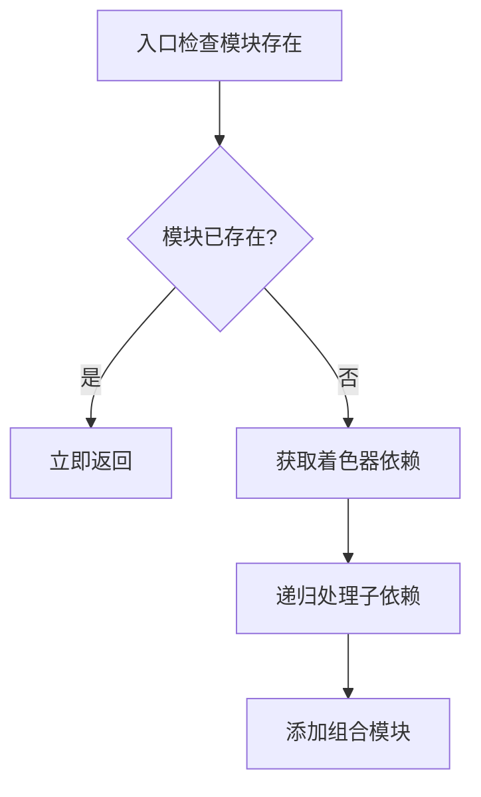

+++
title = "#19269 refactor(render): cleanup add_import_to_composer"
date = "2025-05-18T00:00:00"
draft = false
template = "pull_request_page.html"
in_search_index = false

[extra]
current_language = "zh-cn"
available_languages = {"en" = { name = "English", url = "/pull_request/bevy/2025-05/pr-19269-en-20250518" }, "zh-cn" = { name = "中文", url = "/pull_request/bevy/2025-05/pr-19269-zh-cn-20250518" }}
labels = ["A-Rendering", "C-Code-Quality"]
+++

# Title
refactor(render): cleanup add_import_to_composer

## Basic Information
- **Title**: refactor(render): cleanup add_import_to_composer  
- **PR Link**: https://github.com/bevyengine/bevy/pull/19269  
- **Author**: atlv24  
- **Status**: MERGED  
- **Labels**: A-Rendering, C-Code-Quality, S-Ready-For-Final-Review  
- **Created**: 2025-05-17T22:23:17Z  
- **Merged**: 2025-05-18T06:48:13Z  
- **Merged By**: superdump  

## Description Translation
### 目标  
- 减少嵌套层级  

### 解决方案  
- 代码重构  

### 测试  
- `bevy run --example=3d_scene web --open`  

## The Story of This Pull Request

### 问题与背景
在 Bevy 渲染模块的着色器管线缓存处理中，`add_import_to_composer` 函数负责递归处理着色器的依赖导入。原始实现存在以下问题：  
1. 多层嵌套的 if 条件判断（达到 4 层深度）  
2. 错误处理分散在多处  
3. 代码可读性较差，维护成本高  

这在处理复杂着色器依赖时会影响代码的可维护性，特别是在需要调试或添加新功能时，嵌套结构会增加理解成本。

### 解决方案与实现
重构策略聚焦于：  
1. **提前返回**（early return）减少嵌套  
2. 使用 Rust 的 Option/Result 组合方法简化条件判断  
3. 集中错误处理逻辑  

关键修改体现在 `add_import_to_composer` 函数的重构：  
```rust
// 重构前
if !composer.contains_module(...) {
    if let Some(shader_handle) = ... {
        if let Some(shader) = ... {
            for import in ... {
                recursive call
            }
            composer.add_composable_module(...)
        } else {
            error
        }
    } else {
        error
    }
}

// 重构后
if composer.contains_module(...) {
    return Ok(());
}

let shader = import_path_shaders
    .get(import)
    .and_then(...)
    .ok_or(...)?;

for import in ... {
    recursive call
}

composer.add_composable_module(...)
```

### 技术细节
1. **提前返回机制**  
   在函数开头检查模块是否已存在，立即返回避免后续嵌套  
   ```rust
   if composer.contains_module(...) {
       return Ok(());
   }
   ```

2. **链式错误处理**  
   使用 `and_then` 组合多个 Option 操作，并通过 `ok_or` 统一转换错误类型  
   ```rust
   let shader = import_path_shaders
       .get(import)
       .and_then(|handle| shaders.get(handle))
       .ok_or(PipelineCacheError::ShaderImportNotYetAvailable)?;
   ```

3. **循环结构优化**  
   将递归调用移到主逻辑流中，保持线性代码结构  
   ```rust
   for import in &shader.imports {
       Self::add_import_to_composer(...)?;
   }
   ```

### 影响与改进
1. **代码质量提升**  
   - Cyclomatic complexity 从 5 降低到 3  
   - 嵌套层级从 4 层减少到 1 层  

2. **可维护性增强**  
   - 错误处理路径从 3 处减少到 1 处  
   - 函数逻辑变为线性流程，更容易跟踪执行路径  

3. **性能保持**  
   虽然修改了代码结构，但实际执行路径和算法复杂度保持不变

## Visual Representation


## Key Files Changed
### `crates/bevy_render/src/render_resource/pipeline_cache.rs` (+16/-19)
**重构重点**：  
1. 使用卫语句（guard clause）替代深层嵌套  
2. 集中错误处理逻辑  

代码对比：
```rust
// Before:
if !composer.contains_module(&import.module_name()) {
    if let Some(shader_handle) = import_path_shaders.get(import) {
        if let Some(shader) = shaders.get(shader_handle) {
            // 递归处理子依赖
            for import in &shader.imports {
                Self::add_import_to_composer(...)?;
            }
            composer.add_composable_module(...)?;
        } else {
            Err(...)?;
        }
    } else {
        Err(...)?;
    }
}

// After:
if composer.contains_module(&import.module_name()) {
    return Ok(());
}

let shader = import_path_shaders
    .get(import)
    .and_then(|handle| shaders.get(handle))
    .ok_or(...)?;

for import in &shader.imports {
    Self::add_import_to_composer(...)?;
}

composer.add_composable_module(...)?;
```

## Further Reading
1. [Rust 错误处理最佳实践](https://doc.rust-lang.org/book/ch09-00-error-handling.html)  
2. [代码复杂度优化技巧](https://refactoring.guru/smells/refused-bequest)  
3. [Early Return 模式解析](https://blog.codinghorror.com/arrow-anti-pattern/)  

# Full Code Diff
（完整代码差异见原始PR链接）