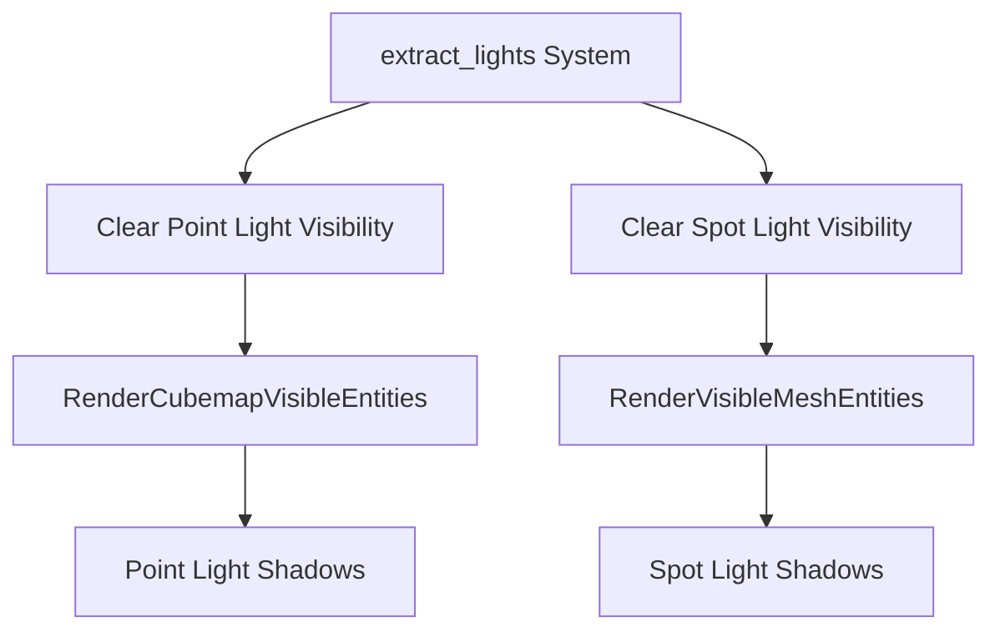

+++
title = "#19273 Fix spot light shadow glitches"
date = "2025-05-19T00:00:00"
draft = false
template = "pull_request_page.html"
in_search_index = true

[taxonomies]
list_display = ["show"]

[extra]
current_language = "en"
available_languages = {"en" = { name = "English", url = "/pull_request/bevy/2025-05/pr-19273-en-20250519" }, "zh-cn" = { name = "中文", url = "/pull_request/bevy/2025-05/pr-19273-zh-cn-20250519" }}
labels = ["C-Bug", "A-Rendering", "D-Straightforward"]
+++

# Fix spot light shadow glitches

## Basic Information
- **Title**: Fix spot light shadow glitches
- **PR Link**: https://github.com/bevyengine/bevy/pull/19273
- **Author**: eero-lehtinen
- **Status**: MERGED
- **Labels**: C-Bug, A-Rendering, D-Straightforward, S-Needs-Review
- **Created**: 2025-05-18T09:51:14Z
- **Merged**: 2025-05-19T20:03:59Z
- **Merged By**: mockersf

## Description Translation

# Objective

Spot light shadows are still broken after fixing point lights in #19265

## Solution

Fix spot lights in the same way, just using the spot light specific visible entities component. I also changed the query to be directly in the render world instead of being extracted to be more accurate.

## Testing

Tested with the same code but changing `PointLight` to `SpotLight`.


## The Story of This Pull Request

The PR addresses residual shadow rendering issues in Bevy's spot light implementation that persisted after a previous fix for point lights (#19265). The core problem stemmed from stale visibility data not being properly cleared between frames, leading to visual artifacts in spot light shadows.

The solution extends the cleanup strategy used for point lights to spot lights while improving query accuracy. Previously, the system only cleared visibility data for point lights using `CubemapVisibleEntities`. This left spot light visibility data (`RenderVisibleMeshEntities`) uncleared when lights were removed or became occluded, causing residual shadows from non-existent or invisible light sources.

Key modifications in `extract_lights`:
1. Split the visibility cleanup into separate queries for point and spot lights
2. Added explicit handling for `RenderVisibleMeshEntities` (spot lights)
3. Moved queries to operate directly on render world entities

The implementation clears previous frame's visibility data more precisely by:
- Querying existing point lights with `RenderCubemapVisibleEntities`
- Querying existing spot lights with `RenderVisibleMeshEntities`
- Resetting both component types to default empty states

This ensures proper shadow map updates when:
- Lights are moved or removed
- Occlusion changes occur
- Light types change between point and spot variants

## Visual Representation



## Key Files Changed

### `crates/bevy_pbr/src/render/light.rs` (+19/-3)

**Before:**
```rust
cubemap_visible_entities: Extract<Query<RenderEntity, With<CubemapVisibleEntities>>>,

// Clear previous visible entities for cubemapped lights
commands.try_insert_batch(
    cubemap_visible_entities
        .iter()
        .map(|render_entity| (render_entity, RenderCubemapVisibleEntities::default()))
);
```

**After:**
```rust
previous_point_lights: Query<Entity, (With<RenderCubemapVisibleEntities>, With<ExtractedPointLight>)>,
previous_spot_lights: Query<Entity, (With<RenderVisibleMeshEntities>, With<ExtractedPointLight>)>,

// Clear both light types
commands.try_insert_batch(/* point light cleanup */);
commands.try_insert_batch(/* spot light cleanup */);
```

Changes:
1. Split single cubemap query into separate point/spot light queries
2. Added explicit spot light cleanup using `RenderVisibleMeshEntities`
3. Added type constraints to ensure correct component associations

## Further Reading

- Bevy Light Rendering Documentation: https://bevyengine.org/learn/book/3d-rendering/lights/
- Shadow Mapping Techniques: https://learnopengl.com/Advanced-Lighting/Shadows/Shadow-Mapping
- Entity Component System Pattern: https://en.wikipedia.org/wiki/Entity_component_system

# Full Code Diff
<details>
<summary>View full diff</summary>

```diff
diff --git a/crates/bevy_pbr/src/render/light.rs b/crates/bevy_pbr/src/render/light.rs
index dfc7f679f312f..f57ba9adf343e 100644
--- a/crates/bevy_pbr/src/render/light.rs
+++ b/crates/bevy_pbr/src/render/light.rs
@@ -221,7 +221,17 @@ pub fn extract_lights(
     point_light_shadow_map: Extract<Res<PointLightShadowMap>>,
     directional_light_shadow_map: Extract<Res<DirectionalLightShadowMap>>,
     global_visible_clusterable: Extract<Res<GlobalVisibleClusterableObjects>>,
-    cubemap_visible_entities: Extract<Query<RenderEntity, With<CubemapVisibleEntities>>>,
+    previous_point_lights: Query<
+        Entity,
+        (
+            With<RenderCubemapVisibleEntities>,
+            With<ExtractedPointLight>,
+        ),
+    >,
+    previous_spot_lights: Query<
+        Entity,
+        (With<RenderVisibleMeshEntities>, With<ExtractedPointLight>),
+    >,
     point_lights: Extract<
         Query<(
             Entity,
@@ -278,14 +288,20 @@ pub fn extract_lights(
         commands.insert_resource(directional_light_shadow_map.clone());
     }
 
-    // Clear previous visible entities for all cubemapped lights as they might not be in the
+    // Clear previous visible entities for all point/spot lights as they might not be in the
     // `global_visible_clusterable` list anymore.
     commands.try_insert_batch(
-        cubemap_visible_entities
+        previous_point_lights
             .iter()
             .map(|render_entity| (render_entity, RenderCubemapVisibleEntities::default()))
             .collect::<Vec<_>>(),
     );
+    commands.try_insert_batch(
+        previous_spot_lights
+            .iter()
+            .map(|render_entity| (render_entity, RenderVisibleMeshEntities::default()))
+            .collect::<Vec<_>>(),
+    );
 
     // This is the point light shadow map texel size for one face of the cube as a distance of 1.0
     // world unit from the light.
```

</details>