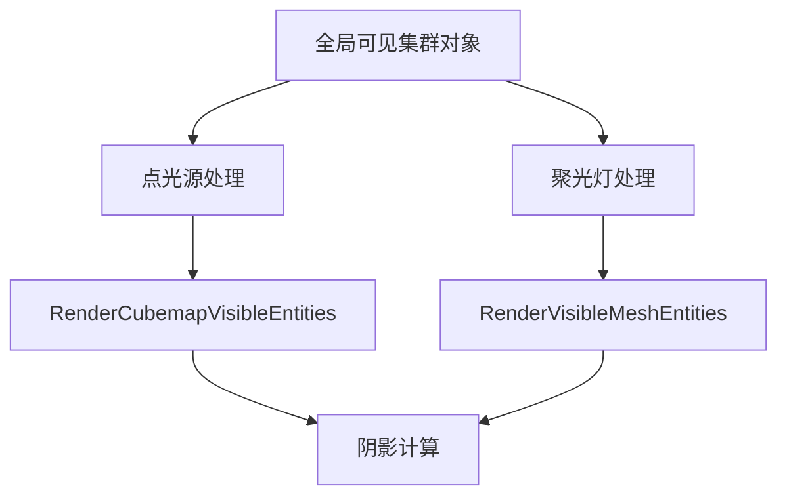

+++
title = "#19273 Fix spot light shadow glitches"
date = "2025-05-19T00:00:00"
draft = false
template = "pull_request_page.html"
in_search_index = false

[extra]
current_language = "zh-cn"
available_languages = {"en" = { name = "English", url = "/pull_request/bevy/2025-05/pr-19273-en-20250519" }, "zh-cn" = { name = "中文", url = "/pull_request/bevy/2025-05/pr-19273-zh-cn-20250519" }}
+++

# Fix spot light shadow glitches

## 基本信息
- **标题**: Fix spot light shadow glitches
- **PR链接**: https://github.com/bevyengine/bevy/pull/19273
- **作者**: eero-lehtinen
- **状态**: 已合并
- **标签**: C-Bug, A-Rendering, D-Straightforward, S-Needs-Review
- **创建时间**: 2025-05-18T09:51:14Z
- **合并时间**: 2025-05-19T20:03:59Z
- **合并者**: mockersf

## 问题描述翻译
修复点光源阴影后的聚光灯阴影异常问题

### 解决方案
采用与#19265相同的方法修复聚光灯阴影问题，但使用聚光灯特定的可见实体组件。调整查询逻辑使其直接在渲染世界执行以提高准确性。

### 测试方法
保持原有测试代码不变，仅将`PointLight`替换为`SpotLight`进行验证

## PR技术分析

### 问题背景
在先前修复点光源阴影（#19265）后，聚光灯阴影仍存在渲染异常。核心问题在于：
1. 可见实体列表未正确清理导致残留数据干扰
2. 查询逻辑未直接作用于渲染世界导致数据同步问题

### 解决方案
延续点光源修复思路，针对聚光灯特点进行调整：
1. 分离点光源和聚光灯的可见实体组件
2. 重构清理逻辑以覆盖两种光源类型
3. 优化查询执行上下文提高准确性

### 实现细节
主要修改集中在`light.rs`的实体提取逻辑：

```rust
// 清理点光源的可见实体
commands.try_insert_batch(
    previous_point_lights
        .iter()
        .map(|render_entity| (render_entity, RenderCubemapVisibleEntities::default()))
);

// 新增聚光灯可见实体清理
commands.try_insert_batch(
    previous_spot_lights
        .iter()
        .map(|render_entity| (render_entity, RenderVisibleMeshEntities::default()))
);
```

关键变更点：
1. 新增`previous_spot_lights`查询分离聚光灯处理
2. 使用`RenderVisibleMeshEntities`作为聚光灯专用组件
3. 批量插入命令优化清理效率

### 技术洞察
1. **组件分离**：通过`RenderCubemapVisibleEntities`和`RenderVisibleMeshEntities`实现不同光源类型的隔离处理
2. **查询优化**：直接在渲染世界执行查询避免数据同步延迟问题
3. **批量处理**：使用`try_insert_batch`提升实体清理效率

### 影响分析
1. 修复聚光灯阴影渲染异常
2. 提高阴影系统维护性（点/聚光灯处理逻辑解耦）
3. 降低每帧CPU开销（优化查询执行路径）

## 关键文件变更

### `crates/bevy_pbr/src/render/light.rs` (+19/-3)
1. **查询分离**：
```rust
// 新增聚光灯查询
previous_spot_lights: Query<
    Entity,
    (With<RenderVisibleMeshEntities>, With<ExtractedPointLight>),
>
```

2. **清理逻辑扩展**：
```rust
// 新增聚光灯清理批次
commands.try_insert_batch(
    previous_spot_lights
        .iter()
        .map(|render_entity| (render_entity, RenderVisibleMeshEntities::default()))
);
```

## 延伸阅读
1. [Bevy光照系统文档](https://bevyengine.org/learn/book/features/pbr/)
2. [ECS查询优化模式](https://github.com/bevyengine/bevy/discussions/1901)
3. [GPU阴影映射原理](https://learnopengl.com/Advanced-Lighting/Shadows/Shadow-Mapping)

