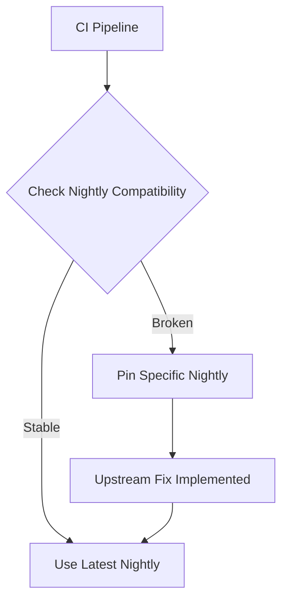

+++
title = "#19278 Unpin nightly in CI"
date = "2025-05-26T00:00:00"
draft = false
template = "pull_request_page.html"
in_search_index = true

[taxonomies]
list_display = ["show"]

[extra]
current_language = "en"
available_languages = {"en" = { name = "English", url = "/pull_request/bevy/2025-05/pr-19278-en-20250526" }, "zh-cn" = { name = "中文", url = "/pull_request/bevy/2025-05/pr-19278-zh-cn-20250526" }}
labels = ["D-Trivial", "A-Build-System", "C-Testing"]
+++

# Title: Unpin nightly in CI

## Basic Information
- **Title**: Unpin nightly in CI
- **PR Link**: https://github.com/bevyengine/bevy/pull/19278
- **Author**: NiklasEi
- **Status**: MERGED
- **Labels**: D-Trivial, A-Build-System, S-Ready-For-Final-Review, C-Testing
- **Created**: 2025-05-18T14:31:41Z
- **Merged**: 2025-05-26T20:24:17Z
- **Merged By**: alice-i-cecile

## Description Translation

# Objective

In #19253 we pinned nightly due to a bug in Miri. That issue was resolved and the latest Miri should be usable for us again.

## Solution

- Use latest nightly again

## Testing

- I tested today's Miri locally with `RUSTUP_TOOLCHAIN=nightly-2025-05-18 MIRIFLAGS="-Zmiri-ignore-leaks -Zmiri-disable-isolation" RUSTFLAGS="-Zrandomize-layout" cargo miri test -p bevy_ecs`


## The Story of This Pull Request

The Bevy project's CI pipeline temporarily pinned a specific Rust nightly version (2025-05-16) as a workaround for Miri test failures caused by rust-lang/miri#4323. This PR removes that temporary constraint after verifying the upstream fix.

**The Problem**: Nightly Rust toolchain updates occasionally introduce breaking changes. In this case, a Miri bug (#4323) caused test failures in Bevy's CI pipeline. To maintain CI stability while waiting for a Miri fix, the team pinned to a known-good nightly version.

**The Solution**: After the Miri maintainers resolved the issue, this PR updates the CI configuration to resume using the latest nightly. The author validated the fix by:
1. Testing locally with the newer nightly-2025-05-18
2. Using Miri's test flags (`-Zmiri-ignore-leaks`, `-Zmiri-disable-isolation`)
3. Maintaining randomized layout testing (`-Zrandomize-layout`)

**Implementation Details**: The core change modifies a single environment variable in GitHub Actions:

```yaml
# Before:
NIGHTLY_TOOLCHAIN: nightly-2025-05-16

# After:
NIGHTLY_TOOLCHAIN: nightly
```

This change allows automatic adoption of new nightly builds while maintaining test reliability. The comment explicitly documents the pinning pattern for future maintenance.

**Technical Trade-offs**:
- Pro: Reduces maintenance overhead by eliminating manual nightly updates
- Pro: Ensures timely detection of new Rust compiler issues
- Con: Risks transient CI failures from new nightly regressions

**Impact**: Restores normal CI behavior while maintaining test coverage through Miri-based memory safety checks. The approach demonstrates effective CI maintenance patterns - temporary pinning followed by prompt unpinning after upstream fixes.

## Visual Representation



## Key Files Changed

**.github/workflows/ci.yml** (+1/-1)
```yaml
# Before:
NIGHTLY_TOOLCHAIN: nightly-2025-05-16 # pinned until a fix for...

# After:
NIGHTLY_TOOLCHAIN: nightly
```

This single-line change:
1. Removes the date-specific nightly pin
2. Restores automatic use of the latest nightly
3. Maintains documentation about the pinning pattern

## Further Reading

1. [Miri Issue #4323](https://github.com/rust-lang/miri/issues/4323) - Original bug report
2. [Rustup Toolchain Documentation](https://rust-lang.github.io/rustup/concepts/toolchains.html) - Managing Rust toolchains
3. [GitHub Actions Environment Variables](https://docs.github.com/en/actions/learn-github-actions/variables) - CI configuration basics

# Full Code Diff
```diff
diff --git a/.github/workflows/ci.yml b/.github/workflows/ci.yml
index 2a0610cf032a8..37db848558d6f 100644
--- a/.github/workflows/ci.yml
+++ b/.github/workflows/ci.yml
@@ -13,7 +13,7 @@ env:
   CARGO_PROFILE_TEST_DEBUG: 0
   CARGO_PROFILE_DEV_DEBUG: 0
   # If nightly is breaking CI, modify this variable to target a specific nightly version.
-  NIGHTLY_TOOLCHAIN: nightly-2025-05-16 # pinned until a fix for https://github.com/rust-lang/miri/issues/4323 is released
+  NIGHTLY_TOOLCHAIN: nightly
   RUSTFLAGS: "-D warnings"
   BINSTALL_VERSION: "v1.12.3"
 
```