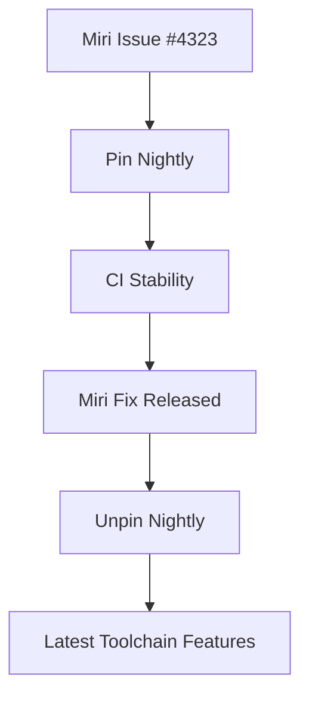

+++
title = "#19278 Unpin nightly in CI"
date = "2025-05-26T00:00:00"
draft = false
template = "pull_request_page.html"
in_search_index = false

[extra]
current_language = "zh-cn"
available_languages = {"en" = { name = "English", url = "/pull_request/bevy/2025-05/pr-19278-en-20250526" }, "zh-cn" = { name = "中文", url = "/pull_request/bevy/2025-05/pr-19278-zh-cn-20250526" }}
labels = ["D-Trivial", "A-Build-System", "C-Testing"]
+++

# Title: Unpin nightly in CI

## Basic Information
- **Title**: Unpin nightly in CI
- **PR Link**: https://github.com/bevyengine/bevy/pull/19278
- **Author**: NiklasEi
- **Status**: MERGED
- **Labels**: D-Trivial, A-Build-System, S-Ready-For-Final-Review, C-Testing
- **Created**: 2025-05-18T14:31:41Z
- **Merged**: 2025-05-26T20:24:17Z
- **Merged By**: alice-i-cecile

## Description Translation
### 目标
在 #19253 中由于 Miri 的 bug 我们固定了 nightly 版本。该问题已解决，最新 Miri 应可再次使用。

### 解决方案
- 重新使用最新 nightly

### 测试
- 已在本地使用以下命令测试当日 Miri：
`RUSTUP_TOOLCHAIN=nightly-2025-05-18 MIRIFLAGS="-Zmiri-ignore-leaks -Zmiri-disable-isolation" RUSTFLAGS="-Zrandomize-layout" cargo miri test -p bevy_ecs`

## The Story of This Pull Request

项目持续集成（CI）流水线中关于 Rust nightly 工具链的版本管理策略经历了一个典型的修复循环。故事始于先前因 Miri 内存检查工具存在严重问题（具体为 [#19253](https://github.com/bevyengine/bevy/pull/19253)），团队采取临时措施将 nightly 版本固定到 2025-05-16 的特定版本。这种 pin 操作是 Rust 项目应对工具链不兼容问题的常见手段，能确保 CI 稳定性但牺牲了获取最新修复的能力。

问题的核心在于 Miri 的 [#4323](https://github.com/rust-lang/miri/issues/4323) 漏洞，该漏洞导致 Bevy 的 CI 无法正常运行。当 Miri 团队修复该问题后，继续使用固定版本反而成为阻碍——项目无法受益于后续的改进和优化。

技术决策过程遵循了标准的工具链管理策略：
1. 确认上游问题已解决
2. 在本地环境验证最新 nightly 的兼容性
3. 恢复工具链的动态更新

关键验证步骤通过特定的环境变量组合完成：
```bash
RUSTUP_TOOLCHAIN=nightly-2025-05-18 \
MIRIFLAGS="-Zmiri-ignore-leaks -Zmiri-disable-isolation" \
RUSTFLAGS="-Zrandomize-layout" \
cargo miri test -p bevy_ecs
```
这些参数组合体现了对内存泄漏检查的定制配置（`-Zmiri-ignore-leaks`）和布局随机化测试（`-Zrandomize-layout`），确保测试覆盖特殊场景。

实现层面的修改虽然简单（单行配置变更），但体现了重要的工程原则：在保证 CI 稳定性的前提下，尽可能使用最新的工具链以获取错误修复和性能改进。这种平衡策略对长期维护至关重要。

## Visual Representation



## Key Files Changed

### `.github/workflows/ci.yml` (+1/-1)
**变更说明**：恢复使用最新的 nightly 工具链而非固定版本

```yaml
# Before:
NIGHTLY_TOOLCHAIN: nightly-2025-05-16 # pinned until a fix for https://github.com/rust-lang/miri/issues/4323 is released

# After: 
NIGHTLY_TOOLCHAIN: nightly
```

该环境变量控制 CI 使用的 Rust 工具链版本。从固定日期版本改为动态获取最新版本，使得 CI 能够自动获取包含 Miri 修复的后续 nightly 版本。

## Further Reading
1. [Rustup 工具链管理文档](https://rust-lang.github.io/rustup/concepts/toolchains.html)
2. [Miri 内存检查器工作原理](https://github.com/rust-lang/miri)
3. [Rust CI 最佳实践](https://github.com/rust-embedded/wg/blob/master/ops/ci.md)