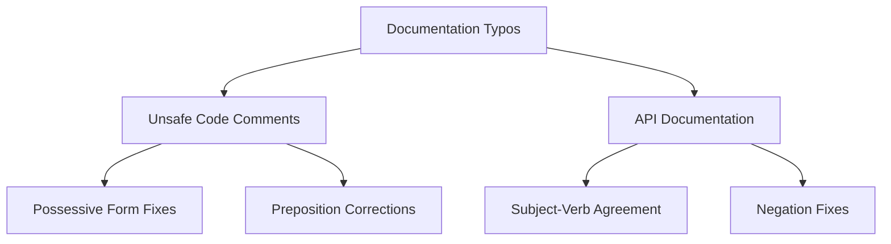

+++
title = "#19280 Fix a few typos in bevy_ecs docs"
date = "2025-05-26T00:00:00"
draft = false
template = "pull_request_page.html"
in_search_index = true

[taxonomies]
list_display = ["show"]

[extra]
current_language = "en"
available_languages = {"en" = { name = "English", url = "/pull_request/bevy/2025-05/pr-19280-en-20250526" }, "zh-cn" = { name = "中文", url = "/pull_request/bevy/2025-05/pr-19280-zh-cn-20250526" }}
labels = ["C-Docs", "D-Trivial", "A-ECS"]
+++

# Title

## Basic Information
- **Title**: Fix a few typos in bevy_ecs docs
- **PR Link**: https://github.com/bevyengine/bevy/pull/19280
- **Author**: theotherphil
- **Status**: MERGED
- **Labels**: C-Docs, D-Trivial, A-ECS, S-Ready-For-Final-Review
- **Created**: 2025-05-18T17:01:38Z
- **Merged**: 2025-05-26T20:25:36Z
- **Merged By**: alice-i-cecile

## Description Translation
# Objective

Fix a few minor typos that I noticed when reading the docs.

## The Story of This Pull Request

This PR addresses documentation clarity in Bevy's Entity Component System (ECS) module through targeted typo corrections. While reviewing the ECS documentation, the author identified several instances of grammatical errors and inconsistent phrasing that could lead to misunderstandings - particularly in safety comments for unsafe code blocks.

The changes focus on two key areas:
1. Correcting possessive forms in safety documentation
2. Fixing subject-verb agreement in API documentation
3. Improving preposition usage for technical accuracy

In `unsafe_world_cell.rs`, multiple safety comments incorrectly used "callers responsibility" instead of the possessive "caller's responsibility". This distinction is crucial in unsafe code documentation where precise ownership of responsibility matters. For example:

```rust
// Before:
// It is the callers responsibility to ensure that

// After:
// It is the caller's responsibility to ensure that
```

The PR also fixes preposition usage in safety requirements. The phrase "live exclusive borrows on world data" was updated to "live exclusive borrows of world data", using the more technically accurate preposition "of" when describing ownership relationships.

In `query.rs`, the documentation for query filters contained a missing negation that could lead to confusion about component requirements. The original text stated "With does require components to be behind a reference" when it should have been "does not require":

```rust
// Before:
// Unlike query data, `With` does require components to be behind a reference

// After: 
// Unlike query data, `With` does not require components to be behind a reference
```

Another correction in query documentation fixed subject-verb agreement in an example comment, changing "A queried items" to "Queried items" to match pluralization.

These changes improve documentation clarity without altering any functional code. For a project like Bevy that heavily uses unsafe code in performance-critical sections, precise documentation is essential for correct usage and preventing undefined behavior.

## Visual Representation



## Key Files Changed

1. `crates/bevy_ecs/src/world/unsafe_world_cell.rs`
- Fixed 15 instances of "callers" -> "caller's" in safety comments
- Corrected "borrows on" to "borrows of" in 3 locations
- Fixed article usage in struct documentation:

```rust
// Before:
// A interior-mutable reference to a particular [`Entity`]

// After:
// An interior-mutable reference to a particular [`Entity`]
```

2. `crates/bevy_ecs/src/system/query.rs`
- Added missing negation in filter documentation:

```rust
// Before:
// Unlike query data, `With` does require components to be behind a reference

// After:
// Unlike query data, `With` does not require components to be behind a reference
```

- Fixed subject-verb agreement in example comment:

```rust
// Before:
// A queried items must contain `ComponentA`

// After:
// Queried items must contain `ComponentA`
```

## Further Reading

- Rust API Documentation Guidelines: https://rust-lang.github.io/api-guidelines/documentation.html
- Bevy ECS Safety Contract: https://bevyengine.org/learn/book/next/ecs/unsafe-ops/
- Rustonomicon (Unsafe Code Guidelines): https://doc.rust-lang.org/nomicon/

# Full Code Diff
[See original PR for full diff]