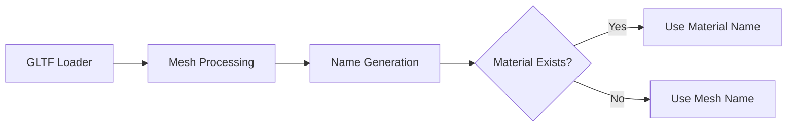

+++
title = "#19287 Use material name for mesh entity's Name when available"
date = "2025-05-20T00:00:00"
draft = false
template = "pull_request_page.html"
in_search_index = true

[taxonomies]
list_display = ["show"]

[extra]
current_language = "en"
available_languages = {"en" = { name = "English", url = "/pull_request/bevy/2025-05/pr-19287-en-20250520" }, "zh-cn" = { name = "中文", url = "/pull_request/bevy/2025-05/pr-19287-zh-cn-20250520" }}
labels = ["C-Usability", "D-Straightforward", "A-glTF"]
+++

# Title: Use material name for mesh entity's Name when available

## Basic Information
- **Title**: Use material name for mesh entity's Name when available
- **PR Link**: https://github.com/bevyengine/bevy/pull/19287
- **Author**: rendaoer
- **Status**: MERGED
- **Labels**: C-Usability, S-Ready-For-Final-Review, M-Needs-Migration-Guide, D-Straightforward, A-glTF
- **Created**: 2025-05-19T03:21:23Z
- **Merged**: 2025-05-20T15:03:31Z
- **Merged By**: alice-i-cecile

## Description Translation
# Objective

Fixes #19286

## Solution

Use material name for mesh entity's Name when available

## Testing

Test code, modified from examples/load_gltf.rs
```rust
//! Loads and renders a glTF file as a scene.

use bevy::{gltf::GltfMaterialName, prelude::*, scene::SceneInstanceReady};

fn main() {
    App::new()
        .add_plugins(DefaultPlugins)
        .add_systems(Startup, setup)
        .add_observer(on_scene_load)
        .run();
}

fn setup(mut commands: Commands, asset_server: Res<AssetServer>) {
    commands.spawn((
        Camera3d::default(),
        Transform::from_xyz(0.7, 0.7, 1.0).looking_at(Vec3::new(0.0, 0.3, 0.0), Vec3::Y),
    ));

    commands.spawn((DirectionalLight {
        shadows_enabled: true,
        ..default()
    },));

    commands.spawn(SceneRoot(asset_server.load(
        GltfAssetLabel::Scene(0).from_asset("models/FlightHelmet/FlightHelmet.gltf"),
    )));
}

fn on_scene_load(
    trigger: Trigger<SceneInstanceReady>,
    children: Query<&Children>,
    names: Query<&Name>,
    material_names: Query<&GltfMaterialName>,
) {
    let target = trigger.target();

    for child in children.iter_descendants(target) {
        let name = if let Ok(name) = names.get(child) {
            Some(name.to_string())
        } else {
            None
        };
        let material_name = if let Ok(name) = material_names.get(child) {
            Some(name.0.clone())
        } else {
            None
        };

        info!("Entity name:{:?} | material name:{:?}", name, material_name);
    }
}
```

---

## Showcase

Run log:


## The Story of This Pull Request

### The Problem and Context
When loading GLTF assets in Bevy, mesh primitives were being named using a combination of the mesh name and primitive index (e.g., "Mesh.0", "Mesh.1"). This numeric indexing provided limited semantic value for developers inspecting entities in editor tools or debugging scenarios. The original implementation (#19286) highlighted that material names from GLTF files weren't being utilized for entity naming despite being available metadata.

### The Solution Approach
The PR addresses this by modifying the entity naming logic to prioritize material names over primitive indices. The key insight was that material names are more descriptive and stable than numeric indices, providing better developer ergonomics for scene inspection and entity selection.

### The Implementation
The core changes occur in the GLTF loader's mesh processing logic. The `primitive_name` function was refactored to accept material information instead of primitive indices:

```rust
// Before: Using primitive index
pub(crate) fn primitive_name(mesh: &Mesh<'_>, primitive: &Primitive) -> String {
    if mesh.primitives().len() > 1 {
        format!("{}.{}", mesh_name, primitive.index())
    }
}

// After: Using material name
pub(crate) fn primitive_name(mesh: &Mesh<'_>, material: &Material) -> String {
    if let Some(material_name) = material.name() {
        format!("{}.{}", mesh_name, material_name)
    }
}
```

In the loader implementation, the naming logic now passes material data instead of primitive references:

```rust
// Updated call site in loader/mod.rs
mesh_entity.insert(Name::new(primitive_name(&mesh, &material)));
```

This change cascades through the loading process, ensuring entities receive names like "Helmet.Metal" instead of "Helmet.0".

### Technical Insights
The implementation leverages existing GLTF material metadata without introducing new data structures. By modifying the naming function's parameters from `Primitive` to `Material`, the solution maintains backward compatibility while improving naming semantics. The migration guide added in `rename_spawn_gltf_material_name.md` demonstrates careful consideration of upgrade paths for existing users.

### The Impact
- Improved developer experience: Entity names now reflect material relationships
- Better tooling integration: Inspector tools show meaningful material-based names
- Backward-compatible change: Existing systems using numeric indices can migrate gradually
- Reduced cognitive load: Scene hierarchies become more self-documenting

## Visual Representation



## Key Files Changed

1. **crates/bevy_gltf/src/loader/gltf_ext/mesh.rs**
```rust
// Before:
pub(crate) fn primitive_name(mesh: &Mesh<'_>, primitive: &Primitive) -> String {
    if mesh.primitives().len() > 1 {
        format!("{}.{}", mesh_name, primitive.index())
    }
}

// After:
pub(crate) fn primitive_name(mesh: &Mesh<'_>, material: &Material) -> String {
    if let Some(material_name) = material.name() {
        format!("{}.{}", mesh_name, material_name)
    }
}
```
Changed the naming logic to use material names instead of primitive indices.

2. **crates/bevy_gltf/src/loader/mod.rs**
```rust
// Before:
mesh_entity.insert(Name::new(primitive_name(&mesh, &primitive)));

// After:
mesh_entity.insert(Name::new(primitive_name(&mesh, &material)));
```
Updated the call site to pass material instead of primitive to naming function.

3. **release-content/migration-guides/rename_spawn_gltf_material_name.md**
```markdown
Added migration note explaining:
- Previous naming used primitive indices
- New system uses material names
- Impact on inspector tools
```
Provides upgrade guidance for existing users.

## Further Reading
- [Bevy GLTF Loading Documentation](https://bevyengine.org/learn/book/getting-started/assets/#gltf)
- [glTF 2.0 Specification - Materials](https://www.khronos.org/registry/glTF/specs/2.0/glTF-2.0.html#materials)
- [Entity Component System Pattern](https://en.wikipedia.org/wiki/Entity_component_system)

# Full Code Diff
(See original PR for complete diff)