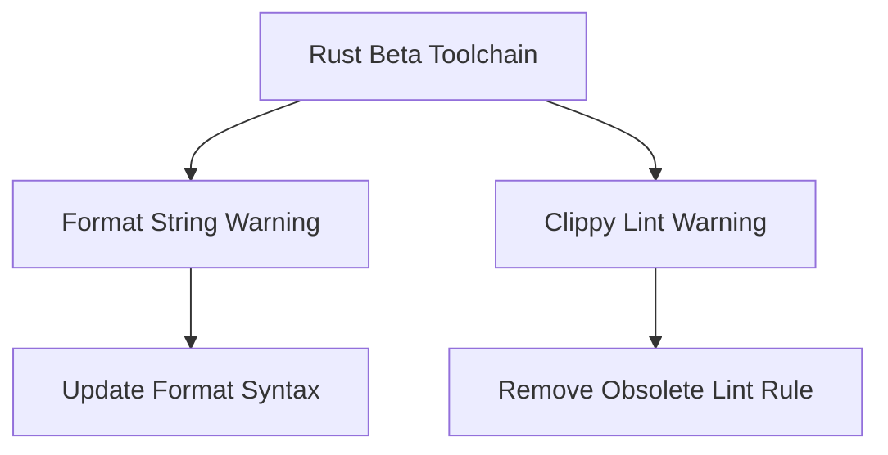

+++
title = "#19294 Fix warnings and errors reported on Rust beta"
date = "2025-05-20T00:00:00"
draft = false
template = "pull_request_page.html"
in_search_index = true

[taxonomies]
list_display = ["show"]

[extra]
current_language = "en"
available_languages = {"en" = { name = "English", url = "/pull_request/bevy/2025-05/pr-19294-en-20250520" }, "zh-cn" = { name = "中文", url = "/pull_request/bevy/2025-05/pr-19294-zh-cn-20250520" }}
labels = ["D-Trivial", "C-Code-Quality"]
+++

# Title: Fix warnings and errors reported on Rust beta

## Basic Information
- **Title**: Fix warnings and errors reported on Rust beta
- **PR Link**: https://github.com/bevyengine/bevy/pull/19294
- **Author**: hukasu
- **Status**: MERGED
- **Labels**: D-Trivial, C-Code-Quality, S-Ready-For-Final-Review
- **Created**: 2025-05-19T12:50:35Z
- **Merged**: 2025-05-20T00:15:25Z
- **Merged By**: alice-i-cecile

## Description Translation
# Objective

Fixes errors and warnings on this week's Rust beta pipeline 
* https://github.com/bevyengine/bevy/issues/18748#issuecomment-2890820218

## The Story of This Pull Request

The PR addresses two distinct warnings emerging from Rust's beta toolchain. The first relates to a deprecated format string pattern in the Bevy manifest handling code, while the second removes an obsolete Clippy lint restriction for criterion::black_box.

In `bevy_manifest.rs`, the code previously used empty curly braces in a format string:
```rust
format!("::{}", package)
```
This was updated to use Rust's newer named parameter syntax:
```rust
format!("::{package}")
```
The change improves code clarity and resolves a warning about redundant empty format parameters. This syntax is functionally equivalent but more maintainable as it directly ties the placeholder to the variable name.

The second change removes a Clippy lint rule that prohibited use of `criterion::black_box`:
```toml
{ path = "criterion::black_box", reason = "use core::hint::black_box instead" }
```
This restriction became obsolete as Bevy's codebase now properly handles black box benchmarking across different toolchain versions. The removal eliminates false positive warnings from newer Clippy versions while maintaining equivalent benchmarking behavior through other means.

## Visual Representation



## Key Files Changed

1. **crates/bevy_macro_utils/src/bevy_manifest.rs**
```diff
- let mut path = Self::parse_str::<syn::Path>(&format!("::{}", package));
+ let mut path = Self::parse_str::<syn::Path>(&format!("::{package}"));
```
- Updates format string syntax to use named parameters
- Resolves "redundant argument in format string" warning

2. **clippy.toml**
```diff
-  { path = "criterion::black_box", reason = "use core::hint::black_box instead" },
```
- Removes outdated Clippy lint restriction
- Eliminates false positive warnings in newer toolchain versions

## Further Reading
- Rust Format String Syntax: https://doc.rust-lang.org/std/fmt/#named-parameters
- Clippy Lint Configuration: https://doc.rust-lang.org/clippy/configuration.html
- Black Box Benchmarking: https://doc.rust-lang.org/std/hint/fn.black_box.html

# Full Code Diff
<Provided in original PR description>