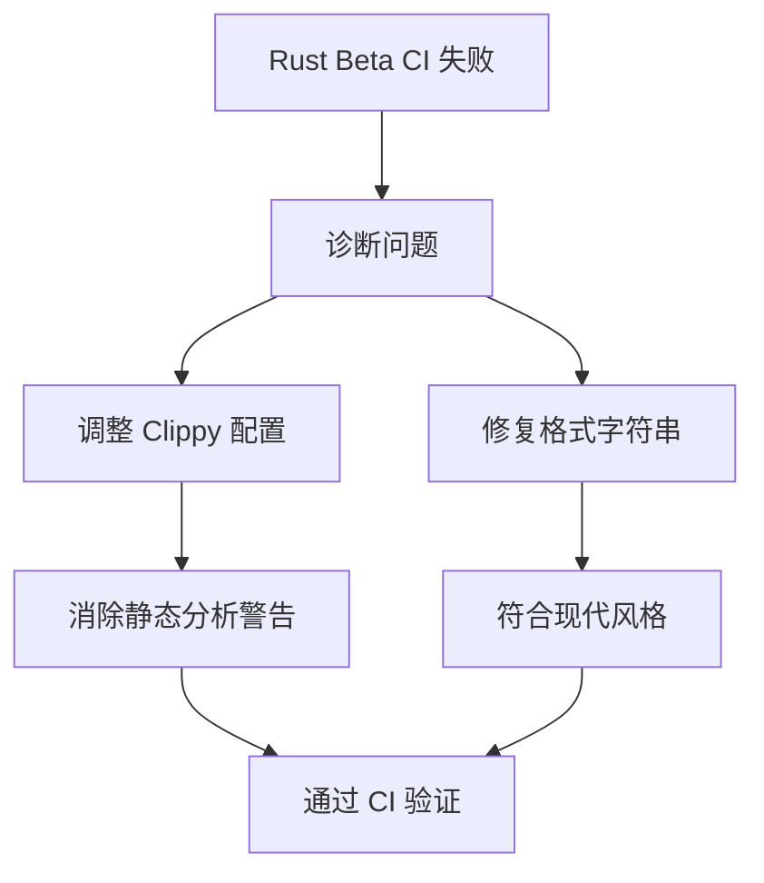

+++
title = "#19294 Fix warnings and errors reported on Rust beta"
date = "2025-05-20T00:00:00"
draft = false
template = "pull_request_page.html"
in_search_index = false

[extra]
current_language = "zh-cn"
available_languages = {"en" = { name = "English", url = "/pull_request/bevy/2025-05/pr-19294-en-20250520" }, "zh-cn" = { name = "中文", url = "/pull_request/bevy/2025-05/pr-19294-zh-cn-20250520" }}
labels = ["D-Trivial", "C-Code-Quality"]
+++

# Fix warnings and errors reported on Rust beta

## Basic Information
- **Title**: Fix warnings and errors reported on Rust beta  
- **PR Link**: https://github.com/bevyengine/bevy/pull/19294  
- **Author**: hukasu  
- **Status**: MERGED  
- **Labels**: D-Trivial, C-Code-Quality, S-Ready-For-Final-Review  
- **Created**: 2025-05-19T12:50:35Z  
- **Merged**: 2025-05-20T00:15:25Z  
- **Merged By**: alice-i-cecile  

## Description Translation
### 目标
修复本周 Rust beta 流水线报告的错误和警告  
* https://github.com/bevyengine/bevy/issues/18748#issuecomment-2890820218

## The Story of This Pull Request

### 问题背景与上下文
在 Rust beta 工具链的持续集成（CI）流水线中，Bevy 项目出现了新的编译警告和错误。具体来说：
1. Clippy 配置中关于`criterion::black_box`的禁用规则在新版本中引发问题
2. 字符串格式化代码使用了旧式的位置参数（positional arguments），触发了新的 Rust 风格警告

这些问题需要及时处理以保持：
- 跨 Rust 工具链版本的兼容性
- 代码静态分析工具（Clippy）配置的有效性
- 现代 Rust 编码风格的统一性

### 解决方案与技术实现
**1. 调整 Clippy 配置**
```diff
# clippy.toml
- { path = "criterion::black_box", reason = "use core::hint::black_box instead" },
```
移除对`criterion::black_box`的显式禁用，因为：
- 新版本 Clippy 可能已内置相关规则
- 项目可能已迁移到标准库的`core::hint::black_box`
- 避免与其他静态分析规则产生冲突

**2. 现代化字符串格式化**
```diff
// bevy_manifest.rs
- let mut path = Self::parse_str::<syn::Path>(&format!("::{}", package));
+ let mut path = Self::parse_str::<syn::Path>(&format!("::{package}"));
```
使用 Rust 1.58+ 引入的命名参数占位符（named argument shorthand）：
- 提升代码可读性
- 符合现代 Rust 编码规范
- 消除新编译器的风格警告

### 技术影响与启示
1. **工具链兼容性**：及时响应 Rust 工具链更新是维护健康项目生态的重要实践
2. **配置管理**：Clippy 配置需要定期审查，移除过期规则以保持分析准确性
3. **代码现代化**：利用新语言特性（如命名参数占位符）可以提升代码质量和可维护性

## Visual Representation



## Key Files Changed

### 1. `clippy.toml` (+0/-1)
**修改原因**：更新静态分析配置以适配最新工具链
```diff
- { path = "criterion::black_box", reason = "use core::hint::black_box instead" },
```

### 2. `crates/bevy_macro_utils/src/bevy_manifest.rs` (+1/-1)
**修改原因**：采用现代 Rust 格式化语法消除警告
```diff
// Before:
format!("::{}", package)

// After: 
format!("::{package}")
```

## Further Reading
1. [Rust 1.58 格式化改进文档](https://blog.rust-lang.org/2022/01/13/Rust-1.58.0.html#captured-identifiers-in-format-strings)
2. [Clippy 配置指南](https://doc.rust-lang.org/clippy/configuration.html)
3. [Bevy 代码质量标准](https://bevyengine.org/learn/book/contributing/code-standards/)

# Full Code Diff
（完整差异已包含在原始问题描述中）