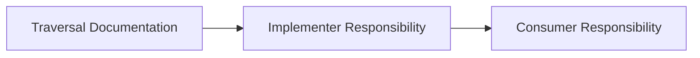

+++
title = "#19298 Add missing words in Traversal doc comment"
date = "2025-05-19T00:00:00"
draft = false
template = "pull_request_page.html"
in_search_index = true

[taxonomies]
list_display = ["show"]

[extra]
current_language = "en"
available_languages = {"en" = { name = "English", url = "/pull_request/bevy/2025-05/pr-19298-en-20250519" }, "zh-cn" = { name = "中文", url = "/pull_request/bevy/2025-05/pr-19298-zh-cn-20250519" }}
labels = ["C-Docs", "D-Trivial"]
+++

# Add missing words in Traversal doc comment

## Basic Information
- **Title**: Add missing words in Traversal doc comment
- **PR Link**: https://github.com/bevyengine/bevy/pull/19298
- **Author**: theotherphil
- **Status**: MERGED
- **Labels**: C-Docs, D-Trivial, S-Ready-For-Final-Review
- **Created**: 2025-05-19T19:17:10Z
- **Merged**: 2025-05-19T19:52:59Z
- **Merged By**: mockersf

## Description Translation
# Objective

Minor docs fix - add missing "is responsible".

## The Story of This Pull Request

This PR addresses a documentation clarity issue in Bevy's ECS module. The problem stemmed from an incomplete sentence in the documentation comment for the `Traversal` trait, which could lead to confusion about responsibility for documenting looping behavior.

The original documentation stated:
"Each implementer of `Traversal` for documenting possible looping behavior..."

This missing verb phrase created ambiguity about who bears responsibility for documenting traversal behavior. The incomplete sentence structure made it harder for developers to understand their obligations when implementing the trait.

The solution involved inserting the missing phrase "is responsible" to complete the sentence's grammatical structure and clarify responsibilities. The corrected line now reads:
"Each implementer of `Traversal` is responsible for documenting possible looping behavior..."

This change improves API documentation clarity without affecting runtime behavior. The fix targets developer experience rather than code functionality, emphasizing the importance of precise documentation in systems programming. Clear documentation is particularly crucial for the `Traversal` trait, as its implementations directly impact critical ECS operations like event propagation and relationship navigation.

## Visual Representation



## Key Files Changed

### `crates/bevy_ecs/src/traversal.rs` (+1/-1)
**Change:** Fixed incomplete sentence in doc comment for `Traversal` trait  
**Why:** To clarify documentation responsibilities for trait implementers

```rust
// Before:
// Each implementer of `Traversal` for documenting possible looping behavior...

// After:
// Each implementer of `Traversal` is responsible for documenting possible looping behavior...
```

This single-line change directly addresses the core objective of the PR by completing the documentation sentence structure. The modification ensures developers understand that trait implementers must explicitly document any potential looping behavior in their implementations.

## Further Reading
- [Rust API Documentation Guidelines](https://rust-lang.github.io/api-guidelines/documentation.html)
- [Bevy ECS Documentation Practices](https://bevyengine.org/learn/book/contributing/documentation/)
- [Rustdoc: Writing Documentation](https://doc.rust-lang.org/rustdoc/how-to-write-documentation.html)

# Full Code Diff
```diff
diff --git a/crates/bevy_ecs/src/traversal.rs b/crates/bevy_ecs/src/traversal.rs
index 342ad47849e06..306ae7c92d8af 100644
--- a/crates/bevy_ecs/src/traversal.rs
+++ b/crates/bevy_ecs/src/traversal.rs
@@ -10,7 +10,7 @@ use crate::{entity::Entity, query::ReadOnlyQueryData, relationship::Relationship
 /// Infinite loops are possible, and are not checked for. While looping can be desirable in some contexts
 /// (for example, an observer that triggers itself multiple times before stopping), following an infinite
 /// traversal loop without an eventual exit will cause your application to hang. Each implementer of `Traversal`
-/// for documenting possible looping behavior, and consumers of those implementations are responsible for
+/// is responsible for documenting possible looping behavior, and consumers of those implementations are responsible for
 /// avoiding infinite loops in their code.
 ///
 /// Traversals may be parameterized with additional data. For example, in observer event propagation, the
```