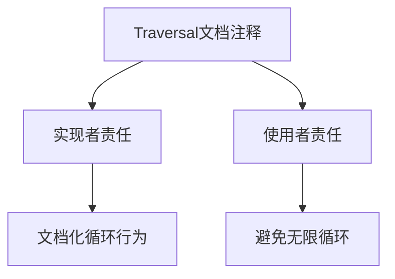

+++
title = "#19298 Add missing words in Traversal doc comment"
date = "2025-05-19T00:00:00"
draft = false
template = "pull_request_page.html"
in_search_index = false

[extra]
current_language = "zh-cn"
available_languages = {"en" = { name = "English", url = "/pull_request/bevy/2025-05/pr-19298-en-20250519" }, "zh-cn" = { name = "中文", url = "/pull_request/bevy/2025-05/pr-19298-zh-cn-20250519" }}
labels = ["C-Docs", "D-Trivial"]
+++

# Add missing words in Traversal doc comment

## Basic Information
- **Title**: Add missing words in Traversal doc comment  
- **PR Link**: https://github.com/bevyengine/bevy/pull/19298
- **Author**: theotherphil
- **Status**: MERGED
- **Labels**: C-Docs, D-Trivial, S-Ready-For-Final-Review
- **Created**: 2025-05-19T19:17:10Z
- **Merged**: 2025-05-19T19:52:59Z
- **Merged By**: mockersf

## Description Translation
### 目标
文档小修复 - 添加缺失的"is responsible"

## The Story of This Pull Request

在Bevy引擎的ECS模块中，`Traversal` trait的文档注释存在语句不完整的问题。具体来说，在解释遍历行为责任划分时，原文档缺少关键动词短语，可能导致开发者对接口责任边界产生误解。

开发者在代码审查时发现以下文档语句存在语法断裂：
```rust
// Before:
// Each implementer of `Traversal` for documenting possible looping behavior, and consumers...
```

问题出现在`Traversal`实现者的责任描述不完整，原句缺失"is responsible"短语，导致语义不连贯。这种文档缺陷虽然微小，但会影响开发者理解接口契约，特别是关于循环遍历行为的责任划分。

修复方案通过补充缺失的动词短语来完善文档：
```rust
// After:
// Each implementer of `Traversal` is responsible for documenting possible looping behavior, and consumers...
```

这个修改恢复了语句的语法完整性，明确了两层责任：
1. `Traversal`实现者需要文档化可能的循环行为
2. 接口使用者需要避免无限循环

从工程实践角度看，这个修复体现了几个重要原则：
1. **文档即契约**：精确的接口文档对于框架使用者至关重要
2. **防御性注释**：明确责任划分可以减少误用风险
3. **持续质量维护**：即使是微小文档问题也值得及时修复

## Visual Representation


## Key Files Changed
### `crates/bevy_ecs/src/traversal.rs` (+1/-1)
**修改说明**：修复文档注释中的语句不完整问题

```rust
// Before:
// Each implementer of `Traversal` for documenting possible looping behavior, and consumers...

// After:
// Each implementer of `Traversal` is responsible for documenting possible looping behavior, and consumers...
```

这个修改直接对应PR的核心目标，通过添加"is responsible"短语修复文档语句的语法和语义完整性。

## Further Reading
1. [Rust API Guidelines - Documentation](https://rust-lang.github.io/api-guidelines/documentation.html)
2. [Bevy ECS Architecture](https://bevyengine.org/learn/book/plugins/ecs/)
3. [Effective Rust Documentation Practices](https://doc.rust-lang.org/rustdoc/how-to-write-documentation.html)

## Full Code Diff
```diff
diff --git a/crates/bevy_ecs/src/traversal.rs b/crates/bevy_ecs/src/traversal.rs
index 342ad47849e06..306ae7c92d8af 100644
--- a/crates/bevy_ecs/src/traversal.rs
+++ b/crates/bevy_ecs/src/traversal.rs
@@ -10,7 +10,7 @@ use crate::{entity::Entity, query::ReadOnlyQueryData, relationship::Relationship
 /// Infinite loops are possible, and are not checked for. While looping can be desirable in some contexts
 /// (for example, an observer that triggers itself multiple times before stopping), following an infinite
 /// traversal loop without an eventual exit will cause your application to hang. Each implementer of `Traversal`
-/// for documenting possible looping behavior, and consumers of those implementations are responsible for
+/// is responsible for documenting possible looping behavior, and consumers of those implementations are responsible for
 /// avoiding infinite loops in their code.
 ///
 /// Traversals may be parameterized with additional data. For example, in observer event propagation, the
```