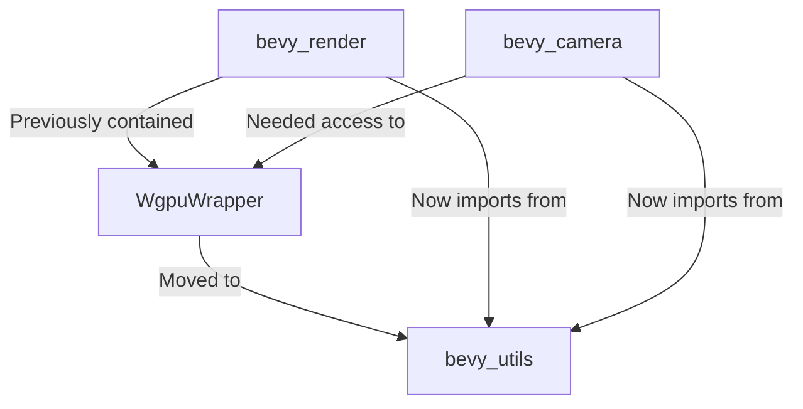

+++
title = "#19303 refactor(render): move WgpuWrapper into bevy_utils"
date = "2025-05-27T00:00:00"
draft = false
template = "pull_request_page.html"
in_search_index = true

[taxonomies]
list_display = ["show"]

[extra]
current_language = "en"
available_languages = {"en" = { name = "English", url = "/pull_request/bevy/2025-05/pr-19303-en-20250527" }, "zh-cn" = { name = "中文", url = "/pull_request/bevy/2025-05/pr-19303-zh-cn-20250527" }}
labels = ["C-Code-Quality", "A-Utils", "D-Straightforward"]
+++

# Title

## Basic Information
- **Title**: refactor(render): move WgpuWrapper into bevy_utils
- **PR Link**: https://github.com/bevyengine/bevy/pull/19303
- **Author**: atlv24
- **Status**: MERGED
- **Labels**: C-Code-Quality, S-Ready-For-Final-Review, A-Utils, X-Uncontroversial, D-Straightforward
- **Created**: 2025-05-20T02:26:37Z
- **Merged**: 2025-05-27T04:02:27Z
- **Merged By**: alice-i-cecile

## Description Translation

# Objective

- A step towards splitting out bevy_camera from bevy_render

## Solution

- Move a shim type into bevy_utils to avoid a dependency cycle
- Manually expand Deref/DerefMut to avoid having a bevy_derive dependency so early in the dep tree

## Testing

- It compiles

## The Story of This Pull Request

The PR addresses a structural dependency issue in the Bevy engine's rendering components. The core problem centered around the `WgpuWrapper` type, which was originally located in `bevy_render` but needed to be shared with other crates like `bevy_camera`. This created a potential dependency cycle that needed resolution.

The solution involved two key technical decisions. First, the team moved `WgpuWrapper` to `bevy_utils`, a lower-level crate with fewer dependencies. Second, they manually implemented `Deref` and `DerefMut` traits instead of using derive macros from `bevy_derive`, which would have introduced an unwanted dependency higher in the tree.

The implementation required careful handling of platform-specific code, particularly for WebAssembly targets with atomics support. The original `WgpuWrapper` used conditional compilation to manage thread safety on different platforms:

```rust
// Original bevy_render implementation
#[cfg(not(all(target_arch = "wasm32", target_feature = "atomics")))]
#[derive(Debug, Clone, Deref, DerefMut)]
pub struct WgpuWrapper<T>(T);
```

When moving to `bevy_utils`, the team replaced the derive-based `Deref` implementation with explicit trait implementations to avoid depending on `bevy_derive`:

```rust
// New bevy_utils implementation
impl<T> core::ops::Deref for WgpuWrapper<T> {
    type Target = T;

    fn deref(&self) -> &Self::Target {
        &self.0
    }
}
```

This manual implementation maintained the same functionality while keeping dependency chains clean. The cargo manifest changes reflect this restructuring, with `bevy_render` removing its direct `send_wrapper` dependency and `bevy_utils` gaining it behind a feature flag:

```toml
// bevy_utils/Cargo.toml addition
[target.'cfg(all(target_arch = "wasm32", target_feature = "atomics"))'.dependencies]
send_wrapper = { version = "0.6.0", optional = true }
```

The primary impact of these changes is improved architectural flexibility. By moving `WgpuWrapper` to a more foundational crate, the team enabled future extraction of `bevy_camera` without creating circular dependencies. This refactor also demonstrates good practice in managing macro dependencies - by avoiding derive macros in low-level utilities, the team maintains flexibility in dependency management.

## Visual Representation



## Key Files Changed

1. `crates/bevy_utils/src/wgpu_wrapper.rs` (+50/-0)
   - New home for `WgpuWrapper` implementation
   - Manual `Deref`/`DerefMut` implementations
   - Platform-specific safety implementations

2. `crates/bevy_render/src/renderer/mod.rs` (+1/-40)
   - Removed `WgpuWrapper` implementation
   - Added import from `bevy_utils`

3. `crates/bevy_render/Cargo.toml` (+3/-4)
   - Removed `send_wrapper` dependency
   - Adjusted `bevy_utils` dependency with features

4. `crates/bevy_utils/Cargo.toml` (+5/-0)
   - Added conditional `send_wrapper` dependency
   - New `wgpu_wrapper` feature flag

5. `crates/bevy_utils/src/lib.rs` (+5/-0)
   - Exported new `WgpuWrapper` type
   - Added module declaration

## Further Reading

- Rust Deref trait documentation: https://doc.rust-lang.org/std/ops/trait.Deref.html
- Bevy's guide to dependency management: https://bevyengine.org/learn/book/development-practices/cargo-dependencies/
- WebGPU threading model: https://gpuweb.github.io/gpuweb/#threading-model