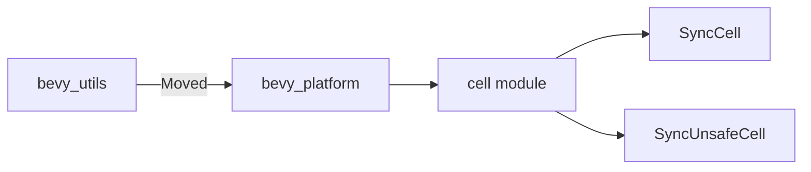

+++
title = "#19305 refactor(utils): move SyncCell and SyncUnsafeCell to bevy_platform"
date = "2025-05-27T00:00:00"
draft = false
template = "pull_request_page.html"
in_search_index = true

[taxonomies]
list_display = ["show"]

[extra]
current_language = "en"
available_languages = {"en" = { name = "English", url = "/pull_request/bevy/2025-05/pr-19305-en-20250527" }, "zh-cn" = { name = "中文", url = "/pull_request/bevy/2025-05/pr-19305-zh-cn-20250527" }}
labels = ["C-Code-Quality", "A-Utils", "D-Straightforward"]
+++

# Title: refactor(utils): move SyncCell and SyncUnsafeCell to bevy_platform

## Basic Information
- **Title**: refactor(utils): move SyncCell and SyncUnsafeCell to bevy_platform  
- **PR Link**: https://github.com/bevyengine/bevy/pull/19305  
- **Author**: atlv24  
- **Status**: MERGED  
- **Labels**: C-Code-Quality, S-Ready-For-Final-Review, M-Needs-Migration-Guide, A-Utils, X-Uncontroversial, D-Straightforward  
- **Created**: 2025-05-20T06:00:13Z  
- **Merged**: 2025-05-27T05:16:56Z  
- **Merged By**: alice-i-cecile  

## Description Translation
# Objective  
- Move SyncCell and SyncUnsafeCell to bevy_platform  

## Solution  
- Move SyncCell and SyncUnsafeCell to bevy_platform  

## Testing  
- cargo clippy works  

## The Story of This Pull Request

This refactor addresses code organization by relocating two synchronization primitives to a more appropriate module. The SyncCell and SyncUnsafeCell types were originally housed in bevy_utils, but their thread-safety characteristics made them better suited for bevy_platform, which contains platform-specific and low-level concurrency utilities.

The implementation involved three key steps:
1. **File relocation**: The SyncCell and SyncUnsafeCell implementations were moved from `bevy_utils/src/synccell.rs` and `bevy_utils/src/syncunsafecell.rs` to a new `cell` module in bevy_platform:
```rust
// crates/bevy_platform/src/cell/mod.rs
mod sync_cell;
mod sync_unsafe_cell;

pub use sync_cell::SyncCell;
pub use sync_unsafe_cell::SyncUnsafeCell;
```

2. **Import updates**: All references across the codebase were updated to point to the new location. For example:
```rust
// Before in bevy_ecs/src/component.rs
use bevy_utils::synccell::SyncCell;

// After
use bevy_platform::cell::SyncCell;
```

3. **Documentation maintenance**: A migration guide was added to help users transition:
```markdown
--- 
title: SyncCell and SyncUnsafeCell moved to bevy_platform
pull_requests: [19305]
---

`bevy_utils::synccell::SyncCell` is now `bevy_platform::cell::SyncCell`
`bevy_utils::syncunsafecell::SyncUnsafeCell` is now `bevy_platform::cell::SyncUnsafeCell`
```

The changes maintain identical functionality while improving code organization. SyncCell provides thread-safe interior mutability through runtime-checked borrows, while SyncUnsafeCell offers unsafe unchecked access for performance-critical scenarios. Their relocation groups them with similar concurrency primitives in bevy_platform, making the codebase more intuitive to navigate.

## Visual Representation



## Key Files Changed

1. `crates/bevy_platform/src/cell/mod.rs` (+9/-0)  
   - Created new module housing both cell types  
   - Consolidated documentation about thread-safe cells  

2. `release-content/migration-guides/sync_cell_utils.md` (+7/-0)  
   - Added migration notice for users of moved types  
```markdown
--- 
title: SyncCell and SyncUnsafeCell moved to bevy_platform
pull_requests: [19305]
---

`bevy_utils::synccell::SyncCell` is now `bevy_platform::cell::SyncCell`
```

3. `crates/bevy_ecs/src/component.rs` (+2/-2)  
   - Updated documentation references  
```rust
// Before:
//! [`SyncCell`]: bevy_utils::synccell::SyncCell

// After:
//! [`SyncCell`]: bevy_platform::cell::SyncCell
```

4. `crates/bevy_ecs/src/schedule/executor/multi_threaded.rs` (+1/-1)  
   - Updated import for scheduler internals  
```rust
// Before:
use bevy_utils::syncunsafecell::SyncUnsafeCell;

// After: 
use bevy_platform::cell::SyncUnsafeCell;
```

## Further Reading

1. [Rust Standard Library Cells](https://doc.rust-lang.org/std/cell/index.html) - Base concepts for interior mutability  
2. [Bevy Platform Crate Documentation](https://docs.rs/bevy_platform/latest/bevy_platform/) - Context for where these types now live  
3. [Interior Mutability Patterns](https://doc.rust-lang.org/book/ch15-05-interior-mutability.html) - Rust's approach to safe internal mutation