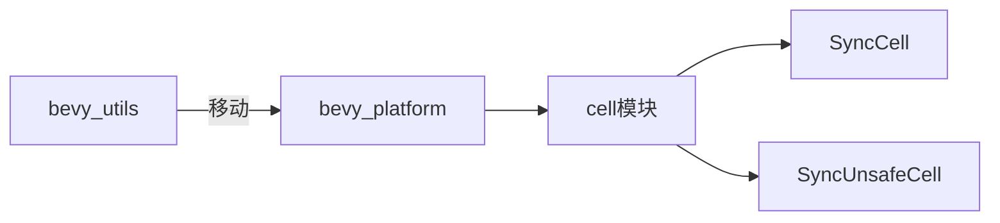

+++
title = "#19305 refactor(utils): move SyncCell and SyncUnsafeCell to bevy_platform"
date = "2025-05-27T00:00:00"
draft = false
template = "pull_request_page.html"
in_search_index = false

[extra]
current_language = "zh-cn"
available_languages = {"en" = { name = "English", url = "/pull_request/bevy/2025-05/pr-19305-en-20250527" }, "zh-cn" = { name = "中文", url = "/pull_request/bevy/2025-05/pr-19305-zh-cn-20250527" }}
labels = ["C-Code-Quality", "A-Utils", "D-Straightforward"]
+++

# refactor(utils): move SyncCell and SyncUnsafeCell to bevy_platform

## Basic Information
- **Title**: refactor(utils): move SyncCell and SyncUnsafeCell to bevy_platform
- **PR Link**: https://github.com/bevyengine/bevy/pull/19305
- **Author**: atlv24
- **Status**: MERGED
- **Labels**: C-Code-Quality, S-Ready-For-Final-Review, M-Needs-Migration-Guide, A-Utils, X-Uncontroversial, D-Straightforward
- **Created**: 2025-05-20T06:00:13Z
- **Merged**: 2025-05-27T05:16:56Z
- **Merged By**: alice-i-cecile

## Description Translation
该PR的目标是将SyncCell和SyncUnsafeCell移动到bevy_platform中。解决方案是直接移动这两个类型到目标模块，并通过cargo clippy进行验证。

## The Story of This Pull Request

### 代码结构优化
本次重构源于对Bevy代码库组织结构的持续优化。原位于`bevy_utils`中的并发容器`SyncCell`和`SyncUnsafeCell`，从其功能定位来看更适合归类到`bevy_platform`模块。这两个类型提供跨平台的同步原语支持，与`bevy_platform`管理底层平台适配的职责更加契合。

### 实现策略
核心改动包含三个层面：
1. **物理文件迁移**：将`sync_cell.rs`和`sync_unsafe_cell.rs`从`bevy_utils/src`移动到`bevy_platform/src/cell`目录
2. **模块暴露**：在`bevy_platform`中新建`cell`模块并通过`mod.rs`导出类型
3. **引用更新**：全局替换所有对原路径`bevy_utils::synccell`的引用为`bevy_platform::cell`

示例代码修改：
```rust
// 修改前
use bevy_utils::synccell::SyncCell;

// 修改后
use bevy_platform::cell::SyncCell;
```

### 兼容性处理
为保证平滑迁移：
1. 在`release-content/migration-guides`添加迁移指南
2. 更新所有文档中的类型引用
3. 调整相关crate的依赖关系（如`bevy_log`新增对`bevy_platform`的依赖）

### 技术考量
- **类型安全**：保持原有`unsafe`实现的边界不变
- **零性能损耗**：纯路径修改不涉及实际逻辑变动
- **跨平台一致性**：强化`bevy_platform`作为底层抽象层的定位

## Visual Representation



## Key Files Changed

### `crates/bevy_platform/src/cell/mod.rs` (+9/-0)
新建模块入口文件，定义公共接口：
```rust
// 模块结构定义
pub mod sync_cell;
pub mod sync_unsafe_cell;

// 类型导出
pub use sync_cell::SyncCell;
pub use sync_unsafe_cell::SyncUnsafeCell;
```

### `release-content/migration-guides/sync_cell_utils.md` (+7/-0)
迁移指南包含具体路径变更说明：
```markdown
`bevy_utils::synccell::SyncCell` -> `bevy_platform::cell::SyncCell`
`bevy_utils::syncunsafecell::SyncUnsafeCell` -> `bevy_platform::cell::SyncUnsafeCell`
```

### `crates/bevy_ecs/src/component.rs` (+2/-2)
更新文档示例中的类型引用：
```rust
// 修改前
/// [`SyncCell`]: bevy_utils::synccell::SyncCell

// 修改后
/// [`SyncCell`]: bevy_platform::cell::SyncCell
```

## Further Reading
- [Rust同步原语文档](https://doc.rust-lang.org/std/sync/index.html)
- [Bevy模块架构设计指南](https://bevyengine.org/learn/book/plugins/)