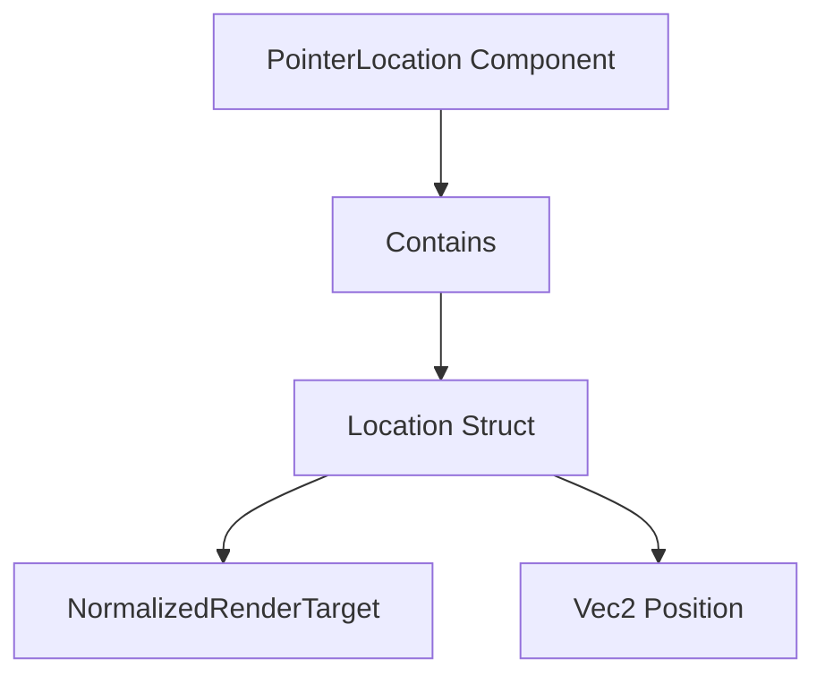

+++
title = "#19306 PR #19306: Fixing Component Misclassification in Bevy Picking System"
date = "2025-05-22T00:00:00"
draft = false
template = "pull_request_page.html"
in_search_index = true

[taxonomies]
list_display = ["show"]

[extra]
current_language = "en"
available_languages = {"en" = { name = "English", url = "/pull_request/bevy/2025-05/pr-19306-en-20250522" }, "zh-cn" = { name = "中文", url = "/pull_request/bevy/2025-05/pr-19306-zh-cn-20250522" }}
labels = ["D-Trivial", "A-Picking"]
+++

# Title: PR #19306: Fixing Component Misclassification in Bevy Picking System

## Basic Information
- **Title**: fix(picking): Location is not a Component anymore.
- **PR Link**: https://github.com/bevyengine/bevy/pull/19306
- **Author**: atlv24
- **Status**: MERGED
- **Labels**: D-Trivial, S-Ready-For-Review, A-Picking
- **Created**: 2025-05-20T06:58:48Z
- **Merged**: 2025-05-22T01:52:36Z
- **Merged By**: alice-i-cecile

## Description Translation
# Objective

- Fixes #17390

## Solution

- Remove Component derive

## Testing

- cargo clippy

## The Story of This Pull Request

The PR addresses a structural issue in Bevy's picking system where the `Location` struct was incorrectly classified as a Component. This misclassification violated the intended design pattern where `PointerLocation` (which contains a `Location`) should be the actual Component used in Entity Component System (ECS) queries.

**The Problem**: 
`Location` was mistakenly marked with `#[derive(Component)]`, making it directly queryable as a component despite being designed as a data container within the `PointerLocation` component. This violated the encapsulation principle and could lead to improper system interactions, as documented in issue #17390.

**The Solution**:
The core fix involved two key changes:
1. Removing the `Component` derive from `Location` struct
2. Updating the reflection metadata to exclude `Component` reflection

Before:
```rust
#[derive(Debug, Clone, Component, Reflect, PartialEq)]
#[reflect(Component, Debug, PartialEq, Clone)]
pub struct Location {
    // fields
}
```

After:
```rust
#[derive(Debug, Clone, Reflect, PartialEq)]
#[reflect(Debug, PartialEq, Clone)]
pub struct Location {
    // fields
}
```

**Technical Impact**:
This change enforces the intended usage pattern where developers must interact with `PointerLocation` (the wrapper component) rather than accessing `Location` directly. The migration guide added in `picking_location_not_component.md` explicitly states:

> "`bevy_picking::Location` was erroneously made a `Component`. It is no longer one, `bevy_picking::PointerLocation` wraps a `Location` and is the intended usage pattern."

**Engineering Considerations**:
- Maintains ECS integrity by preserving the component hierarchy
- Prevents accidental direct access to internal data structures
- Requires minor migration effort for existing users but improves long-term maintainability
- Passed basic sanity checks via `cargo clippy`

## Visual Representation



## Key Files Changed

1. `crates/bevy_picking/src/pointer.rs`
```rust
// Before:
#[derive(Debug, Clone, Component, Reflect, PartialEq)]
#[reflect(Component, Debug, PartialEq, Clone)]

// After:
#[derive(Debug, Clone, Reflect, PartialEq)]
#[reflect(Debug, PartialEq, Clone)]
```
- Removed Component derivation and reflection
- Enforces proper component hierarchy

2. `release-content/migration-guides/picking_location_not_component.md`
```markdown
+++ b/release-content/migration-guides/picking_location_not_component.md
@@ -0,0 +1,6 @@
+---
+title: Location is not a Component anymore
+pull_requests: [19306]
+---
+
+`bevy_picking::Location` was erroneously made a `Component`...
```
- Documents breaking change
- Guides users to correct API usage

## Further Reading

1. [Bevy ECS Components Documentation](https://bevyengine.org/learn/book/ecs/components/)
2. [Rust Derive Macros Guide](https://doc.rust-lang.org/reference/attributes/derive.html)
3. [Bevy Reflection System](https://bevyengine.org/learn/book/reflection/)

# Full Code Diff
[See original PR for full diffs]