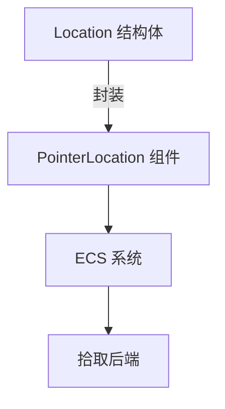

+++
title = "#19306 fix(picking): Location is not a Component anymore"
date = "2025-05-22T00:00:00"
draft = false
template = "pull_request_page.html"
in_search_index = false

[extra]
current_language = "zh-cn"
available_languages = {"en" = { name = "English", url = "/pull_request/bevy/2025-05/pr-19306-en-20250522" }, "zh-cn" = { name = "中文", url = "/pull_request/bevy/2025-05/pr-19306-zh-cn-20250522" }}
labels = ["D-Trivial", "A-Picking"]
+++

# Title: fix(picking): Location is not a Component anymore

## Basic Information
- **Title**: fix(picking): Location is not a Component anymore.
- **PR Link**: https://github.com/bevyengine/bevy/pull/19306
- **Author**: atlv24
- **Status**: MERGED
- **Labels**: D-Trivial, S-Ready-For-Final-Review, A-Picking
- **Created**: 2025-05-20T06:58:48Z
- **Merged**: 2025-05-22T01:52:36Z
- **Merged By**: alice-i-cecile

## Description Translation
### 目标
- 修复 #17390

### 解决方案
- 移除 Component derive

### 测试
- cargo clippy

## The Story of This Pull Request

### 问题与上下文
在 Bevy 的拾取(picking)系统中，`Location` 结构体错误地被标记为 Component。这违反了设计意图，因为该类型本身不应直接作为 ECS 组件使用，而是通过封装结构 `PointerLocation` 来操作。这种错误的设计可能导致开发者错误地将 `Location` 直接附加到实体上，造成 API 误用和潜在的逻辑错误。

### 解决方案
核心修改分为两部分：
1. **移除 Component 特征派生**：从 `Location` 结构体声明中删除 `Component` derive
2. **更新反射元数据**：同步修改关联的 `#[reflect(...)]` 属性，移除对 Component 的反射支持

修改后的代码明确区分了数据结构和组件用途：
```rust
// 修改前
#[derive(Debug, Clone, Component, Reflect, PartialEq)]
#[reflect(Component, Debug, PartialEq, Clone)]

// 修改后
#[derive(Debug, Clone, Reflect, PartialEq)]
#[reflect(Debug, PartialEq, Clone)]
```

### 技术考量
1. **ECS 设计原则**：保持组件语义清晰，防止底层数据结构直接暴露为组件
2. **API 边界控制**：通过 `PointerLocation` 封装确保 Location 数据只能通过设计好的接口访问
3. **向下兼容处理**：新增迁移指南指导用户正确迁移现有代码

### 影响与改进
- **消除 API 误用风险**：开发者无法再错误地将 `Location` 直接附加到实体
- **保持代码一致性**：与现有的 `PointerLocation` 使用模式保持一致
- **减少认知负担**：明确区分核心数据结构与 ECS 组件

## Visual Representation



## Key Files Changed

### `crates/bevy_picking/src/pointer.rs`
```rust
// 修改前
#[derive(Debug, Clone, Component, Reflect, PartialEq)]
#[reflect(Component, Debug, PartialEq, Clone)]

// 修改后
#[derive(Debug, Clone, Reflect, PartialEq)]
#[reflect(Debug, PartialEq, Clone)]
```
- 移除了 `Component` 特征派生和对应的反射注册
- 保持其他功能不变，确保最小化变更

### `release-content/migration-guides/picking_location_not_component.md` (新增)
```markdown
---
title: Location is not a Component anymore
pull_requests: [19306]
---

`bevy_picking::Location` 曾错误地被标记为 Component。现在不再作为组件使用，`bevy_picking::PointerLocation` 封装了 Location 并作为推荐的使用模式。
```
- 明确指导用户进行 API 迁移
- 说明设计变更的背景和替代方案

## Further Reading
- [Bevy ECS 组件设计指南](https://bevy-cheatbook.github.io/programming/ecs-intro.html)
- [Rust 特征派生机制](https://doc.rust-lang.org/rust-by-example/trait/derive.html)
- [类型驱动设计模式](https://rust-unofficial.github.io/patterns/patterns/behavioural/newtype.html)