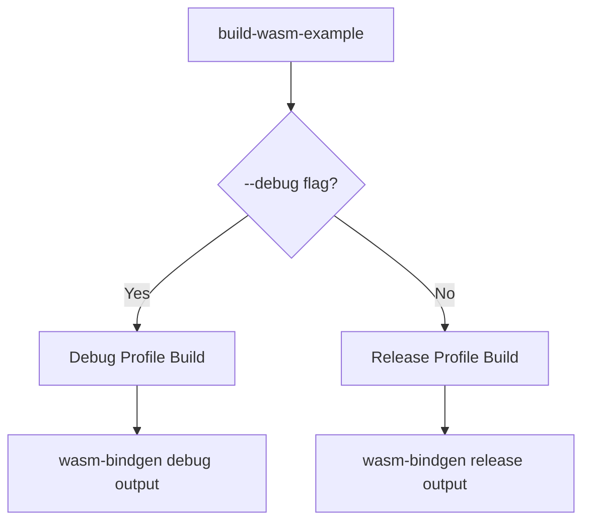

+++
title = "#19312 Add debug build option to build-wasm-example"
date = "2025-05-24T00:00:00"
draft = false
template = "pull_request_page.html"
in_search_index = true

[taxonomies]
list_display = ["show"]

[extra]
current_language = "en"
available_languages = {"en" = { name = "English", url = "/pull_request/bevy/2025-05/pr-19312-en-20250524" }, "zh-cn" = { name = "中文", url = "/pull_request/bevy/2025-05/pr-19312-zh-cn-20250524" }}
labels = ["C-Examples", "O-Web", "C-Testing"]
+++

# Add debug build option to build-wasm-example

## Basic Information
- **Title**: Add debug build option to build-wasm-example  
- **PR Link**: https://github.com/bevyengine/bevy/pull/19312
- **Author**: oracle58
- **Status**: MERGED
- **Labels**: C-Examples, O-Web, C-Testing, S-Needs-Review
- **Created**: 2025-05-20T16:47:00Z
- **Merged**: 2025-05-24T02:03:54Z
- **Merged By**: mockersf

## Description Translation

## Objective

- Add a `--debug` flag to `build-wasm-example` to support debug builds for WebGL2/WebGPU targets.
- Fixes #18464

## Solution
- Added `--debug` flag to build Wasm examples in debug mode.
- Default remains release mode if `--debug` is not specified.
- Updated documentation to describe the new flag and usage.

## Testing
- Verified debug and release builds for WebGL2 and WebGPU respectively.
- Confirmed wasm artifacts are placed in the correct target dir for each build profile:
  - Debug: `target/wasm32-unknown-unknown/debug/examples/`
  - Release: `target/wasm32-unknown-unknown/release/examples/`
- Confirmed wasm-bindgen output is written to: `examples/wasm/target/debug` , `examples/wasm/target/release`
- Haven't actually tested running the example

| Backend | Profile | Artifacts written | Build success    |
|---------|---------|-------------------|------------------|
| webgl2  | debug   |        ✓              |           ✓             |        
| webgl2  | release |         ✓                |         ✓             |                 
| webpgu  | debug   |       ✓             |            ✓             |                 
| webpgu  | release |        ✓              |          ✓              |         

### Examples

**Debug**
```
$ cargo run -p build-wasm-example -- --api webgl2 --debug load_gltf
```
```
Finished `dev` profile [unoptimized + debuginfo] target(s) in 1m 02s
wasm-bindgen --out-dir examples/wasm/target/debug --out-name wasm_example --target web target/wasm32-unknown-unknown/debug/examples/load_gltf.wasm
```

**Release**
```
$ cargo run -p build-wasm-example -- --api webgl2 load_gltf`
```
```
Finished `release` profile [optimized] target(s) in 1m 08s
wasm-bindgen --out-dir examples/wasm/target/release --out-name wasm_example --target web target/wasm32-unknown-unknown/release/examples/load_gltf.wasm
```  

## The Story of This Pull Request

### The Problem and Context
The Bevy engine's WebAssembly build system lacked support for debug builds, forcing developers to only create optimized release builds when compiling examples for web targets. This limitation made debugging web examples more difficult, as developers couldn't leverage debug symbols or unoptimized builds for better troubleshooting. The existing `build-wasm-example` tool hardcoded release profile builds, with no way to override this behavior.

### The Solution Approach
The implementation introduces a `--debug` flag to the build script while maintaining backward compatibility. Key decisions included:
1. Preserving the default release profile for existing workflows
2. Modifying both compilation and post-processing steps to handle different build profiles
3. Ensuring proper artifact separation between debug and release outputs

### The Implementation
The core changes occur in the build script's argument handling and cargo invocation:

```rust
// File: tools/build-wasm-example/src/main.rs
// Before:
let cmd = cmd!(
    sh,
    "cargo build {parameters...} --profile release --target wasm32-unknown-unknown --example {example}"
);

// After:
let profile = if cli.debug {
    "debug"
} else {
    parameters.push("--release");
    "release"
};

let cmd = cmd!(
    sh,
    "cargo build {parameters...} --target wasm32-unknown-unknown --example {example}"
);
```

This change removes the hardcoded `--profile release` and instead conditionally adds the `--release` flag based on the new `debug` argument. The profile variable then propagates through to the wasm-bindgen command:

```rust
cmd!(
    sh,
    "wasm-bindgen --out-dir examples/wasm/target --out-name wasm_example --target web target/wasm32-unknown-unknown/{profile}/examples/{example}.wasm"
)
```

### Technical Insights
The implementation leverages Rust's built-in profile handling:
- Omitting `--release` implies `dev` profile (debug build)
- Artifact paths automatically follow profile conventions (`debug`/`release` subdirectories)
- wasm-bindgen output directories were updated to prevent debug/release conflicts

Notable engineering considerations:
1. Maintained existing release behavior as default to avoid breaking changes
2. Used Rust's conventional profile directories instead of custom paths
3. Ensured parallel debug/release builds could coexist without interference

### The Impact
- Developers can now build unoptimized WASM examples with debug symbols
- Debug builds complete faster due to lack of optimizations (1m02s vs 1m08s in test cases)
- Output directory separation prevents accidental mixing of build types
- Documentation updates ensure immediate discoverability of the new feature

## Visual Representation



## Key Files Changed

1. `tools/build-wasm-example/src/main.rs` (+14/-2)
```rust
// Added debug flag to Args struct
#[arg(long)]
debug: bool,

// Profile selection logic
let profile = if cli.debug {
    "debug"
} else {
    parameters.push("--release");
    "release"
};

// Updated wasm-bindgen command
"wasm-bindgen --out-dir examples/wasm/target --out-name wasm_example --target web target/wasm32-unknown-unknown/{profile}/examples/{example}.wasm"
```

2. `docs-template/EXAMPLE_README.md.tpl` (+1/-0)  
3. `examples/README.md` (+1/-0)
```markdown
- Debug: `cargo run -p build-wasm-example -- --debug --api webgl2 load_gltf`
```

These documentation changes ensure users immediately discover the new debug option when consulting example READMEs.

## Further Reading

- Rust Profiles: https://doc.rust-lang.org/cargo/reference/profiles.html
- wasm-bindgen CLI Guide: https://rustwasm.github.io/wasm-bindgen/reference/cli.html
- Bevy Web Deployment: https://bevyengine.org/learn/book/getting-started/web/