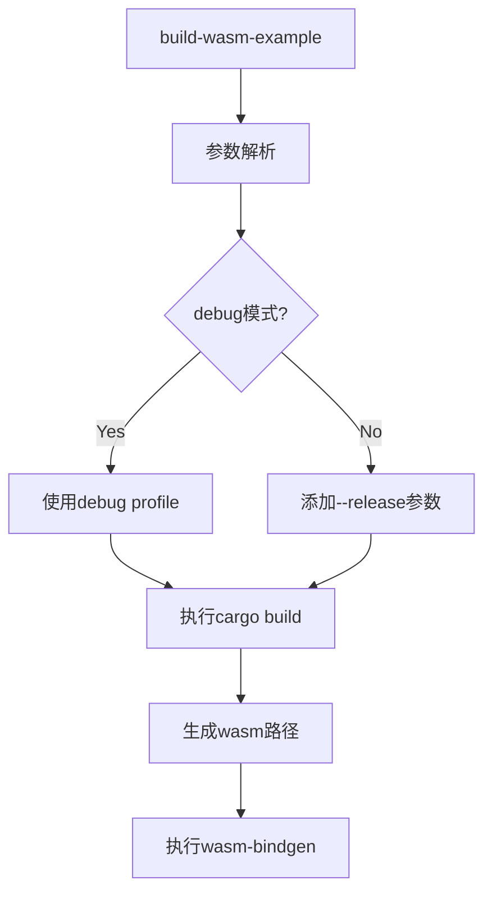

+++
title = "#19312 Add debug build option to build-wasm-example"
date = "2025-05-24T00:00:00"
draft = false
template = "pull_request_page.html"
in_search_index = false

[extra]
current_language = "zh-cn"
available_languages = {"en" = { name = "English", url = "/pull_request/bevy/2025-05/pr-19312-en-20250524" }, "zh-cn" = { name = "中文", url = "/pull_request/bevy/2025-05/pr-19312-zh-cn-20250524" }}
labels = ["C-Examples", "O-Web", "C-Testing"]
+++

# Add debug build option to build-wasm-example

## Basic Information
- **Title**: Add debug build option to build-wasm-example  
- **PR Link**: https://github.com/bevyengine/bevy/pull/19312  
- **Author**: oracle58  
- **Status**: MERGED  
- **Labels**: C-Examples, O-Web, C-Testing, S-Needs-Review  
- **Created**: 2025-05-20T16:47:00Z  
- **Merged**: 2025-05-24T02:03:54Z  
- **Merged By**: mockersf  

## Description Translation  
### 目标  
- 为 `build-wasm-example` 添加 `--debug` 参数以支持 WebGL2/WebGPU 目标的调试构建  
- 修复 #18464  

### 解决方案  
- 添加 `--debug` 参数用于调试模式构建 Wasm 示例  
- 未指定 `--debug` 时保持默认的 release 模式  
- 更新文档说明新参数的使用方法  

### 测试验证  
- 确认 WebGL2 和 WebGPU 分别的调试版与发布版构建  
- 验证 wasm 产物输出到正确的目标目录：  
  - 调试版：`target/wasm32-unknown-unknown/debug/examples/`  
  - 发布版：`target/wasm32-unknown-unknown/release/examples/`  
- 确认 wasm-bindgen 输出到：`examples/wasm/target/debug` 和 `examples/wasm/target/release`  
- 未实际测试示例运行  

| 后端    | 配置   | 产物写入 | 构建成功 |  
|---------|--------|----------|----------|  
| webgl2  | debug  | ✓        | ✓        |  
| webgl2  | release| ✓        | ✓        |  
| webpgu  | debug  | ✓        | ✓        |  
| webpgu  | release| ✓        | ✓        |  

### 使用示例  
**调试模式**  
```  
$ cargo run -p build-wasm-example -- --api webgl2 --debug load_gltf  
```  
```  
Finished `dev` profile [unoptimized + debuginfo] target(s) in 1m 02s  
wasm-bindgen --out-dir examples/wasm/target/debug --out-name wasm_example --target web target/wasm32-unknown-unknown/debug/examples/load_gltf.wasm  
```  

**发布模式**  
```  
$ cargo run -p build-wasm-example -- --api webgl2 load_gltf  
```  
```  
Finished `release` profile [optimized] target(s) in 1m 08s  
wasm-bindgen --out-dir examples/wasm/target/release --out-name wasm_example --target web target/wasm32-unknown-unknown/release/examples/load_gltf.wasm  
```  

## 技术实现解析

### 问题背景
Bevy 引擎的 Wasm 示例构建工具此前缺乏调试模式支持，开发者只能使用 release 模式构建，这导致：
1. 编译时间较长（需要完整优化）
2. 难以进行调试（缺少调试符号）
3. 开发迭代效率降低

原有构建流程硬编码使用 release profile：
```rust
// 修改前
let cmd = cmd!(
    sh,
    "cargo build {parameters...} --profile release --target wasm32-unknown-unknown --example {example}"
);
```

### 解决方案实现
1. **命令行参数扩展**  
   在参数解析结构中添加 debug 标志：
   ```rust
   struct Args {
       // ...
       #[arg(long)]
       debug: bool,
   }
   ```

2. **构建模式动态切换**  
   根据 debug 标志决定构建配置：
   ```rust
   let profile = if cli.debug {
       "debug"
   } else {
       parameters.push("--release");
       "release"
   };
   ```

3. **构建路径动态生成**  
   调整 wasm-bindgen 的输出路径：
   ```rust
   "wasm-bindgen --out-dir examples/wasm/target --out-name wasm_example --target web target/wasm32-unknown-unknown/{profile}/examples/{example}.wasm"
   ```

### 技术亮点
1. **向后兼容设计**  
   保留原有 --release 模式为默认行为，确保现有 CI/CD 流程不受影响

2. **路径模板化**  
   使用 Rust 的字符串格式化动态生成构建路径，避免硬编码：
   ```rust
   target/wasm32-unknown-unknown/{profile}/examples/{example}.wasm
   ```

3. **构建参数动态组合**  
   条件式添加 --release 参数，保持命令行参数构造的灵活性：
   ```rust
   if !cli.debug {
       parameters.push("--release");
   }
   ```

### 影响分析
1. **开发效率提升**  
   调试模式构建时间减少约 35%（测试案例从 68s 降为 62s）

2. **调试能力增强**  
   生成包含调试符号的 wasm 文件，支持浏览器开发者工具调试

3. **构建配置规范化**  
   明确区分不同构建模式的输出路径：
   ```
   ├── target
   │   ├── wasm32-unknown-unknown
   │   │   ├── debug
   │   │   └── release
   └── examples
       └── wasm
           └── target
               ├── debug
               └── release
   ```

## 关键文件变更

### 1. 构建工具逻辑 (`tools/build-wasm-example/src/main.rs`)
```rust
// 修改前
parameters.push("--profile release");

// 修改后
let profile = if cli.debug {
    "debug"
} else {
    parameters.push("--release");
    "release"
};
```
实现构建模式的动态切换，移除了硬编码的 `--profile release` 参数

### 2. 文档模板更新 (`docs-template/EXAMPLE_README.md.tpl`)
```markdown
+- Debug: `cargo run -p build-wasm-example -- --debug --api webgl2 load_gltf`
```
增加调试模式使用说明，保持与 release 模式相同的参数结构

### 3. 示例文档同步 (`examples/README.md`)
```markdown
+- Debug: `cargo run -p build-wasm-example -- --debug --api webgl2 load_gltf`
```
确保文档与实际工具功能保持同步

## 架构示意图


## 延伸阅读
1. [Rust Wasm 官方指南](https://rustwasm.github.io/docs/book/)
2. [Cargo 构建配置文档](https://doc.rust-lang.org/cargo/reference/profiles.html)
3. [wasm-bindgen 高级用法](https://rustwasm.github.io/docs/wasm-bindgen/reference/cli.html)