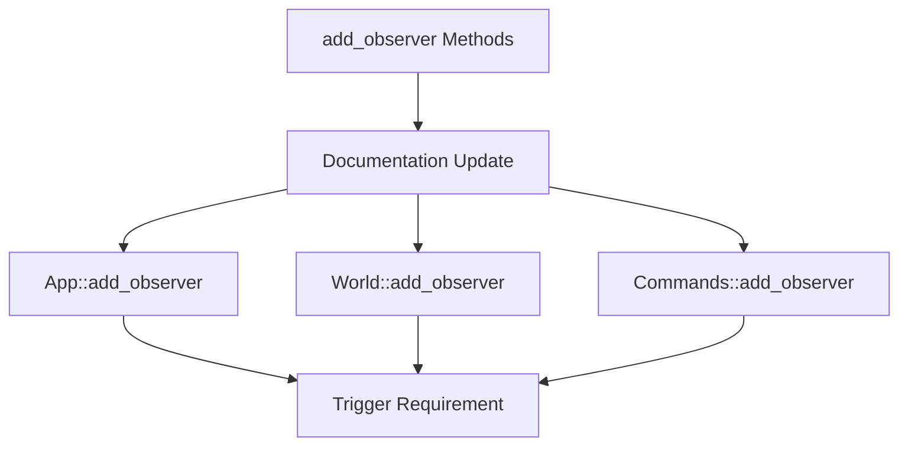

+++
title = "#19315 PR #19315 - Clarifying Trigger Parameter Requirement in Observer Documentation"
date = "2025-05-26T00:00:00"
draft = false
template = "pull_request_page.html"
in_search_index = true

[taxonomies]
list_display = ["show"]

[extra]
current_language = "en"
available_languages = {"en" = { name = "English", url = "/pull_request/bevy/2025-05/pr-19315-en-20250526" }, "zh-cn" = { name = "中文", url = "/pull_request/bevy/2025-05/pr-19315-zh-cn-20250526" }}
labels = ["C-Docs", "D-Trivial"]
+++

# Title: PR #19315 - Clarifying Trigger Parameter Requirement in Observer Documentation

## Basic Information
- **Title**: Mention in .add_observer() docs that first parameter must be a Trigger
- **PR Link**: https://github.com/bevyengine/bevy/pull/19315
- **Author**: theotherphil
- **Status**: MERGED
- **Labels**: C-Docs, D-Trivial, S-Ready-For-Final-Review
- **Created**: 2025-05-20T19:57:37Z
- **Merged**: 2025-05-26T20:41:32Z
- **Merged By**: alice-i-cecile

## Description Translation
# Objective

Fix https://github.com/bevyengine/bevy/issues/13860

## Solution

Add note in docs that Trigger must be the first parameter of observer systems

## The Story of This Pull Request

The PR addresses a documentation gap in Bevy's observer system API. Users encountering issue #13860 were likely writing observer systems without properly using a `Trigger` as the first parameter, leading to unexpected behavior or compilation errors. While the observer system implementation technically requires this parameter ordering, the documentation didn't explicitly state this requirement.

The solution focuses on clarifying API contracts through targeted documentation improvements. Three key locations in the codebase received nearly identical documentation updates:

1. `App::add_observer` method
2. `World::add_observer` method
3. `Commands::add_observer` method

Each documentation block now explicitly states that the observer system must have a `Trigger` as its first parameter. This change helps developers correctly structure their observer systems without needing to infer requirements from example code or implementation details.

The implementation demonstrates effective documentation maintenance by:
- Adding consistent phrasing across related APIs
- Placing requirements prominently in method documentation
- Maintaining existing example code while clarifying foundational assumptions

These changes improve API discoverability and reduce cognitive load for developers working with Bevy's observer system. By explicitly stating parameter requirements, the documentation now better aligns with Rust's emphasis on explicit interfaces and type safety.

## Visual Representation



## Key Files Changed

1. `crates/bevy_app/src/app.rs`
```rust
// Before:
/// Spawns an [`Observer`] entity, which will watch for and respond to the given event.
///
/// # Examples

// After:
/// Spawns an [`Observer`] entity, which will watch for and respond to the given event.
///
/// `observer` can be any system whose first parameter is a [`Trigger`].
///
/// # Examples
```

2. `crates/bevy_ecs/src/observer/mod.rs`
```rust
// Before:
/// Spawns a "global" [`Observer`] which will watch for the given event.
/// Returns its [`Entity`] as a [`EntityWorldMut`].

// After:
/// Spawns a "global" [`Observer`] which will watch for the given event.
/// Returns its [`Entity`] as a [`EntityWorldMut`].
///
/// `system` can be any system whose first parameter is a [`Trigger`].
```

3. `crates/bevy_ecs/src/system/commands/mod.rs`
```rust
// Before:
/// Spawns an [`Observer`] and returns the [`EntityCommands`] associated
/// with the entity that stores the observer.

// After:
/// Spawns an [`Observer`] and returns the [`EntityCommands`] associated
/// with the entity that stores the observer.
///
/// `observer` can be any system whose first parameter is a [`Trigger`].
```

## Further Reading
- Bevy Observer System Documentation: https://bevyengine.org/learn/book/events/observers/
- Rust API Guidelines on Documentation: https://rust-lang.github.io/api-guidelines/documentation.html
- Bevy Event System Overview: https://bevy-cheatbook.github.io/programming/events.html

# Full Code Diff
(See original PR for complete diff)