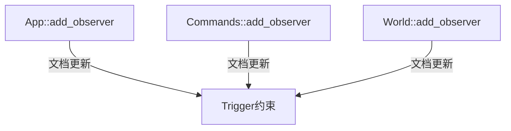

+++
title = "#19315 Mention in .add_observer() docs that first parameter must be a Trigger"
date = "2025-05-26T00:00:00"
draft = false
template = "pull_request_page.html"
in_search_index = false

[extra]
current_language = "zh-cn"
available_languages = {"en" = { name = "English", url = "/pull_request/bevy/2025-05/pr-19315-en-20250526" }, "zh-cn" = { name = "中文", url = "/pull_request/bevy/2025-05/pr-19315-zh-cn-20250526" }}
labels = ["C-Docs", "D-Trivial"]
+++

# Mention in .add_observer() docs that first parameter must be a Trigger

## Basic Information
- **Title**: Mention in .add_observer() docs that first parameter must be a Trigger
- **PR Link**: https://github.com/bevyengine/bevy/pull/19315
- **Author**: theotherphil
- **Status**: MERGED
- **Labels**: C-Docs, D-Trivial, S-Ready-For-Final-Review
- **Created**: 2025-05-20T19:57:37Z
- **Merged**: 2025-05-26T20:41:32Z
- **Merged By**: alice-i-cecile

## Description Translation
### 目标
修复 https://github.com/bevyengine/bevy/issues/13860

### 解决方案
在文档中添加说明，明确观察者系统的第一个参数必须是 Trigger

## The Story of This Pull Request

### 问题背景
在 Bevy 的观察者系统设计中，用户需要正确实现观察者系统的参数签名。触发机制要求观察者系统的第一个参数必须是 `Trigger` 类型。但原有文档中对此约束说明不足，导致用户可能错误地定义观察者系统参数顺序，引发运行时错误（如 issue #13860 中报告的 panic）。

### 解决方案选择
直接增强 API 文档的明确性是最有效的解决方式。通过在三个关键入口点（App、World、Commands）的 `add_observer` 方法文档中增加参数约束说明，确保开发者在使用不同 API 时都能获得一致的指导。

### 具体实现
修改集中在三个文件的核心 API 文档注释中：

1. **app.rs** 中 App::add_observer 方法：
```rust
/// `observer` can be any system whose first parameter is a [`Trigger`].
```
通过明确参数约束，修正了原有示例代码前的注释位置，使文档结构更清晰。

2. **observer/mod.rs** 中 World::add_observer 方法：
```rust
/// `system` can be any system whose first parameter is a [`Trigger`].
```
保持与 App 接口的一致性说明，确保通过 World 直接添加观察者的开发者也能获得相同信息。

3. **commands/mod.rs** 中 Commands::add_observer 方法：
```rust
/// `observer` can be any system whose first parameter is a [`Trigger`].
///
/// [`Trigger`]: crate::observer::Trigger
```
特别添加了类型链接，方便开发者快速跳转到 Trigger 类型的文档，增强文档的互联性。

### 技术考量
- **一致性维护**：三个接口的文档修改保持相同表述，避免多入口点文档不一致
- **错误预防**：在可能触发 panic 的方法前明确参数要求，符合 Rust 的 fail-fast 原则
- **开发者体验**：通过类型链接（`[`Trigger`]`）增强文档可导航性

### 影响分析
该修改虽然代码量小，但有效解决了 API 误用问题：
1. 降低新用户的学习曲线
2. 减少因参数顺序错误导致的运行时崩溃
3. 提升 API 文档的自解释性
4. 保持 Bevy ECS 模块不同接口间文档的一致性

## Visual Representation



## Key Files Changed

### 1. crates/bevy_app/src/app.rs (+3/-1)
**修改说明**：在 App 的 add_observer 方法文档中增加参数约束说明
```rust
// 修改前
/// Spawns an [`Observer`] entity...

// 修改后
/// Spawns an [`Observer`] entity...
///
/// `observer` can be any system whose first parameter is a [`Trigger`].
```

### 2. crates/bevy_ecs/src/system/commands/mod.rs (+4/-0)
**修改说明**：为 Commands 的 add_observer 添加类型链接
```rust
/// `observer` can be any system whose first parameter is a [`Trigger`].
///
/// [`Trigger`]: crate::observer::Trigger
```

### 3. crates/bevy_ecs/src/observer/mod.rs (+2/-0)
**修改说明**：统一 World 接口的文档表述
```rust
/// Spawns a "global" [`Observer`]...
///
/// `system` can be any system whose first parameter is a [`Trigger`].
```

## Further Reading
1. [Bevy Observers 官方文档](https://docs.rs/bevy/latest/bevy/ecs/observer/index.html)
2. [Rust API 文档指南](https://rust-lang.github.io/api-guidelines/documentation.html)
3. [类型驱动开发模式](https://zh.wikipedia.org/wiki/类型驱动开发) (Type-Driven Development)