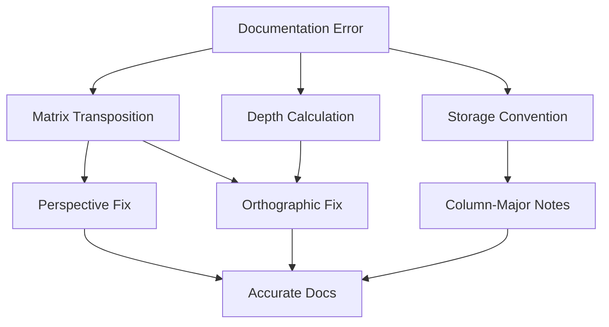

+++
title = "#19317 doc(render): fix incorrectly transposed view matrix docs"
date = "2025-05-27T00:00:00"
draft = false
template = "pull_request_page.html"
in_search_index = true

[taxonomies]
list_display = ["show"]

[extra]
current_language = "en"
available_languages = {"en" = { name = "English", url = "/pull_request/bevy/2025-05/pr-19317-en-20250527" }, "zh-cn" = { name = "中文", url = "/pull_request/bevy/2025-05/pr-19317-zh-cn-20250527" }}
labels = ["C-Bug", "C-Docs", "A-Rendering", "D-Straightforward"]
+++

# Title: doc(render): fix incorrectly transposed view matrix docs

## Basic Information
- **Title**: doc(render): fix incorrectly transposed view matrix docs
- **PR Link**: https://github.com/bevyengine/bevy/pull/19317
- **Author**: atlv24
- **Status**: MERGED
- **Labels**: C-Bug, C-Docs, A-Rendering, S-Ready-For-Final-Review, D-Straightforward
- **Created**: 2025-05-21T03:55:00Z
- **Merged**: 2025-05-27T05:16:56Z
- **Merged By**: alice-i-cecile

## Description Translation
# Objective

- Mend incorrect docs

## Solution

- Mend them
- add example use
- clarify column major

## Testing

- No code changes

## The Story of This Pull Request

The PR addresses a documentation issue in Bevy's rendering system where view matrix documentation showed transposed matrix layouts. This stemmed from a mismatch between mathematical notation conventions and the actual column-major storage used by GLAM (Bevy's math library) and WGSL (WebGPU Shading Language).

The core problem manifested in two key areas:
1. Perspective projection matrices incorrectly placed the near plane value at [3][2] instead of [2][3]
2. Orthographic projection matrices showed an inverted depth calculation (near - far instead of far - near) and misplaced translation components

These documentation errors could mislead developers working with custom projections or matrix operations. The author identified three main fixes needed:
- Correct matrix element positions to match column-major storage
- Fix depth calculation in orthographic matrix comments
- Add explicit notes about column-major storage conventions

In `view/mod.rs`, the perspective projection matrix was restructured to properly represent column-major layout. The near plane moved from the fourth row to the third column:

```rust
// Before incorrect layout:
// ⎡ f / aspect  0     0   0 ⎤
// ⎢          0  f     0   0 ⎥
// ⎢          0  0     0  -1 ⎥
// ⎣          0  0  near   0 ⎦

// After correction:
// ⎡ f / aspect  0   0     0 ⎤
// ⎢          0  f   0     0 ⎥
// ⎢          0  0   0  near ⎥
// ⎣          0  0  -1     0 ⎦
```

For orthographic projections, the fix involved:
- Correcting depth calculation to `far - near`
- Properly placing translation components in the fourth column
- Fixing matrix component denominators

The WGSL shader documentation in `view.wgsl` received parallel corrections to maintain consistency between CPU and GPU-side documentation. A crucial addition was explicit notes about column-major storage:

```wgsl
// Added clarification:
// Wgsl matrices are column major, so for example getting the near plane
// of a perspective projection is `clip_from_view[3][2]`
```

These changes improve documentation accuracy in three key ways:
1. Matrix layouts now match actual memory representation
2. Depth calculations follow standard graphics conventions
3. Column-major storage is explicitly documented at usage points

## Visual Representation



## Key Files Changed

1. `crates/bevy_render/src/view/mod.rs`
- Fixed matrix layouts in Rust documentation
- Added column-major storage explanation
- Corrected orthographic depth calculation

Before:
```rust
// Orthographic matrix before:
// ⎡  2 / w       0         0  0 ⎤
// ⎢      0   2 / h         0  0 ⎥
// ⎢      0       0     1 / d  0 ⎥
// ⎣ cw / w  ch / h  near / d  1 ⎦
// Where d = near - far
```

After:
```rust
// Orthographic matrix after:
// ⎡ 2 / w      0      0   cw / w ⎤
// ⎢     0  2 / h      0   ch / h ⎥
// ⎢     0      0  1 / d  far / d ⎥
// ⎣     0      0      0        1 ⎦
// Where d = far - near
```

2. `crates/bevy_render/src/view/view.wgsl`
- Synchronized WGSL documentation with Rust changes
- Added WGSL-specific column-major note

Before:
```wgsl
// Perspective matrix before:
// ⎢          0  0     0  -1 ⎥
// ⎣          0  0  near   0 ⎦
```

After:
```wgsl
// Perspective matrix after:
// ⎢          0  0   0  near ⎥
// ⎣          0  0  -1     0 ⎦
```

## Further Reading
- GLAM Matrix Guide: https://docs.rs/glam/latest/glam/struct.Mat4.html
- WebGPU Matrix Storage: https://www.w3.org/TR/WGSL/#matrix-layout
- Graphics Projection Matrices: https://www.scratchapixel.com/lessons/3d-basic-rendering/perspective-and-orthographic-projection-matrix