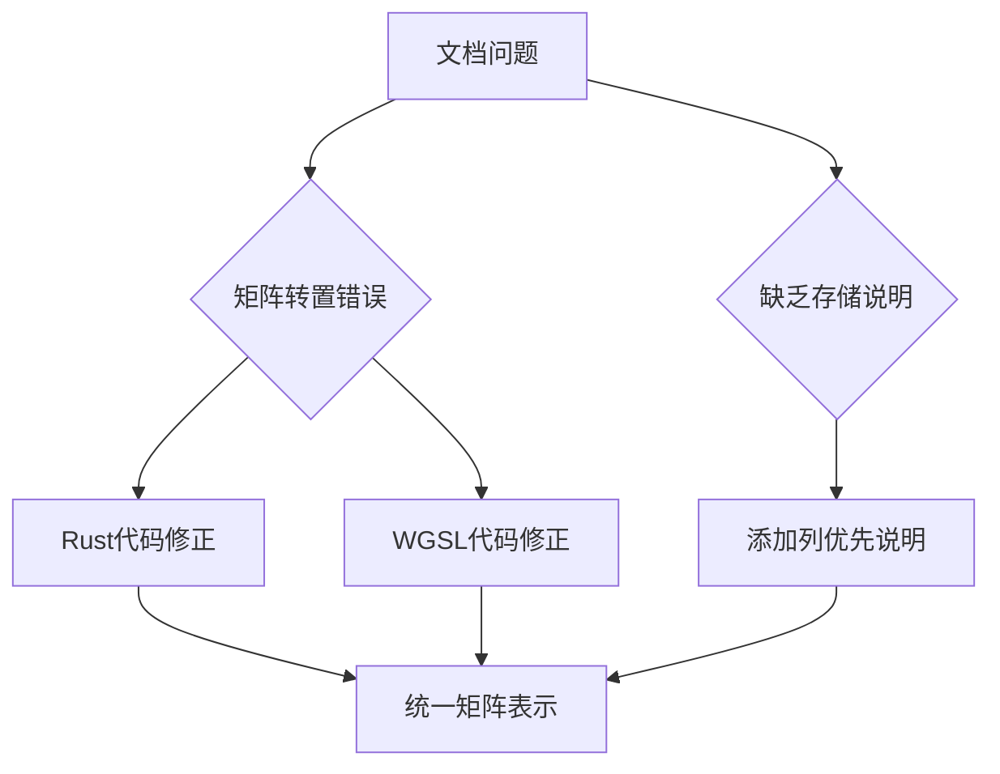

+++
title = "#19317 doc(render): fix incorrectly transposed view matrix docs"
date = "2025-05-27T00:00:00"
draft = false
template = "pull_request_page.html"
in_search_index = false

[extra]
current_language = "zh-cn"
available_languages = {"en" = { name = "English", url = "/pull_request/bevy/2025-05/pr-19317-en-20250527" }, "zh-cn" = { name = "中文", url = "/pull_request/bevy/2025-05/pr-19317-zh-cn-20250527" }}
labels = ["C-Bug", "C-Docs", "A-Rendering", "D-Straightforward"]
+++

# PR #19317: doc(render): fix incorrectly transposed view matrix docs

## Basic Information
- **Title**: doc(render): fix incorrectly transposed view matrix docs  
- **PR Link**: https://github.com/bevyengine/bevy/pull/19317  
- **Author**: atlv24  
- **Status**: MERGED  
- **Labels**: C-Bug, C-Docs, A-Rendering, S-Ready-For-Final-Review, D-Straightforward  
- **Created**: 2025-05-21T03:55:00Z  
- **Merged**: 2025-05-27T05:16:56Z  
- **Merged By**: alice-i-cecile  

## Description Translation
该PR的目标是修复渲染模块中视图矩阵的文档错误。主要修改包括：
- 修正转置错误的矩阵公式
- 增加示例用法
- 明确列优先(column-major)存储说明
- 所有修改仅涉及文档内容，无代码逻辑变更

## The Story of This Pull Request

### 问题背景
在Bevy渲染引擎的文档中发现视图矩阵的数学表示存在两个关键问题：
1. 透视投影和正交投影的矩阵公式存在行列转置错误
2. 缺乏对列优先(column-major)存储方式的明确说明

这些问题会导致开发者：
- 错误理解矩阵结构
- 错误访问矩阵元素（如near值的获取）
- 在自定义shader时产生兼容性问题

### 解决方案
作者进行了三方面修正：

1. **矩阵转置修正**：
   原文档中的投影矩阵行列顺序错误，现根据实际列优先存储调整矩阵元素的排列位置。例如透视投影矩阵的第四列（原文档错误放置在第三列）现在正确表示near值。

2. **存储方式说明**：
   在矩阵注释中明确添加"column-major"说明，并给出元素访问示例：
   ```rust
   // Glam matrices are column major, so for example getting the near plane
   // of a perspective projection is `clip_from_view[3][2]`
   ```

3. **公式对齐**：
   确保Rust代码注释与WGSL shader代码中的矩阵表示保持一致，消除跨语言文档的不一致性。

### 技术细节分析
以正交投影矩阵为例，修正前后的变化：

**修正前**：
```text
⎡  2/w     0      0    0 ⎤
⎢    0   2/h      0    0 ⎥
⎢    0     0  1/d    0 ⎥
⎣ cw/w  ch/h  near/d 1 ⎦
```

**修正后**：
```text
⎡ 2/w    0     0   cw/w ⎤
⎢   0  2/h     0   ch/h ⎥ 
⎢   0    0  1/d  far/d ⎥
⎣   0    0     0     1 ⎦
```

关键修正点：
- 平移项(cw/w, ch/h)移动到第四列（正确反映列优先存储）
- far值计算修正为`far/d`而非原来的`near/d`
- 矩阵维度排列符合列优先约定

### 影响分析
1. **文档准确性**：消除矩阵操作的认知偏差
2. **跨语言一致性**：Rust和WGSL文档现在使用相同的矩阵表示
3. **开发者体验**：明确的列优先说明帮助开发者正确访问矩阵元素
4. **渲染正确性**：防止因文档错误导致的shader矩阵计算问题

## Visual Representation



## Key Files Changed

### 1. crates/bevy_render/src/view/mod.rs
**修改重点**：
- 修正投影矩阵公式的列排列
- 添加列优先存储说明
- 统一透视/正交投影的变量命名

代码片段对比：
```rust
// Before:
// ⎡ f / aspect  0     0   0 ⎤
// ⎢          0  f     0   0 ⎥
// ⎢          0  0     0  -1 ⎥
// ⎣          0  0  near   0 ⎦

// After:
// ⎡ f / aspect  0   0     0 ⎤
// ⎢          0  f   0     0 ⎥ 
// ⎢          0  0   0  near ⎥
// ⎣          0  0  -1     0 ⎦

// 新增说明
// Glam matrices are column major, so for example getting the near plane
// of a perspective projection is `clip_from_view[3][2]`
```

### 2. crates/bevy_render/src/view/view.wgsl
**修改重点**：
- 保持与Rust文档相同的矩阵结构
- 添加WGSL特定的列优先说明

代码片段对比：
```wgsl
// Before:
// ⎡  2/w     0      0    0 ⎤
// ⎢    0   2/h      0    0 ⎥
// ⎢    0     0  1/d    0 ⎥
// ⎣ cw/w  ch/h  near/d 1 ⎦

// After:
// ⎡ 2/w    0     0   cw/w ⎤
// ⎢   0  2/h     0   ch/h ⎥
// ⎢   0    0  1/d  far/d ⎥
// ⎣   0    0     0     1 ⎦

// 新增说明
// Wgsl matrices are column major, so for example getting the near plane
// of a perspective projection is `clip_from_view[3][2]`
```

## Further Reading
1. [Glam矩阵存储文档](https://docs.rs/glam/latest/glam/struct.Mat4.html)
2. [WGSL矩阵规范](https://www.w3.org/TR/WGSL/#matrix-types)
3. [透视投影矩阵推导](https://www.scratchapixel.com/lessons/3d-basic-rendering/perspective-and-orthographic-projection-matrix/opengl-perspective-projection-matrix.html)