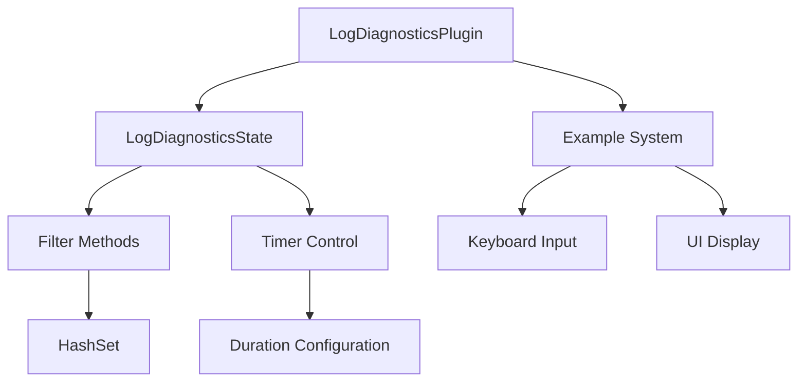

+++
title = "#19323 Expose `LogDiagnosticsState`"
date = "2025-05-23T00:00:00"
draft = false
template = "pull_request_page.html"
in_search_index = true

[taxonomies]
list_display = ["show"]

[extra]
current_language = "en"
available_languages = {"en" = { name = "English", url = "/pull_request/bevy/2025-05/pr-19323-en-20250523" }, "zh-cn" = { name = "中文", url = "/pull_request/bevy/2025-05/pr-19323-zh-cn-20250523" }}
labels = ["C-Usability", "A-Diagnostics"]
+++

# Title: Expose `LogDiagnosticsState`

## Basic Information
- **Title**: Expose `LogDiagnosticsState`
- **PR Link**: https://github.com/bevyengine/bevy/pull/19323
- **Author**: hukasu
- **Status**: MERGED
- **Labels**: C-Usability, S-Ready-For-Final-Review, A-Diagnostics
- **Created**: 2025-05-21T14:07:09Z
- **Merged**: 2025-05-23T21:14:24Z
- **Merged By**: alice-i-cecile

## Description Translation
# Objective

Closes #19175  
Make `LogDiagnosticsState` public to be able to edit its filters

## Solution

Make `LogDiagnosticsState` public and add methods to allow editing the duration and filter

## Testing

`cargo run -p ci`

## Showcase

Updated `log_diagnostics` example  


## The Story of This Pull Request

### The Problem and Context
The Bevy engine's diagnostic system included a `LogDiagnosticsPlugin` that logged system metrics, but its filtering mechanism had two key limitations:
1. The `LogDiagnosticsState` struct containing filter configuration was private
2. Filters used a `Vec` container that allowed duplicates and had O(n) lookups

This prevented users from dynamically modifying diagnostic filters at runtime and led to inefficient filter checks. The restriction became apparent when users requested finer control over diagnostic logging in issue #19175.

### The Solution Approach
The implementation strategy focused on two main improvements:
1. **Exposing State**: Make `LogDiagnosticsState` public and add mutation methods
2. **Optimizing Filters**: Replace `Vec<DiagnosticPath>` with `HashSet<DiagnosticPath>` for O(1) lookups

Key engineering decisions included:
- Maintaining backward compatibility through the existing `filtered()` constructor
- Providing granular filter control methods (`add_filter`, `remove_filter`, etc.)
- Adding UI to the example demonstrating runtime configuration

### The Implementation
The core changes occurred in `log_diagnostics_plugin.rs`:

```rust
// Before: Private struct
struct LogDiagnosticsState {
    timer: Timer,
    filter: Option<Vec<DiagnosticPath>>,
}

// After: Public API surface
pub struct LogDiagnosticsState {
    timer: Timer,
    filter: Option<HashSet<DiagnosticPath>>,
}

impl LogDiagnosticsState {
    pub fn set_timer_duration(&mut self, duration: Duration) { ... }
    pub fn add_filter(&mut self, diagnostic_path: DiagnosticPath) -> bool { ... }
    // 6 additional mutation methods
}
```

The example gained interactive filtering capabilities through keyboard input handling and UI updates:

```rust
fn filters_inputs(
    keys: Res<ButtonInput<KeyCode>>,
    mut status: ResMut<LogDiagnosticsStatus>,
    mut filters: ResMut<LogDiagnosticsFilters>,
    mut log_state: ResMut<LogDiagnosticsState>
) {
    if keys.just_pressed(KeyCode::KeyQ) {
        *status = match *status {
            LogDiagnosticsStatus::Enabled => {
                log_state.disable_filtering();
                LogDiagnosticsStatus::Disabled
            }
            // State transition logic
        };
    }
    // Filter toggling for different diagnostic categories
}
```

### Technical Insights
1. **HashSet Advantages**: The switch from Vec to HashSet eliminated duplicate filters and improved lookup performance from O(n) to O(1)
2. **Entity Component System (ECS) Integration**: Leveraged Bevy's resource system to manage filter state as a first-class citizen
3. **UI Synchronization**: Implemented reactive UI updates using Bevy's change detection (`resource_exists_and_changed`)

### The Impact
These changes provide:
- Runtime configuration of diagnostic logging filters
- More efficient filter management
- Example-driven documentation of new capabilities
- Foundation for future diagnostic customization features

Migration requirements were minimal but clearly documented in the accompanying guide, addressing the breaking change from Vec to HashSet.

## Visual Representation



## Key Files Changed

1. **crates/bevy_diagnostic/src/log_diagnostics_plugin.rs** (+61/-6)
- Made `LogDiagnosticsState` public
- Replaced `Vec` with `HashSet` for filters
- Added mutation methods for state control

2. **examples/diagnostics/log_diagnostics.rs** (+247/-3)
- Added interactive filter toggling with keyboard controls
- Implemented UI feedback system
- Demonstrated runtime state modifications

```rust
// Before plugin initialization:
LogDiagnosticsPlugin::default()

// After with filter control:
LogDiagnosticsPlugin {
    filter: Some(HashSet::new()),
    ..Default::default()
}
```

3. **release-content/migration-guides/log-diagnostics-hash-set.md** (+8/-0)
- Documented HashSet migration requirement
- Addressed breaking change from Vec to HashSet

4. **examples/stress_tests/many_components.rs** (+4/-3)
- Updated filter initialization to use HashSet
- Maintained compatibility with new API

```rust
// Before:
LogDiagnosticsPlugin::filtered(vec![DiagnosticPath::new("fps")])

// After:
LogDiagnosticsPlugin::filtered(HashSet::from_iter([
    DiagnosticPath::new("fps")
]))
```

## Further Reading
- Bevy ECS Documentation: https://bevyengine.org/learn/book/ecs-intro/
- Rust HashSet Reference: https://doc.rust-lang.org/std/collections/struct.HashSet.html
- Bevy Input Handling: https://bevyengine.org/examples/input/input/