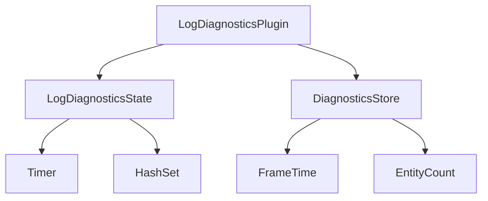

+++
title = "#19323 Expose `LogDiagnosticsState`"
date = "2025-05-23T00:00:00"
draft = false
template = "pull_request_page.html"
in_search_index = false

[extra]
current_language = "zh-cn"
available_languages = {"en" = { name = "English", url = "/pull_request/bevy/2025-05/pr-19323-en-20250523" }, "zh-cn" = { name = "中文", url = "/pull_request/bevy/2025-05/pr-19323-zh-cn-20250523" }}
labels = ["C-Usability", "A-Diagnostics"]
+++

# Expose `LogDiagnosticsState`

## Basic Information
- **Title**: Expose `LogDiagnosticsState`
- **PR Link**: https://github.com/bevyengine/bevy/pull/19323
- **Author**: hukasu
- **Status**: MERGED
- **Labels**: C-Usability, S-Ready-For-Final-Review, A-Diagnostics
- **Created**: 2025-05-21T14:07:09Z
- **Merged**: 2025-05-23T21:14:24Z
- **Merged By**: alice-i-cecile

## Description Translation
### 目标

关闭 #19175  
公开 `LogDiagnosticsState` 以允许编辑其过滤器

### 解决方案

将 `LogDiagnosticsState` 公开并添加用于编辑持续时间和过滤器的方法

### 测试

`cargo run -p ci`

### 展示

更新后的 `log_diagnostics` 示例  


## The Story of This Pull Request

### 问题与背景
Bevy 引擎的诊断系统内置了 `LogDiagnosticsPlugin` 用于定期输出诊断信息，但存在两个主要限制：
1. `LogDiagnosticsState` 结构体原本是私有类型，用户无法在运行时修改日志过滤配置
2. 过滤机制使用 `Vec<DiagnosticPath>` 存储，查找效率为 O(n)，当需要管理大量诊断项时存在性能问题

这些问题在 issue #19175 中被提出，用户需要动态控制诊断日志的过滤规则，例如在性能分析时临时禁用某些指标的日志输出。

### 解决方案选择
开发者选择通过以下方式解决问题：
1. 将 `LogDiagnosticsState` 改为公开（pub）
2. 将过滤器容器从 `Vec` 改为 `HashSet` 提升查询效率
3. 添加全套过滤器管理方法（添加/删除/清空/开关）
4. 更新示例展示动态过滤功能

选择 `HashSet` 的决策基于其 O(1) 的查找复杂度，这对高频更新的诊断系统尤为重要。同时保持向后兼容性，通过迁移指南指导用户适应类型变更。

### 实现细节
在 `log_diagnostics_plugin.rs` 中的关键修改：

```rust
// 原私有结构体改为公开
#[derive(Resource)]
pub struct LogDiagnosticsState {
    timer: Timer,
    filter: Option<HashSet<DiagnosticPath>>, // Vec -> HashSet
}

// 新增过滤器管理方法
impl LogDiagnosticsState {
    pub fn add_filter(&mut self, path: DiagnosticPath) -> bool {
        self.filter.get_or_insert_with(HashSet::new).insert(path)
    }
    
    pub fn remove_filter(&mut self, path: &DiagnosticPath) -> bool {
        self.filter.as_mut().map_or(false, |f| f.remove(path))
    }
}
```

在示例 `log_diagnostics.rs` 中新增交互逻辑：
```rust
// 按键处理过滤器状态
fn filters_inputs(
    keys: Res<ButtonInput<KeyCode>>,
    mut log_state: ResMut<LogDiagnosticsState>
) {
    if keys.just_pressed(KeyCode::Digit1) {
        log_state.toggle_filter(FrameTimeDiagnosticsPlugin::FPS);
    }
}
```

### 技术洞察
1. **资源生命周期管理**：`LogDiagnosticsState` 作为 Resource 注册，利用 Bevy 的 ECS 系统实现跨系统状态共享
2. **高效过滤机制**：HashSet 的引入使诊断路径的包含检查时间复杂度从 O(n) 降为 O(1)
3. **增量更新优化**：通过 `resource_exists_and_changed` 条件控制系统执行，避免不必要的 UI 更新

### 影响与改进
1. **运行时动态配置**：用户现在可以通过修改 `LogDiagnosticsState` 资源实时调整日志行为
2. **性能提升**：HashSet 的使用减少了大型项目中的性能开销
3. **API 扩展性**：新增的方法集为未来诊断功能扩展奠定了基础

## Visual Representation



## Key Files Changed

### `crates/bevy_diagnostic/src/log_diagnostics_plugin.rs` (+61/-6)
1. 将 `LogDiagnosticsState` 设为公开并实现过滤器管理方法
2. 修改过滤器容器类型为 `HashSet`

```rust
// Before:
struct LogDiagnosticsState {
    filter: Option<Vec<DiagnosticPath>> 
}

// After:
pub struct LogDiagnosticsState {
    filter: Option<HashSet<DiagnosticPath>>
}
```

### `examples/diagnostics/log_diagnostics.rs` (+247/-3)
1. 新增交互式过滤器控制界面
2. 实现按键响应和UI状态同步

```rust
// 新增按键处理逻辑
if keys.just_pressed(KeyCode::KeyQ) {
    log_state.toggle_filtering();
}
```

### `release-content/migration-guides/log-diagnostics-hash-set.md` (+8/-0)
提供从 Vec 到 HashSet 的迁移指导：

```markdown
- 将 `LogDiagnosticsPlugin::filtered(vec![...])` 
- 改为 `LogDiagnosticsPlugin::filtered(HashSet::from_iter([...]))`
```

## Further Reading
1. [Bevy ECS 资源系统文档](https://bevyengine.org/learn/book/ecs/resources/)
2. [Rust HashSet 性能特征](https://doc.rust-lang.org/std/collections/struct.HashSet.html)
3. [Bevy 诊断系统架构](https://bevyengine.org/learn/book/diagnostics/)