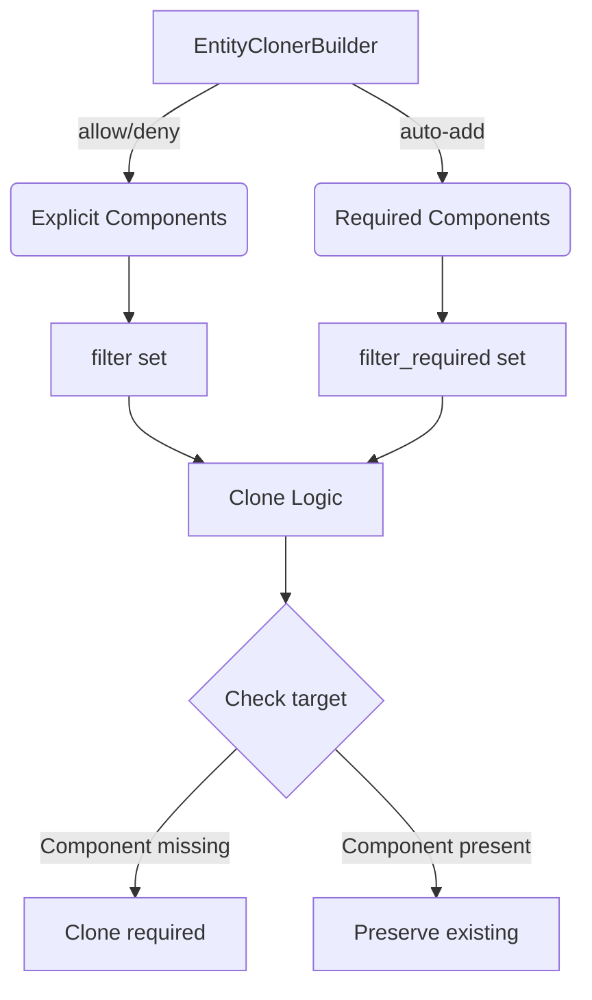

+++
title = "#19326 Fix `EntityCloner` replacing required components."
date = "2025-05-30T00:00:00"
draft = false
template = "pull_request_page.html"
in_search_index = true

[taxonomies]
list_display = ["show"]

[extra]
current_language = "en"
available_languages = {"en" = { name = "English", url = "/pull_request/bevy/2025-05/pr-19326-en-20250530" }, "zh-cn" = { name = "中文", url = "/pull_request/bevy/2025-05/pr-19326-zh-cn-20250530" }}
labels = ["C-Bug", "A-ECS"]
+++

## Fixing `EntityCloner`'s Required Component Handling

### Basic Information
- **Title**: Fix `EntityCloner` replacing required components.
- **PR Link**: https://github.com/bevyengine/bevy/pull/19326
- **Author**: eugineerd
- **Status**: MERGED
- **Labels**: C-Bug, A-ECS, S-Ready-For-Final-Review
- **Created**: 2025-05-21T16:25:14Z
- **Merged**: 2025-05-30T19:49:52Z
- **Merged By**: alice-i-cecile

### Description Translation
# Objective  
Fix #19324  

## Solution  
`EntityCloner` replaces required components when filtering. This is unexpected when comparing with the way the rest of bevy handles required components. This PR separates required components from explicit components when filtering in `EntityClonerBuilder`.  

## Testing  
Added a regression test for this case.  

### The Problem and Context
The issue (#19324) revealed a behavioral inconsistency in Bevy's ECS entity cloning mechanism. When using `EntityCloner` with component filters, required components (components that must exist alongside other components) were being forcibly replaced on target entities. This violated the expected behavior where required components should only be added if missing, not overwritten. 

Consider a component `A` that requires component `B`. In normal ECS operations, adding `A` to an entity automatically adds `B` if missing. However, during filtered cloning with `EntityCloner`, if we cloned `A` to a target that already had `B`, the existing `B` would be unexpectedly replaced by the source entity's `B`. This caused inconsistent state and violated the principle that required components should be handled implicitly.

### The Solution Approach
The fix separates the handling of explicitly filtered components from required dependencies. Previously, required components were added to the main filter set, causing them to be treated as explicit cloning targets. The new approach:
1. Introduces a dedicated `filter_required` set to track component dependencies
2. Modifies the cloning logic to only add required components if missing on the target
3. Preserves existing required components when present

Key engineering decisions:
- Maintained backward compatibility with existing filter APIs
- Minimized archetype lookups for performance
- Used existing component requirement metadata from `ComponentInfo`

### The Implementation
The core changes occur in `EntityCloner` and `EntityClonerBuilder`:

**1. Added required component tracking**  
A new `filter_required` field tracks dependencies separately from explicit filters:

```rust
// Before:
filter: HashSet<ComponentId>,

// After:
filter: HashSet<ComponentId>,
filter_required: HashSet<ComponentId>,  // New field
```

**2. Modified filter application logic**  
The `is_cloning_allowed` method now checks if required components exist on the target:

```rust
fn is_cloning_allowed(
    &self,
    component: &ComponentId,
    target_archetype: Option<&Archetype>,  // New parameter
) -> bool {
    if self.filter_allows_components {
        self.filter.contains(component)
            || target_archetype.is_some_and(|archetype| {
                !archetype.contains(*component) && self.filter_required.contains(component)
            })
    } else {
        !self.filter.contains(component) && !self.filter_required.contains(component)
    }
}
```

**3. Updated builder methods**  
The `allow`/`deny` methods now handle required components correctly:

```rust
// In EntityClonerBuilder::allow
for required_id in info.required_components().iter_ids() {
    if self.entity_cloner.filter_allows_components {
        self.entity_cloner.filter_required.insert(required_id);  // Was 'filter'
    } else {
        self.entity_cloner.filter_required.remove(&required_id);
    }
}
```

### Testing
A regression test verifies the correct behavior with required components:

```rust
#[test]
fn cloning_with_required_components_preserves_existing() {
    #[derive(Component, Clone, PartialEq, Debug, Default)]
    #[require(B(5))]  // Component A requires B
    struct A;
    
    #[derive(Component, Clone, PartialEq, Debug)]
    struct B(u32);
    
    let mut world = World::default();
    let source = world.spawn((A, B(0))).id();
    let target = world.spawn(B(1)).id();
    
    // Clone A to target (should preserve target's B(1))
    EntityCloner::build(&mut world)
        .deny_all()
        .allow::<A>()
        .clone_entity(source, target);
    
    assert_eq!(world.entity(target).get::<B>(), Some(&B(1)));
}
```

### Technical Insights
The solution leverages Bevy's existing component requirement metadata from `ComponentInfo`. By separating required components into their own filter set:
- We maintain the existing filter API surface
- Avoid expensive lookups by only fetching target archetype when needed
- Preserve the principle that required components are additive only
- The conditional archetype fetch (`target_archetype.is_some_and()`) ensures we only pay the lookup cost when required components exist

### The Impact
- Fixes unexpected component replacement behavior
- Maintains consistency with Bevy's required component semantics
- Preserves existing entity data when cloning
- Adds ~8 lines of core logic with comprehensive test coverage



### Key Files Changed
**crates/bevy_ecs/src/entity/clone_entities.rs**  
- Added `filter_required` tracking field
- Modified component allowance logic
- Updated builder methods to handle requirements
- Added regression test

```rust
// Before: filter contained both explicit and required components
fn is_cloning_allowed(&self, component: &ComponentId) -> bool {
    (self.filter_allows_components && self.filter.contains(component))
        || (!self.filter_allows_components && !self.filter.contains(component))
}

// After: Separate handling for required components
fn is_cloning_allowed(
    &self,
    component: &ComponentId,
    target_archetype: Option<&Archetype>,
) -> bool {
    if self.filter_allows_components {
        self.filter.contains(component)
            || target_archetype.is_some_and(|archetype| {
                !archetype.contains(*component) && self.filter_required.contains(component)
            })
    } else {
        !self.filter.contains(component) && !self.filter_required.contains(component)
    }
}
```

### Further Reading
- [Component Dependencies in ECS](https://bevyengine.org/learn/book/design/component-dependencies/)
- [Entity Cloning Documentation](https://docs.rs/bevy_ecs/latest/bevy_ecs/entity/struct.EntityCloner.html)
- [Original Issue #19324](https://github.com/bevyengine/bevy/issues/19324)