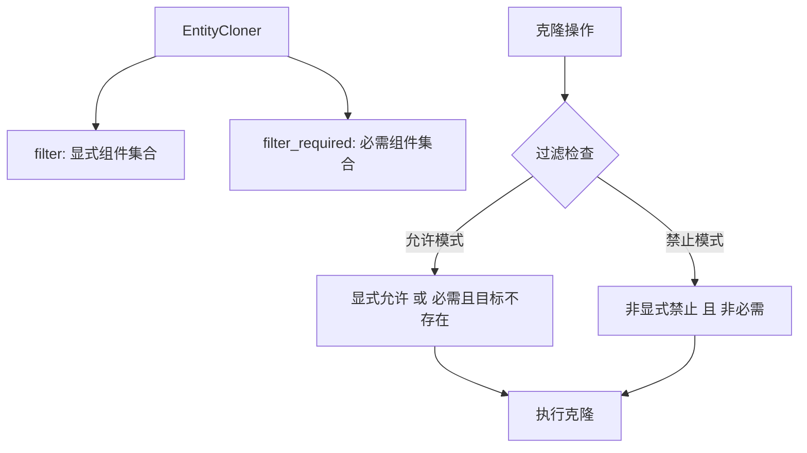

+++
title = "#19326 Fix `EntityCloner` replacing required components"
date = "2025-05-30T00:00:00"
draft = false
template = "pull_request_page.html"
in_search_index = false

[extra]
current_language = "zh-cn"
available_languages = {"en" = { name = "English", url = "/pull_request/bevy/2025-05/pr-19326-en-20250530" }, "zh-cn" = { name = "中文", url = "/pull_request/bevy/2025-05/pr-19326-zh-cn-20250530" }}
+++

## Fix `EntityCloner` replacing required components

### 基本信息
- **标题**: Fix `EntityCloner` replacing required components
- **PR链接**: https://github.com/bevyengine/bevy/pull/19326
- **作者**: eugineerd
- **状态**: 已合并
- **标签**: C-Bug, A-ECS, S-Ready-For-Final-Review
- **创建时间**: 2025-05-21T16:25:14Z
- **合并时间**: 2025-05-30T19:49:52Z
- **合并人**: alice-i-cecile

### 描述翻译
**目标**  
修复 #19324  

**解决方案**  
`EntityCloner` 在过滤时会替换 required components（必需组件）。与 bevy 处理 required components 的其他方式相比，这是不符合预期的。本 PR 在 `EntityClonerBuilder` 的过滤过程中将 required components 与显式组件分离处理。  

**测试**  
添加了针对此场景的回归测试。

### PR 的技术分析

#### 问题与背景
在 Bevy 的 ECS 系统中，`EntityCloner` 用于克隆实体及其组件。当使用过滤规则（允许/拒绝特定组件）时，发现一个关键问题：如果组件 A 要求存在组件 B（使用 `#[require(B)]` 属性），那么当仅允许克隆 A 时，`EntityCloner` 会错误地覆盖目标实体上现有的 B 组件。这违反了 Bevy 对 required components 的常规处理逻辑（只添加必需的组件但不替换现有组件），导致目标实体的状态被意外修改。

#### 解决方案
核心解决方案是将 required components 与显式指定的组件在过滤逻辑中分开处理：
1. 在 `EntityCloner` 结构中新增 `filter_required` 字段，专门存储因组件依赖关系而隐式允许/禁止的组件
2. 修改组件过滤逻辑，增加对目标实体是否已存在组件的检查
3. 在克隆操作中，当遇到 required components 时：
   - 如果目标实体已有该组件，则保留现有组件
   - 如果目标实体缺少该组件，则添加必需组件

#### 具体实现
主要修改集中在 `EntityCloner` 的过滤判断逻辑：

```rust
// 修改后的过滤判断方法
fn is_cloning_allowed(
    &self,
    component: &ComponentId,
    target_archetype: Option<&Archetype>, // 新增目标原型参数
) -> bool {
    if self.filter_allows_components {
        // 允许模式逻辑
        self.filter.contains(component)
            || target_archetype.is_some_and(|archetype| {
                !archetype.contains(*component) && self.filter_required.contains(component)
            })
    } else {
        // 禁止模式逻辑
        !self.filter.contains(component) && !self.filter_required.contains(component)
    }
}
```

关键改进点：
1. 新增 `target_archetype` 参数检查目标实体是否已包含组件
2. 在允许模式下：如果组件是必需的 (`filter_required.contains(component)`) 且目标实体没有该组件，则允许克隆
3. 在禁止模式下：明确排除必需组件 (`!self.filter_required.contains(component)`)

#### 构建器调整
在 `EntityClonerBuilder` 中，修改了对 required components 的处理方式，将它们放入专门的集合：

```rust
// 在 allow() 方法中
if let Some(info) = self.world.components().get_info(id) {
    for required_id in info.required_components().iter_ids() {
        if self.entity_cloner.filter_allows_components {
            // 将必需组件放入专用集合
            self.entity_cloner.filter_required.insert(required_id);
        } else {
            self.entity_cloner.filter_required.remove(&required_id);
        }
    }
}
```

#### 性能考虑
为最小化性能影响：
1. 仅在存在必需组件时 (`!self.filter_required.is_empty()`) 才获取目标实体的原型
2. 保持组件 ID 的 HashSet 查询为 O(1) 操作
3. 避免在无必需组件情况下增加额外开销

#### 测试验证
添加的回归测试验证了核心场景：

```rust
#[test]
fn cloning_with_required_components_preserves_existing() {
    #[derive(Component, Clone, PartialEq, Debug, Default)]
    #[require(B(5))] // 组件A要求组件B存在
    struct A;

    #[derive(Component, Clone, PartialEq, Debug)]
    struct B(u32);

    // 测试场景1：只允许克隆A，但保留目标实体已有的B(1)
    EntityCloner::build(&mut world)
        .deny_all()
        .allow::<A>()
        .clone_entity(e, e_clone);
    
    // 验证：A被克隆，但B(1)未被覆盖
    assert_eq!(world.entity(e_clone).get::<B>(), Some(&B(1)));

    // 测试场景2：允许所有组件但显式拒绝A
    EntityCloner::build(&mut world)
        .allow_all()
        .deny::<A>()
        .clone_entity(e, e_clone2);
    
    // 验证：B(2)未被覆盖
    assert_eq!(world.entity(e_clone2).get::<B>(), Some(&B(2)));
}
```

### 技术图示



### 关键文件变更

**crates/bevy_ecs/src/entity/clone_entities.rs**  
主要修改点：
1. 新增 `filter_required` 字段存储必需组件
2. 重构过滤逻辑加入目标实体检查
3. 添加回归测试验证修复

关键代码片段：
```rust
// 修改前：
fn is_cloning_allowed(&self, component: &ComponentId) -> bool {
    (self.filter_allows_components && self.filter.contains(component))
        || (!self.filter_allows_components && !self.filter.contains(component))
}

// 修改后：
fn is_cloning_allowed(
    &self,
    component: &ComponentId,
    target_archetype: Option<&Archetype>,
) -> bool {
    if self.filter_allows_components {
        self.filter.contains(component)
            || target_archetype.is_some_and(|archetype| {
                !archetype.contains(*component) && self.filter_required.contains(component)
            })
    } else {
        !self.filter.contains(component) && !self.filter_required.contains(component)
    }
}
```

### 总结
此 PR 解决了 `EntityCloner` 在过滤模式下错误覆盖 required components 的问题。通过引入以下关键改进：
1. 分离显式组件和必需组件的存储
2. 在过滤逻辑中增加目标实体状态检查
3. 保持必需组件的添加行为而不覆盖现有组件

修复后，`EntityCloner` 的行为与 Bevy ECS 的其他部分保持一致，确保 required components 只在必要时添加，而不会意外覆盖现有组件状态。

### 扩展阅读
- [Bevy ECS 组件文档](https://docs.rs/bevy_ecs/latest/bevy_ecs/component/trait.Component.html)
- [实体克隆机制详解](https://github.com/bevyengine/bevy/blob/main/crates/bevy_ecs/src/entity/clone_entities.rs)
- [Required Components 设计模式](https://docs.rs/bevy_ecs/latest/bevy_ecs/component/trait.Component.html#required-components)