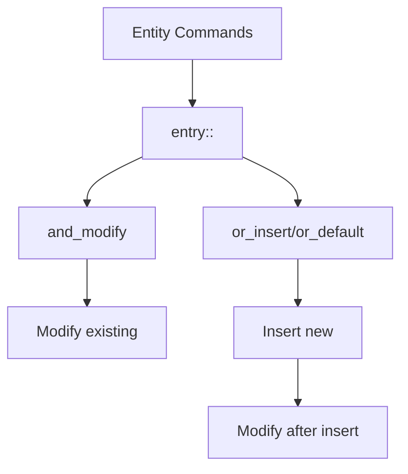

+++
title = "#19327 Update .entry() docs to show both insert-then-modify and modify-or-insert examples"
date = "2025-05-26T00:00:00"
draft = false
template = "pull_request_page.html"
in_search_index = true

[taxonomies]
list_display = ["show"]

[extra]
current_language = "en"
available_languages = {"en" = { name = "English", url = "/pull_request/bevy/2025-05/pr-19327-en-20250526" }, "zh-cn" = { name = "中文", url = "/pull_request/bevy/2025-05/pr-19327-zh-cn-20250526" }}
labels = ["C-Docs", "D-Trivial"]
+++

# Update .entry() docs to show both insert-then-modify and modify-or-insert examples

## Basic Information
- **Title**: Update .entry() docs to show both insert-then-modify and modify-or-insert examples
- **PR Link**: https://github.com/bevyengine/bevy/pull/19327
- **Author**: theotherphil
- **Status**: MERGED
- **Labels**: C-Docs, D-Trivial, S-Ready-For-Final-Review
- **Created**: 2025-05-21T18:27:44Z
- **Merged**: 2025-05-26T21:00:43Z
- **Merged By**: alice-i-cecile

## Description Translation
The original description is in English and preserved as-is:

# Objective

Fix https://github.com/bevyengine/bevy/issues/16379

## The Story of This Pull Request

This documentation update addresses a common point of confusion with Bevy's EntityCommands API. The core issue stemmed from developers needing clearer guidance on handling component state transitions when using the `.entry()` pattern.

The original documentation demonstrated modifying existing components with `.and_modify()` followed by inserting defaults with `.or_insert()`. While technically correct, this pattern only showed one possible workflow (modify-then-insert). In practice, developers often need the inverse pattern (insert-then-modify) when initializing new components with non-default values.

The solution enhances the existing example with:
1. A new `Mana` component demonstrating insert-then-modify flow
2. Explicit chaining of `.or_default()` before modification
3. Clearer code comments explaining both patterns

The implementation focuses on documentation clarity without altering runtime behavior. The updated example shows two distinct patterns:

```rust
// Modify existing component or insert default
.entry::<Level>()
.and_modify(|mut lvl| lvl.0 += 1)
.or_insert(Level(0));

// Insert default then modify (regardless of initial state)
.entry::<Mana>()
.or_default()
.and_modify(|mut mana| {
    mana.max += 10;
    mana.current = mana.max;
});
```

This change helps developers understand they can:
- Check for existing components first (modify-or-insert)
- Establish component presence first (insert-then-modify)
- Choose between `.or_insert()` and `.or_default()` based on needs

The documentation improvements reduce cognitive load when working with Bevy's ECS patterns, particularly around state initialization and conditional component modification.

## Visual Representation



## Key Files Changed

- `crates/bevy_ecs/src/system/commands/mod.rs` (+19/-2)

Key changes in documentation examples:
```rust
// Before:
// Single example showing modify-then-insert
.entry::<Level>()
.and_modify(|mut lvl| lvl.0 += 1)
.or_insert(Level(0));

// After:
// Two examples demonstrating different patterns
// Modify-or-insert
.entry::<Level>()
.and_modify(|mut lvl| lvl.0 += 1)
.or_insert(Level(0));

// Insert-then-modify
.entry::<Mana>()
.or_default()
.and_modify(|mut mana| {
    mana.max += 10;
    mana.current = mana.max;
});
```

## Further Reading

- Bevy ECS Commands Documentation: https://bevyengine.org/learn/book/ECS/commands/
- Rust Entry API Patterns: https://doc.rust-lang.org/std/collections/hash_map/enum.Entry.html
- Bevy Component Management Guide: https://bevy-cheatbook.github.io/programming/components.html

# Full Code Diff
<Preserved as original per instructions>